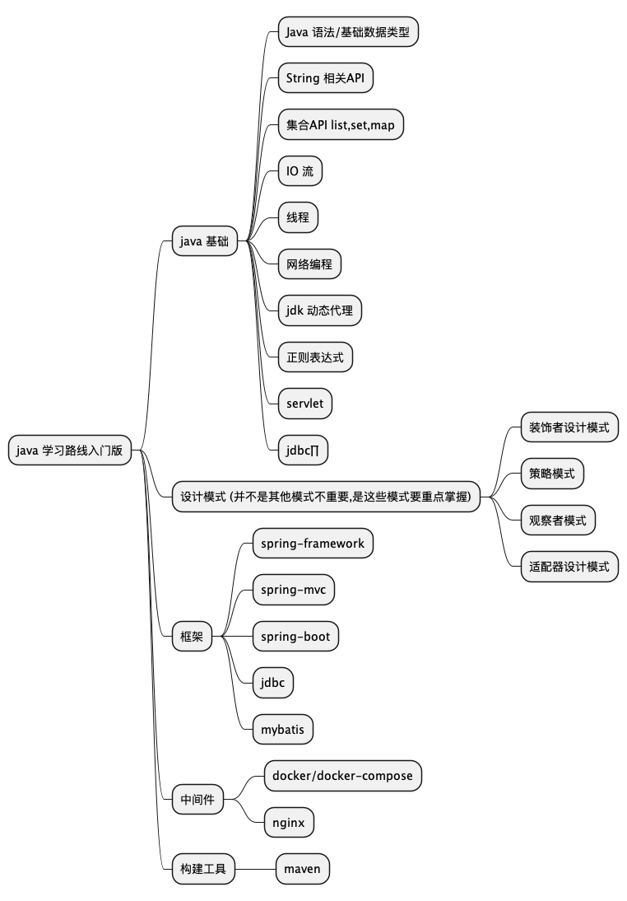

# java 学习路线

## 推荐书籍
1. java 基础: https://www.ituring.com.cn/book/2935
2. jdbc: https://www.oracle.com/database/technologies/getting-started-using-jdbc.html#pre-requisites-tab
3. mybatis: mybatis.org
4. maven: https://maven.apache.org
5. spring: https://spring.io/projects/spring-framework

# 测试题目
## 上机题
1. leetcode 912: 10%
2. leetcode 第14题运行截图 10%
3. 编写一个正则表达式匹配手机号 5% 
    * 11 或14位,
    * 如果是11位那么第一位是1,如果不是那么算上国家/地区号如(+86),国家地区号标准为: 第一位+第二位第三位任意数字 
    * 去掉国家或地区号之后第一位是1
    * 第二位不能是0,1,2
4. 创建一个List<Integer> 对象,并把字符串"hello world"放进列表 5%
5. 基于java 语言实现一个cp命令 15%
    1. cp 普通文件直接复制[非r]
    2. 实现 -r,效果`cp -r [source] [target]` 
    3. 其他参数提示暂不支持,
    4. 代码风格注意
    提示:
        * main 方法传参
        * javac 编译成class 
        * native-image 编译成可执行文件
        * 注意递归

6. 编写一个 interface IWaiter 拥有 welcome 方法  15%
    * 编写一个SimpleWaiter 实现是 welcome 打印 “欢迎光临”
    * 使用jdk 动态代理装饰该对象,增强方法,调用时先打印 "微笑",再打印具体内容

7. 基于debian9 和jdk17 构建一个tomcat9 镜像,写出Dockerfile 15%
8. 创建一个基础的spring boot 项目运行在9090 端口 5%

## 问答题
1. maven 中 dependencyManagement 作用是什么?,maven 有几种scope 区别是什么?说一下你熟悉的maven 生命周期 5%
2. mybatis 的# 和$有什么区别,数据库字段和对象属性不一样时如何处理,如何返回嵌套对象 5%
3. spring 的autowired 和@Compoment 区别,什么是控制反转 5%
4. docker 镜像和容器是什么关系,如何运行容器,导出镜像,导入镜像,删除镜像,删除容器,查看日志 5%
