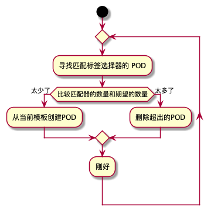

# 副本机制和其他控制器:部署托管的 POD
> POD 是kubernetes 的基本调度单元,但在实际的用例里,几乎不会手动部署 Pod 而是借助Deployment 或者replicationController 这些POD控制器去自动的维持POD的数量,因为要保证部署的POD 保持健康且无需手动干预。而手动创建未托管的POD 在出现异常死亡后不能自动恢复

## 保持POD 健康
> Kubenetes 本身提供了监控POD主进程是否崩溃的机制.如果崩溃,kubenetes 会自动调度POD重启,保证了即使应用程序本身不具备自愈能力也能在 Kubenetes 集群中获得
某些错误并不会导致主进程崩溃,但此时POD内部的进程已经不能提供服务了,(如线程死锁)此时需要一个外部的检查机制来完善它,那就是接下来介绍的存活探针

### 存活探针
> Kubernetes 提供三种健康检查的探针

* TCP探针: 与容器的指定端口建立TCP连接,如果建立成功则认为 POD 存活
* HTTP探针:对容器的IP地址执行HTTP请求,如果收到响应,并且响应的状态码不代表错误(2XX 或 3XX)则认为POD 存活
* exec 探针: 执行某个命令如果退出状态码是 0 则探测成功

> 一些属性的如 `delay` 表示延迟多长时间后开始探测,`timeout`设置探测后多长时间返回否则认为失败,`period`表示距离第一次探测相隔多长时间。**如果没有设置初始延迟,探针将在容器启动后立即开始探测,通常会导致探测失败** .因为一个容器启动需要一定的时间,此时还没办法接收请求
#### 创建有效的探针
* 探针应该检查应用程序内部而没有任何外部因素影响。(数据库失败了,web应用的探针不能判断出错,因为此时重启web应用解决不了问题)
* 探针应该尽量轻量(java项目尽量使用http 探针,放弃资源占用大的JVM探针)
* 无需在探针中做重试循环(kubenetes 自己会做)
* 探针是由kubelet 组件执行的,和控制平面没有关系。(所以当节点崩溃时,控制平面会在其他节点上创建副本)
## 了解ReplicationController 
>ReplicationController 是一种Kubenetes资源，可以确保固定数量的Pod始终处于运行状态,如果POD因为任何原因消失,ReplicationController 会注意到缺少了POD并创建替代的POD，他会持续监控正在运行的 POD 列表,并保证相应 POD “类型”的数量是否符合预期,如果太多将会减少相应的数量,如果太少则会增加相应的数量。
实际上它也不是监控类型,而是前面提到的标签选择器的匹配来决定的,ReplicationController 需要保证 POD 数量是否和标签选择器匹配。所以更改POD模板,原有的标签的POD要手动删除 重新创建才生效

过程如图所示

### ReplicationController 组成
* 标签选择器
* 副本个数
* pod 模板
### 使用 ReplicationController 的好处
* 确保固定数量的 POD 持续运行
* 集群节点发生故障时,将自动转移故障节点上的POD
* 能轻松实现POD的水平伸缩

## 使用ReplicaSet 而不是ReplicationController
> ReplicaSet 是新一代的 ReplicationController 它除了拥有ReplicationController 的所有功能外,还拥有 ***更富表现力的标签匹配*** 。以后的使用都会围绕ReplicaSet ,但是之后也会学习到我们一般不会手动创建ReplicaSet 而是通过创建更高层级的Deployment来创建他们
### ReplicaSet 的更富表现力标签
* **In**:标签值必须是其中之一
* **NotIn**:标签值必须和指定的都不匹配
* **Exists**:Pod 必须拥有某个标签key 值不重要
* **DoesNotExists**:Pod 必须不拥有任何标签key 值不重要

## 使用DaemonSet 在每个节点上运行一个 POD
>DaemonSet 确保集群上的所有节点都运行一个 自己期望的POD(根据POD模板),他没有期望副本数的概念,因为所有节点都是一个,新增节点后也会默认新增DaemonSet 期望的POD 如果被干掉,POD也不会调度到其他节点上而是在当前节点,他也支持节点选择器的配置,如果已经配置了节点选择器,此时只会在配置了相应标签的节点上启动一个Pod 副本,当标签改变符合条件后同理DaemonSet 也会重新调度,但是对于节点亲和度没有限制,Kubernetes 认为DaemonSet 是系统服务及时在不可调度的节点上,系统服务通常也是需要运行的,
## 运行单个任务的JOB
> 前文介绍的都是持续的服务,他们都无法到达一个完成态,他们会在进程结束后重新启动,对于可完成的任务,应该在结束后显示完成态而不启动,Kubenetes 提供了Job 组件支持创建一次性的任务,它允许你通过运行POD,该 POD 在内部进程运行成功结束后,不重新启动,并显示完成状态,如果运行过程中失败,JOB 将重新启动,如果运行过程中节点故障,JOB 将调度到合理的地方重新进行,***值得注意的是,restartPolicy是POD 的属性,在运行JOB任务时应该将其设置为OnFailure或Never***，如果希望作业多次,可以修改 `completions` 次数;同时job 是可以并行运行的,通过设置 `paralletlism`设置同时并行运行的个数;设置`activeDeadlineSeconds` 可以控制任务完成的时间,如果超过此时间,任务将被终止并标记为失败。

## CronJob:安排 job 定期或将来运行一次
> Kubernetes 中的Cron任务是通过创建CornJob,运行任务的时间表以知名的Cron 表达式指定。当达到配置的时间后，CronJob 描述文件配置的模板 ***创建Job 资源***，Job资源根据Pod 模板创建Pod 执行任务,回到前一节相似的内容。通常情况下,CronJob 在规定时间会重新创建job 运行,也有可能同时创建两个或不创建Job,第一个问题对Job的要求是必须保证Job 本身幂等,第二个问题要保证接下去没执行的JOB要把之前没做的任务继续完成而不是跳过。

## 一些常见的命令
```bash
# 查看pod 运行状态 (探针结果)
kubectl describe po [pod]
# 查看节点信息
kubectl get no 
# 查看replicationController 列表
kubectl get rc
# 查看 rc 运行状态
kubectl describe rc [replicationController]
# 修改rc 模板
kubectl edit rc [replicationController]
# 水平缩放 pod
kubectl scale rc [replicationController] --replicas=10
# 删除一个rc --cascade 可以不删除pod 此时POD 独立了不再被管理了
kubectl delete rc [replicationController] --cascade=false
# 获取 replicaSet列表
kubectl get rs
# 查看replicaSet 状态 
kubectl describe rs [replicaSet]
# 删除rs
kubectl delete rs
# 获取daemonSet列表
kubectl get ds
# 查看daemonSet 状态
```