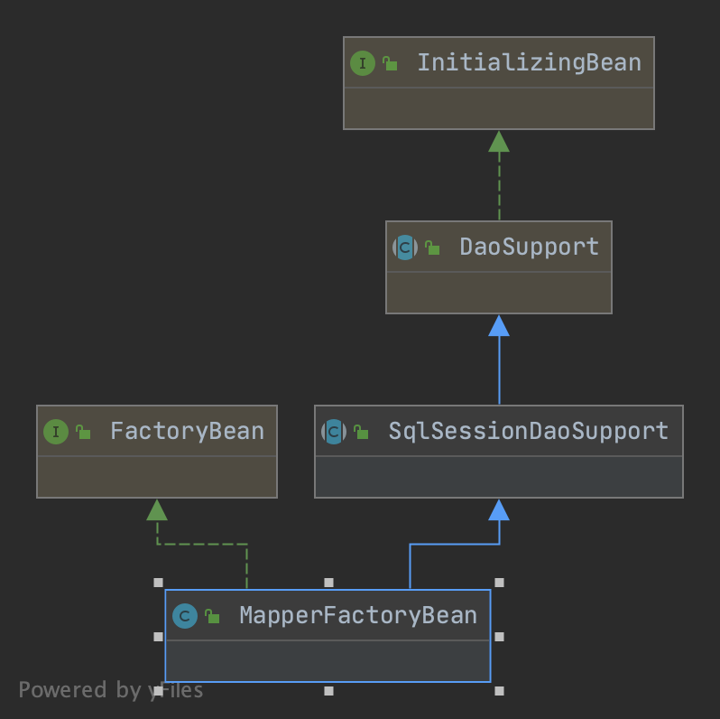

# mybatis spring 整合
## 1. 工程目录结构
```bash
src/main/java/org/mybatis/spring
├── MyBatisExceptionTranslator.java # 异常解析,如何让人看得懂异常
├── MyBatisSystemException.java # 自定义异常一般是事务异常的解析
├── SqlSessionFactoryBean.java # 核心类,如何创建SqlSessionFactory,源码要深刻理解
├── SqlSessionHolder.java # sqlSession持有者,用于获取当前SqlSession以及对应的类型
├── SqlSessionTemplate.java # 封装了spring 接管mybatis 事务的增强类 关心内部 SqlSessionInterceptor 本质上是从ThreadLocal中获取相关的SqlSession
├── SqlSessionUtils.java # 工具类,提供事务相关的方法 给SqlSessionTemplate 调用
├── annotation
│   ├── MapperScan.java # Spring @Import 相关扩展,用于 Mapper 扫描
│   ├── MapperScannerRegistrar.java # 解析@MapperScan 并注册一个 MapperScannerConfigurer 用于执行真正 Mapper扫描行为
│   ├── MapperScans.java # @MapperScan注解的组合形式 解析类似
│   └── package-info.java
├── batch # 这个包一般在和Spring batch 结合时用的比较多,做数据管道数据同步用的比较多 一般工程可以忽略这些代码
│   ├── MyBatisBatchItemWriter.java
│   ├── MyBatisCursorItemReader.java
│   ├── MyBatisPagingItemReader.java
│   ├── builder
│   │   ├── MyBatisBatchItemWriterBuilder.java
│   │   ├── MyBatisCursorItemReaderBuilder.java
│   │   ├── MyBatisPagingItemReaderBuilder.java
│   │   └── package-info.java
│   └── package-info.java
├── config # mybatis-Spring 基于XML解析的BeanDefinition配置方式
│   ├── MapperScannerBeanDefinitionParser.java
│   ├── NamespaceHandler.java
│   └── package-info.java
├── mapper
│   ├── ClassPathMapperScanner.java # Spring 的ComponentScan 扩展
│   ├── MapperFactoryBean.java # spring 的FactoryBean扩展,将实际由Mybatis 创建的Mapper对象放入spring 容器
│   ├── MapperScannerConfigurer.java # 对所有@MapperScan属性的解析并整合注册mapper的核心类 熟悉 Spring BeanFactoryPostProcessor 扩展
│   └── package-info.java
├── package-info.java
├── support
│   ├── SqlSessionDaoSupport.java # MapperFactoryBean 的父类
│   └── package-info.java
└── transaction # spring 对mybati事务接管
    ├── SpringManagedTransaction.java
    ├── SpringManagedTransactionFactory.java
    └── package-info.java
```
## 2. Mapper 扫描
> 如果使用原生Mybatis 要获得Mapper 对象,一般是通过Sqlsession.getMapper 方法做到的,而众所周知,在spring 中可以轻易的使用@Autowired 将需要的Mapper 通过spring 的依赖注入添加到对应的Service 中。在学习Mybatis源码中我们知道Mapper 对象是存在于Configuration 对象内部的 MapperRegistry 属性的KnownMappers 这个Mapper 里面的,唯一的获取方法也是通过getMapper 的类型获得的这个Mapper。所以，学习Mapper扫描本质上是学习Spring 如何把Mybatis创建的Mapper对象加入到Mapper

### 2.1 MapperScan 注解 
* spring boot 中 大部分@EnableXXX 注解都是使用@Import实现的 如 @EnableWebMvc
* 看到这行代码要想起@Import 的三种类型的 ***第三种*** :使用直接添加BeanDefinition的形式注册对象(这种方式的自由度最大,可以随意修改注册到spring 的Bean)表示在MapperScans 中 的MapperScan 是可以多个的
#### 内部属性介绍
* processPropertyPlaceHolders: 是否替换属性值里面的占位符
* annotationClass: 仅扫描带有某个注解的接口作为Mapper
* markerInterface: 仅扫描继承了特定父标记注解的Mapper
* 为Mapper注入spring 容器指定Beanname 生成器
* 为Mapper 指定 MapperFactoryBeanClass 作为当前mapper 添加到Spring 容器的桥梁 用于扩展和增强MapperFactoryBean
* SqlSessionFactoryBeanRef: 一般和多数据源相关,指定对应的SqlSessionFactoryBean
* basePackages/value/basePackageClass: 都是指定包扫描路径,basePackagesClass 指定特定类包路径,如果这三个都没有默认当前注解所在的类作为basePackages
* lazyInitialization: 指定一个Mapper是不是懒加载的,如果是那么这个对象会在使用时才创建
* defaultScope: 指定mapper生命周期,默认singleton 可选thread,即每个线程创建一个Mapper


### 2.2 MapperScannerRegistrar
* 扩展了 @Import 的ImportBeanDefinitonRegistrar,执行时,会创建一个MapperScanner的BeanDefinition 
* 并将注解的属性值通过设置Property的方式在Spring PopulateBeann阶段赋给内部属性,这里注意一下 value,basePackage,basePackagesClass 最终都会给到BasePackage 属性(他们代表同一个意思：mapper接口所在的路径)

```java
  public void registerBeanDefinitions(AnnotationMetadata importingClassMetadata, BeanDefinitionRegistry registry) {
    // 从Spring 的源码阅读过来就应该明白这行代码主要作用是获取注解里面的属性key,value 用于后续处理
    AnnotationAttributes mapperScanAttrs = AnnotationAttributes
        .fromMap(importingClassMetadata.getAnnotationAttributes(MapperScan.class.getName()));
    // 排除掉@MapperScan 但没有添加属性的注解,
    if (mapperScanAttrs != null) {
      registerBeanDefinitions(importingClassMetadata, mapperScanAttrs, registry,
          generateBaseBeanName(importingClassMetadata, 0));
    }
  }

void registerBeanDefinitions(AnnotationMetadata annoMeta, AnnotationAttributes annoAttrs,
      BeanDefinitionRegistry registry, String beanName) {
    // 常用的生成BeanDefinition的方式,这行代码会生成一个 GenericBeanDefinition
    // GenericBeanDefinition 一般用于框架的编写,BeanDefinition不同类型的各自用途要熟悉
    // MapperScannerConfigurer 这个类我们稍后介绍 涉及到众多的Spring 生命周期阶段的事情
    BeanDefinitionBuilder builder = BeanDefinitionBuilder.genericBeanDefinition(MapperScannerConfigurer.class);
    // 设置BeanDefinition 的property 属性,这么写意味着 MapperScannerConfigurer 内部有一个boolean的processPropertyPlaceHolders 属性
    // 见名知意 盲猜一下这个属性是为了解析 @MapperScan配置属性里面的${}占位符
    builder.addPropertyValue("processPropertyPlaceHolders", true);
    // 扩展ComponmentScan 扫描器的IncluFilter 用于扫描特定注解作为Mapper
    Class<? extends Annotation> annotationClass = annoAttrs.getClass("annotationClass");
    if (!Annotation.class.equals(annotationClass)) {
      builder.addPropertyValue("annotationClass", annotationClass);
    }
    // 扩展ComponmentScan 扫描器的IncluFilter 用于扫描继承了特定父标记注解的Mapper
    Class<?> markerInterface = annoAttrs.getClass("markerInterface");
    if (!Class.class.equals(markerInterface)) {
      builder.addPropertyValue("markerInterface", markerInterface);
    }
    // 为Mapper 提供BeanName 的生成器,本次企业重构使用到了这个特性,将旧的Mapper和新的按目录分隔开
    Class<? extends BeanNameGenerator> generatorClass = annoAttrs.getClass("nameGenerator");
    if (!BeanNameGenerator.class.equals(generatorClass)) {
      builder.addPropertyValue("nameGenerator", BeanUtils.instantiateClass(generatorClass));
    }
    // 指定特定的 MapperFactoryBeanClass 作为当前mapper 添加到Spring 容器的桥梁 用于扩展和增强MapperFactoryBean
    Class<? extends MapperFactoryBean> mapperFactoryBeanClass = annoAttrs.getClass("factoryBean");
    if (!MapperFactoryBean.class.equals(mapperFactoryBeanClass)) {
      builder.addPropertyValue("mapperFactoryBeanClass", mapperFactoryBeanClass);
    }
    // 指定特定的SqlSessionTemplateBean 一般用于多数据源时,不同SqlSessionTemplate的选择
    String sqlSessionTemplateRef = annoAttrs.getString("sqlSessionTemplateRef");
    if (StringUtils.hasText(sqlSessionTemplateRef)) {
      builder.addPropertyValue("sqlSessionTemplateBeanName", annoAttrs.getString("sqlSessionTemplateRef"));
    }
    // 指定特定的 SqlSessionFactoryBean 一般用于多数据源时,不同SqlSessionFactoryBean的选择
    String sqlSessionFactoryRef = annoAttrs.getString("sqlSessionFactoryRef");
    if (StringUtils.hasText(sqlSessionFactoryRef)) {
      builder.addPropertyValue("sqlSessionFactoryBeanName", annoAttrs.getString("sqlSessionFactoryRef"));
    }
    // 指定包扫描默认路径,如果不指定默认当前注解的类所在路径
    List<String> basePackages = new ArrayList<>();
    basePackages.addAll(
        Arrays.stream(annoAttrs.getStringArray("value")).filter(StringUtils::hasText).collect(Collectors.toList()));

    basePackages.addAll(Arrays.stream(annoAttrs.getStringArray("basePackages")).filter(StringUtils::hasText)
        .collect(Collectors.toList()));

    basePackages.addAll(Arrays.stream(annoAttrs.getClassArray("basePackageClasses")).map(ClassUtils::getPackageName)
        .collect(Collectors.toList()));

    if (basePackages.isEmpty()) {
      basePackages.add(getDefaultBasePackage(annoMeta));
    }
    // 指定 Mapper 是否是懒加载的,如果是会在使用的时候才创建Mapper对象
    String lazyInitialization = annoAttrs.getString("lazyInitialization");
    if (StringUtils.hasText(lazyInitialization)) {
      builder.addPropertyValue("lazyInitialization", lazyInitialization);
    }
    //Mapper 的存在周期是单例的还是 每个线程创建一个 扩展了BeanDefinition 的Scope 属性
    String defaultScope = annoAttrs.getString("defaultScope");
    if (!AbstractBeanDefinition.SCOPE_DEFAULT.equals(defaultScope)) {
      builder.addPropertyValue("defaultScope", defaultScope);
    }
    // 集合转字符串
    builder.addPropertyValue("basePackage", StringUtils.collectionToCommaDelimitedString(basePackages));

    // for spring-native // spring beanDefinition对于role的定义 表示这个Bean属于基础设施而非业务用户使用
    builder.setRole(BeanDefinition.ROLE_INFRASTRUCTURE);
    // 将MapperScannerConfigure 注册到Spring 的beanDefinitionMap中 后续通过getBean会创建
    registry.registerBeanDefinition(beanName, builder.getBeanDefinition());

  }
```
### 2.3 MapperScan 注解解析器(MapperScannerConfigurer)
> 该对象的所有接口都是spring 的扩展相关的内容

#### 2.3.1 InitializingBean: 
>bean 生命周期创建回调的其中一种实现方式,另外几种方式如JSR-250,指定init-method方法都是 该接口方法会在bean创建成功后执行,此处这个方法主要作用是扫描获得所有Mapper接口的Class,工作是检查BasePackage不为空

#### 2.3.2 BeanDefinitionRegistryPostProcessor
>该接口方法的执行阶段一般是 BeanDefinition初始化结束之后,此时Spring容器获取了所有的 BeanDefinition,这是因为Spring自身有一个默认的BeanDefinitionRegistryProcessProcessor 作用是初始化BeanDefinition 很多基于注解扫描相关的内容也会发生在此处

```java
public void postProcessBeanDefinitionRegistry(BeanDefinitionRegistry registry) {
    // 如果开启了解析占位符则在扫描之前解析一下占位符
    if (this.processPropertyPlaceHolders) {
      processPropertyPlaceHolders();
    }
    // 这个ClassPathMapperScanner 继承至ComponentScan 的Scanner 使用ASM 读取类的信息 (不使用Class.forname的方式,为了保证不提前将类加载至内存)
    // 综合分析可查看 ClassPathBeanDefinitionScanner 讨论
    ClassPathMapperScanner scanner = new ClassPathMapperScanner(registry);
    // 该属性不在通过@MapperScan注解提供的属性中,只能通过JavaConfig 或者XML配置.
    scanner.setAddToConfig(this.addToConfig);
    scanner.setAnnotationClass(this.annotationClass);
    scanner.setMarkerInterface(this.markerInterface);
    scanner.setSqlSessionFactory(this.sqlSessionFactory);
    scanner.setSqlSessionTemplate(this.sqlSessionTemplate);
    scanner.setSqlSessionFactoryBeanName(this.sqlSessionFactoryBeanName);
    scanner.setSqlSessionTemplateBeanName(this.sqlSessionTemplateBeanName);
    scanner.setResourceLoader(this.applicationContext);
    scanner.setBeanNameGenerator(this.nameGenerator);
    scanner.setMapperFactoryBeanClass(this.mapperFactoryBeanClass);
    if (StringUtils.hasText(lazyInitialization)) {
      scanner.setLazyInitialization(Boolean.valueOf(lazyInitialization));
    }
    if (StringUtils.hasText(defaultScope)) {
      scanner.setDefaultScope(defaultScope);
    }
    scanner.registerFilters();
    // 核心是这一行代码编写了扫描逻辑,默认的扫描逻辑是扫描某个包路径返回对应的ScanneredBeanDefionition 这里要做修改
    // 因为接口是不能直接创建实例的,我们需要用一个FactoryBean去创建,然后再从getObject 去返回这个Mapper对象
    scanner.scan(
        StringUtils.tokenizeToStringArray(this.basePackage, ConfigurableApplicationContext.CONFIG_LOCATION_DELIMITERS));
  }
```

#### 2.3.3 ApplicationContextAware
>aware 相关接口,向Spring 容器获取对应对象的方法,如ApplicationContextAware向spring获取ApplicationContext 对象,这里主要为了实现占位符功能
#### 2.3.4 BeanNameAware 
>同上,获取BeanName,用于实现占位符功能
### 2.4 Mapper接口扫描器 ClassPathMapperScanner
> 继承CompomentScan 的扫描器,通过重写doScan 方法,来对扫描出来结果的Mapper 做进一步扩展便于能将Mybatis创建的Mapper对象托管到Spring 容器中
```java
public Set<BeanDefinitionHolder> doScan(String... basePackages) {
  // 调用 ComponentScan 的扫描,这个过程可以参考ConfigurationClassParser 这里不做介绍
  // 最终会得到一个BeanDefinition集合,设置好了一系列默认值,但此时仍需要对BeanDefinition做修改,
  // 因为spring不知道如何根据接口类型创建对象
  Set<BeanDefinitionHolder> beanDefinitions = super.doScan(basePackages);
  if (beanDefinitions.isEmpty()) {
    LOGGER.warn(() -> "No MyBatis mapper was found in '" + Arrays.toString(basePackages)
        + "' package. Please check your configuration.");
  } else {
    // 实际的增强逻辑
    processBeanDefinitions(beanDefinitions);
  }
  return beanDefinitions;
}

private void processBeanDefinitions(Set<BeanDefinitionHolder> beanDefinitions) {
  AbstractBeanDefinition definition;
  BeanDefinitionRegistry registry = getRegistry();
  for (BeanDefinitionHolder holder : beanDefinitions) {
    definition = (AbstractBeanDefinition) holder.getBeanDefinition();
    boolean scopedProxy = false;
    // 如果扫描到了 ScopedProxyFactoryBean class 而不是 interface,(这种情况下是Interface上面加了@Scope注解,且Proxy属性不是default,此时使用ScopeProxy)
    if (ScopedProxyFactoryBean.class.getName().equals(definition.getBeanClassName())) {
      // 此时对BeanClass相关的修改要使用他包装的 BeanDefinition 而不是外部的ScopeProxyFactoryBean
      definition = (AbstractBeanDefinition) Optional
          .ofNullable(((RootBeanDefinition) definition).getDecoratedDefinition())
          .map(BeanDefinitionHolder::getBeanDefinition).orElseThrow(() -> new IllegalStateException(
              "The target bean definition of scoped proxy bean not found. Root bean definition[" + holder + "]"));
      scopedProxy = true;
    }
    //
    String beanClassName = definition.getBeanClassName();
    LOGGER.debug(() -> "Creating MapperFactoryBean with name '" + holder.getBeanName() + "' and '" + beanClassName
        + "' mapperInterface");
    // 如果使用构造方法注入,那么给他提供入参数,此处说明MapperFactoryBean 有一个只有一个Class入参的构造方法,用于知道当前创建的接口类型
    definition.getConstructorArgumentValues().addGenericArgumentValue(beanClassName); // issue #59
    try {
      // 这行代码的功能和上面的代码相似,是通过设置属性的方式来补充入参数
      definition.getPropertyValues().add("mapperInterface", Resources.classForName(beanClassName));
    } catch (ClassNotFoundException ignore) {
      // ignore
    }
    // 指定创建(理论上不能称之为创建)Mapper的Class 是MapperFactoryBean 可通过注解修改
    definition.setBeanClass(this.mapperFactoryBeanClass);
    // 说明@MapperFactoryBean有一个叫做addToConfig 的 boolean 属性
    definition.getPropertyValues().add("addToConfig", this.addToConfig);
    // Attribute for MockitoPostProcessor
    // https://github.com/mybatis/spring-boot-starter/issues/475
    // 这行代码是为了解决这个Issue的,标记当前BeanDefinition是一个FactoryBean的他的原始类型是一个接口,支持MockBean
    definition.setAttribute(FACTORY_BEAN_OBJECT_TYPE, beanClassName);
    boolean explicitFactoryUsed = false;
    // 如果指定了特定了SqlSessionFactoryBean 那么通过属性注入的方式注入它,否则使用当前SqlSessionFactroy(这里一般是null值,因为此时SqlSessionFactory可能还未创建)
    if (StringUtils.hasText(this.sqlSessionFactoryBeanName)) {
      definition.getPropertyValues().add("sqlSessionFactory",
          new RuntimeBeanReference(this.sqlSessionFactoryBeanName));
      explicitFactoryUsed = true;
    } else if (this.sqlSessionFactory != null) {
      definition.getPropertyValues().add("sqlSessionFactory", this.sqlSessionFactory);
      explicitFactoryUsed = true;
    }
    // 操作同上 此处 sqlSessionTemplateBeanName 也是空值
    if (StringUtils.hasText(this.sqlSessionTemplateBeanName)) {
      if (explicitFactoryUsed) {
        LOGGER.warn(
            () -> "Cannot use both: sqlSessionTemplate and sqlSessionFactory together. sqlSessionFactory is ignored.");
      }
      definition.getPropertyValues().add("sqlSessionTemplate",
          new RuntimeBeanReference(this.sqlSessionTemplateBeanName));
      explicitFactoryUsed = true;
    } else if (this.sqlSessionTemplate != null) {
      if (explicitFactoryUsed) {
        LOGGER.warn(
            () -> "Cannot use both: sqlSessionTemplate and sqlSessionFactory together. sqlSessionFactory is ignored.");
      }
      definition.getPropertyValues().add("sqlSessionTemplate", this.sqlSessionTemplate);
      explicitFactoryUsed = true;
    }
    // 设置自动按类型装配,此时可以自动装配SqlSessionFactory 和SqlSessionTemplate
    if (!explicitFactoryUsed) {
      LOGGER.debug(() -> "Enabling autowire by type for MapperFactoryBean with name '" + holder.getBeanName() + "'.");
      definition.setAutowireMode(AbstractBeanDefinition.AUTOWIRE_BY_TYPE);
    }
    // 设置Mapper是否懒加载
    definition.setLazyInit(lazyInitialization);
    if (scopedProxy) {
      continue;
    }
    if (ConfigurableBeanFactory.SCOPE_SINGLETON.equals(definition.getScope()) && defaultScope != null) {
      definition.setScope(defaultScope);
    }
    // 如果这个Bean不是单例的,创建出来一个ScopeProxyFactoryBean,这个可以忽略一般不是主要流程
    if (!definition.isSingleton()) {
      BeanDefinitionHolder proxyHolder = ScopedProxyUtils.createScopedProxy(holder, registry, true);
      if (registry.containsBeanDefinition(proxyHolder.getBeanName())) {
        registry.removeBeanDefinition(proxyHolder.getBeanName());
      }
      registry.registerBeanDefinition(proxyHolder.getBeanName(), proxyHolder.getBeanDefinition());
    }
  }
}
```
综上,实际MapperScan注解的工作结束了,向Spring注册了很多个MapperFactoryBean 的BeanDefinition,我们在,关注SqlSessionFactory创建过程中再来详细讲讲MapperFactoryBean,今天的培训完成了一半

## 3. SqlSessionFactory 创建
> mybatis 中创建SqlSessionFactory 本质上是通过读取Configuration.xml文件初始化的方式创建SqlSessionFactory,mybatis整合到Spring过程中,我们通过FactoryBean得方式来初始化。factoryBean是Spring提供的一个接口,它表示当前Bean是一个特殊的工厂Bean,他是为了创建另一个对象而存在的,也就是说这个Bean一旦被注册到Spring容器中,它会产生两个Bean(它自己本身和本身通过调用getObject返回的对象)SqlSessionFactoryBean 就是一个 ***FactoryBean***，也是一个 ***initializingBean***,***ApplicationListener***,于是我们关注其三个方法 afterPropertySet,getObject,onApplicationEvent

```java

protected SqlSessionFactory buildSqlSessionFactory() throws Exception {
  final Configuration targetConfiguration;
  XMLConfigBuilder xmlConfigBuilder = null;
  if (this.configuration != null) {
    // 如果Configuration 这个属性 说明我们通过代码的形式配置了Configuration 的内容
    targetConfiguration = this.configuration;
    if (targetConfiguration.getVariables() == null) {
      targetConfiguration.setVariables(this.configurationProperties);
    } else if (this.configurationProperties != null) {
      targetConfiguration.getVariables().putAll(this.configurationProperties);
    }
  } else if (this.configLocation != null) {
    // 如果设置了configLocation这个属性 说明指定了原mybatis 对应的配置文件,直接通过读取配置文件的形式初始化
    // 保留了原先的加载方案,另外configuration 的类型是Resource,这是Spring 对于资源读取的一个解决方案,
    // 对应文件无论是在jar包还是在目录下或是远程(http地址) 都采用统一的解决方案去做
    xmlConfigBuilder = new XMLConfigBuilder(this.configLocation.getInputStream(), null, this.configurationProperties);
    targetConfiguration = xmlConfigBuilder.getConfiguration();
  } else {
    // 否则说明我们可能采用高度自定义的方式配置Mybatis 这个时候我们一个属性一个属性的设置
    LOGGER.debug(
        () -> "Property 'configuration' or 'configLocation' not specified, using default MyBatis Configuration");
    targetConfiguration = new Configuration();
    Optional.ofNullable(this.configurationProperties).ifPresent(targetConfiguration::setVariables);
  }
  // 如果存在设置好的opjectFactory,objectWrapperFactory,vfs那么设置给Configuration
  Optional.ofNullable(this.objectFactory).ifPresent(targetConfiguration::setObjectFactory);
  Optional.ofNullable(this.objectWrapperFactory).ifPresent(targetConfiguration::setObjectWrapperFactory);
  Optional.ofNullable(this.vfs).ifPresent(targetConfiguration::setVfsImpl);
  // 存在指定报名同义词时,扫描里面的所有非匿名内部类,非成员类 为他们建立映射关系
  if (hasLength(this.typeAliasesPackage)) {
    scanClasses(this.typeAliasesPackage, this.typeAliasesSuperType).stream()
        .filter(clazz -> !clazz.isAnonymousClass()).filter(clazz -> !clazz.isInterface())
        .filter(clazz -> !clazz.isMemberClass()).forEach(targetConfiguration.getTypeAliasRegistry()::registerAlias);
  }
  // typeAlias 就直接建立关系
  if (!isEmpty(this.typeAliases)) {
    Stream.of(this.typeAliases).forEach(typeAlias -> {
      targetConfiguration.getTypeAliasRegistry().registerAlias(typeAlias);
      LOGGER.debug(() -> "Registered type alias: '" + typeAlias + "'");
    });
  }
  // plugins 本质上是指Mybatis的拦截器,也设置进去
  if (!isEmpty(this.plugins)) {
    Stream.of(this.plugins).forEach(plugin -> {
      targetConfiguration.addInterceptor(plugin);
      LOGGER.debug(() -> "Registered plugin: '" + plugin + "'");
    });
  }
  // typeHandlerPackage 指的是一些类型的转换关系
  // 通过扫描包,这里注意一下 这个扫描包也是被改写过的,采用了ASM扫描技术
  if (hasLength(this.typeHandlersPackage)) {
    scanClasses(this.typeHandlersPackage, TypeHandler.class).stream().filter(clazz -> !clazz.isAnonymousClass())
        .filter(clazz -> !clazz.isInterface()).filter(clazz -> !Modifier.isAbstract(clazz.getModifiers()))
        .forEach(targetConfiguration.getTypeHandlerRegistry()::register);
  }
  // typeHandlers 直接加 一般TypeHandlers
  if (!isEmpty(this.typeHandlers)) {
    Stream.of(this.typeHandlers).forEach(typeHandler -> {
      targetConfiguration.getTypeHandlerRegistry().register(typeHandler);
      LOGGER.debug(() -> "Registered type handler: '" + typeHandler + "'");
    });
  }
  //设置默认枚举类型的映射
  targetConfiguration.setDefaultEnumTypeHandler(defaultEnumTypeHandler);
  if (!isEmpty(this.scriptingLanguageDrivers)) {
    Stream.of(this.scriptingLanguageDrivers).forEach(languageDriver -> {
      targetConfiguration.getLanguageRegistry().register(languageDriver);
      LOGGER.debug(() -> "Registered scripting language driver: '" + languageDriver + "'");
    });
  }
  Optional.ofNullable(this.defaultScriptingLanguageDriver)
      .ifPresent(targetConfiguration::setDefaultScriptingLanguage);
  if (this.databaseIdProvider != null) {// fix #64 set databaseId before parse mapper xmls
    try {
      targetConfiguration.setDatabaseId(this.databaseIdProvider.getDatabaseId(this.dataSource));
    } catch (SQLException e) {
      throw new NestedIOException("Failed getting a databaseId", e);
    }
  }
  Optional.ofNullable(this.cache).ifPresent(targetConfiguration::addCache);
  if (xmlConfigBuilder != null) {
    try {
      xmlConfigBuilder.parse();
      LOGGER.debug(() -> "Parsed configuration file: '" + this.configLocation + "'");
    } catch (Exception ex) {
      throw new NestedIOException("Failed to parse config resource: " + this.configLocation, ex);
    } finally {
      ErrorContext.instance().reset();
    }
  }
  // 设置Environment
  targetConfiguration.setEnvironment(new Environment(this.environment,
  //    这行代码很重要,使用 SpringManagedTransactionFactory 提供事务托管,值得深入研究
      this.transactionFactory == null ? new SpringManagedTransactionFactory() : this.transactionFactory,
      this.dataSource));
  // 解析MapperLocations 从而创建MapperStatment 向MapperRegistry注册Mapper
  if (this.mapperLocations != null) {
    if (this.mapperLocations.length == 0) {
      LOGGER.warn(() -> "Property 'mapperLocations' was specified but matching resources are not found.");
    } else {
      for (Resource mapperLocation : this.mapperLocations) {
        if (mapperLocation == null) {
          continue;
        }
        try {
          XMLMapperBuilder xmlMapperBuilder = new XMLMapperBuilder(mapperLocation.getInputStream(),
              targetConfiguration, mapperLocation.toString(), targetConfiguration.getSqlFragments());
          xmlMapperBuilder.parse();
        } catch (Exception e) {
          throw new NestedIOException("Failed to parse mapping resource: '" + mapperLocation + "'", e);
        } finally {
          ErrorContext.instance().reset();
        }
        LOGGER.debug(() -> "Parsed mapper file: '" + mapperLocation + "'");
      }
    }
  } else {
    LOGGER.debug(() -> "Property 'mapperLocations' was not specified.");
  }
  // 此时创建DefaultSqlSessionFactory
  return this.sqlSessionFactoryBuilder.build(targetConfiguration);
}

public SqlSessionFactory getObject() throws Exception {
  // getObject方法判断当前有没有执行过afterPropertiesSet() 如果没有就执行一遍
  if (this.sqlSessionFactory == null) {
    afterPropertiesSet();
  }
  // 此时一定已经有一个SqlSessionFactory
  return this.sqlSessionFactory;
}

public void onApplicationEvent(ApplicationEvent event) {
    if (failFast && event instanceof ContextRefreshedEvent) {
      // 当发现refresh结束后SqlSessionFactory还没有初始化时主动加载MapperStatment,这行代码平时项目运行时不会执行，
      // 因为failFast默认值为false  
      this.sqlSessionFactory.getConfiguration().getMappedStatementNames();
    }
  }
```

## 2.5 MapperFactoryBean
类图如图所示


* InitializingBean 会在Bean刚创建的时候执行afterPropertySet
* DaoSupport 实现了该接口定义了两个方法 checkDaoConfig 和initDao(该方法目前没有内容,猜想是留给自定义MapperFactoryBean扩展的)
* SqlSessionDaoSupport 实现了checkDaoConfig 主要检查SqlSessionTemplate 是否不为空,理论上这个值不可能为空,因为在解析MapperScan注解环节他已经通过设置BeanDefinition属性的方式提供了SqlSessionFactory,Spring 通过构造方法

* MapperFactoryBean 继续通过重写并调用父类方法增加了逻辑
```java
protected void checkDaoConfig() {
  // 校验SqlSessionTemplate 是否为空
  super.checkDaoConfig();
  notNull(this.mapperInterface, "Property 'mapperInterface' is required");
  // SqlSessionTemplate 本质上是一个SqlSession,他内部持有一个SqlSessionFactory
  Configuration configuration = getSqlSession().getConfiguration();
  // addToConfig 默认值为false 表示Mapper不会在这里添加,并且HasMapper方法在这里一定返回false 所以这部分代码可以不用关注
  if (this.addToConfig && !configuration.hasMapper(this.mapperInterface)) {
    try {
      configuration.addMapper(this.mapperInterface);
    } catch (Exception e) {
      logger.error("Error while adding the mapper '" + this.mapperInterface + "' to configuration.", e);
      throw new IllegalArgumentException(e);
    } finally {
      ErrorContext.instance().reset();
    }
  }
}

public T getObject() throws Exception {
    // 通过getObject方法将Mapper对象暴露给Spring 底层调用Mybatis 的API获取Mapper对象
    return getSqlSession().getMapper(this.mapperInterface);
}
```


## 2.6 事务托管 SpringManagedTransaction

```java
// 当spring populateBean调用setSqlSessionFactory时,会创建SqlSessionTemplate
public void setSqlSessionFactory(SqlSessionFactory sqlSessionFactory) {
    if (this.sqlSessionTemplate == null || sqlSessionFactory != this.sqlSessionTemplate.getSqlSessionFactory()) {
        this.sqlSessionTemplate = createSqlSessionTemplate(sqlSessionFactory);
    }
}
protected SqlSessionTemplate createSqlSessionTemplate(SqlSessionFactory sqlSessionFactory) {
    return new SqlSessionTemplate(sqlSessionFactory);
}
// 最终会走到这个构造方法,我们需要关心SqlSessionProxy 是怎么创建的
public SqlSessionTemplate(SqlSessionFactory sqlSessionFactory, ExecutorType executorType,
      PersistenceExceptionTranslator exceptionTranslator) {

    notNull(sqlSessionFactory, "Property 'sqlSessionFactory' is required");
    notNull(executorType, "Property 'executorType' is required");

    this.sqlSessionFactory = sqlSessionFactory;
    this.executorType = executorType;
    this.exceptionTranslator = exceptionTranslator;
    // 通过动态代理创建一个SqlSessionProxy,那么我们可以看一下SqlSessionProxy 对SqlSession做了什么操作来保证事务
    this.sqlSessionProxy = (SqlSession) newProxyInstance(SqlSessionFactory.class.getClassLoader(),
        new Class[] { SqlSession.class }, new SqlSessionInterceptor());
    
}
// SqlSessionInterceptor 一定是InvokeHandler 的子类,编写的事当前方法调用过程中的增强逻辑
private class SqlSessionInterceptor implements InvocationHandler {
    public Object invoke(Object proxy, Method method, Object[] args) throws Throwable {
      // 尝试执行SqiSessionUtils 的getSqlSession 方法，该方法会尝试从当前线程中获取SqlSession,如果没有,才考虑自己创建
      SqlSession sqlSession = getSqlSession(SqlSessionTemplate.this.sqlSessionFactory,
          SqlSessionTemplate.this.executorType, SqlSessionTemplate.this.exceptionTranslator);
      try {
        Object result = method.invoke(sqlSession, args);
        if (!isSqlSessionTransactional(sqlSession, SqlSessionTemplate.this.sqlSessionFactory)) {
          //  不处于spring 事务管理的直接提交
          sqlSession.commit(true);
        }
        return result;
      } catch (Throwable t) {
        Throwable unwrapped = unwrapThrowable(t);
        if (SqlSessionTemplate.this.exceptionTranslator != null && unwrapped instanceof PersistenceException) {
          // release the connection to avoid a deadlock if the translator is no loaded. See issue #22
          closeSqlSession(sqlSession, SqlSessionTemplate.this.sqlSessionFactory);
          sqlSession = null;
          Throwable translated = SqlSessionTemplate.this.exceptionTranslator
              .translateExceptionIfPossible((PersistenceException) unwrapped);
          if (translated != null) {
            unwrapped = translated;
          }
        }
        // 抛出异常让spring 处理回滚
        throw unwrapped;
      } finally {
        if (sqlSession != null) {
          closeSqlSession(sqlSession, SqlSessionTemplate.this.sqlSessionFactory);
        }
      }
    }
  }


```


