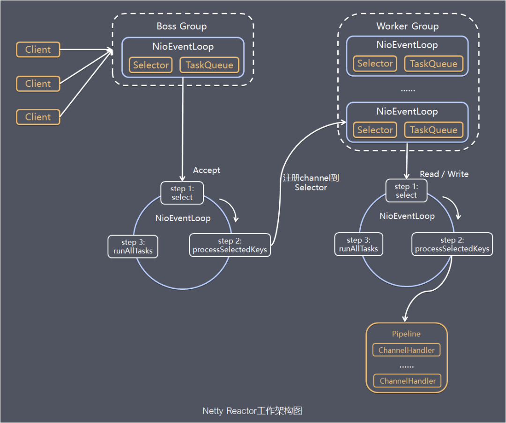
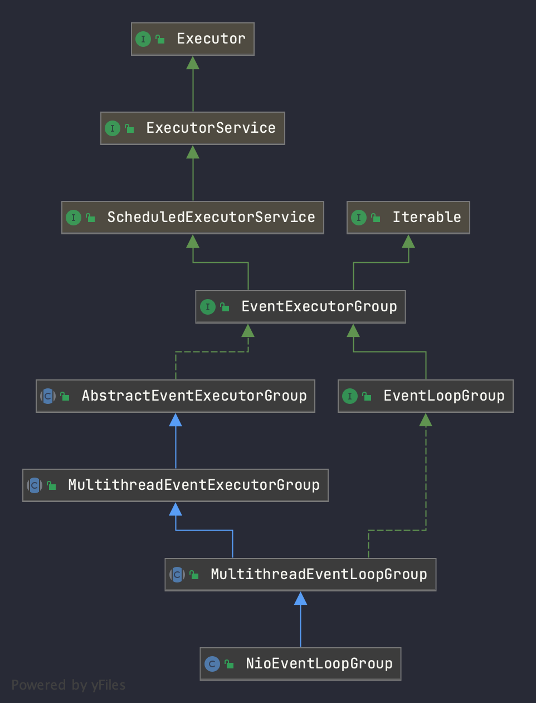
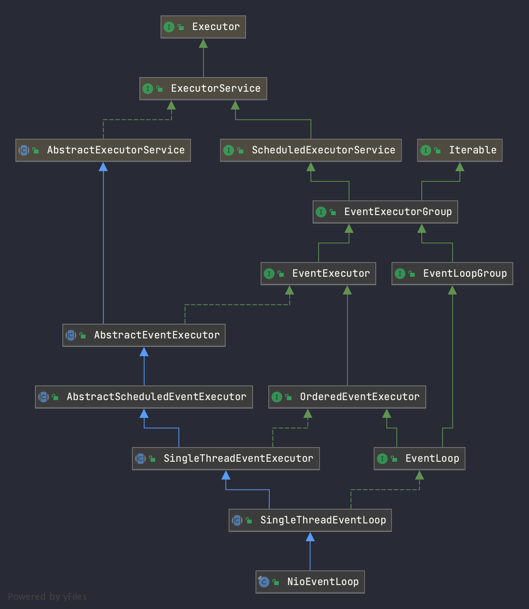
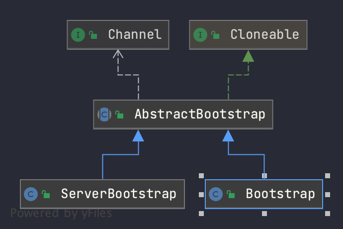

# netty 组件源码阅读
## 1. 简介
> netty 的架构是基于**主从多线程模型**设计的,其图大概如下 



通过使用如下代码,我们便能得到一个netty 服务,其中应用开发者只需关心pipeline 生命周期和业务逻辑的编写,由netty 自身帮助实现高性能网络服务
```java
/**
 * 需要的依赖：
 * <dependency>
 * <groupId>io.netty</groupId>
 * <artifactId>netty-all</artifactId>
 * <version>4.1.52.Final</version>
 * </dependency>
 */
public static void main(String[] args) throws InterruptedException {
    EventLoopGroup bossGroup = new NioEventLoopGroup(1);
    EventLoopGroup workerGroup = new NioEventLoopGroup();
    try {
        ServerBootstrap bootstrap = new ServerBootstrap();
        bootstrap
                .group(bossGroup, workerGroup)
                .channel(NioServerSocketChannel.class)
                .option(ChannelOption.SO_BACKLOG, 128)
                .childOption(ChannelOption.SO_KEEPALIVE, true)
                .childHandler(
                        new ChannelInitializer<SocketChannel>() {
                            // 向 Pipeline 添加业务处理器
                            @Override
                            protected void initChannel(
                                    SocketChannel socketChannel
                            ) throws Exception {
                                socketChannel.pipeline().addLast(
                                        new NettyServerHandler()
                                );
                                
                                // 可以继续调用 socketChannel.pipeline().addLast()
                                // 添加更多 Handler
                            }
                        }
                );
        ChannelFuture channelFuture = bootstrap.bind(8080).sync();
        channelFuture.channel().closeFuture().sync();
    } finally {
        bossGroup.shutdownGracefully();
        workerGroup.shutdownGracefully();
    }
}
```
## 2.组件源码分析
### NioEventLoopGroup 
> 事件循环组基本实现,按照主从多线程模型,一般会有 bossGroup(单线程) 和 WorkGroup(多线程),是N个单线程线程池的实现(N取决于BossGroup还是WorkerGroup)下面我们简要展示一下类图


#### 2.1 AbstractEventExecutorGroup
>主要实现 EventExecutorGroup 的方法,通过调用 ***next*** 获得一个内部的事件循环器,去执行事件循环的功能,组合设计模式。所有通用的方法都有事件循环器解决。
#### 2.2 MultithreadEventExecutorGroup
1. 提供父类 **next** 实现,通过 & 位运算或取余的方式 
2. 提供内部工作线程的初始化,销毁,选择策略 最重要的初始化环节代码如下
3. 子类需要实现 newChild 提供具体工作线程的初始化

```java
checkPositive(nThreads, "nThreads");
// 新建单线程线程池
if (executor == null) {
    executor = new ThreadPerTaskExecutor(newDefaultThreadFactory());
}
// 提供事件循环（工作线程)的初始化
children = new EventExecutor[nThreads];
// 循环调用 newChild 初始化事件循环
for (int i = 0; i < nThreads; i ++) {
    boolean success = false;
    try {
        children[i] = newChild(executor, args);
        success = true;
    } catch (Exception e) {
        throw new IllegalStateException("failed to create a child event loop", e);
    } finally {
        if (!success) {
            for (int j = 0; j < i; j ++) {
                children[j].shutdownGracefully();
            }
            for (int j = 0; j < i; j ++) {
                EventExecutor e = children[j];
                try {
                    while (!e.isTerminated()) {
                        e.awaitTermination(Integer.MAX_VALUE, TimeUnit.SECONDS);
                    }
                } catch (InterruptedException interrupted) {
                    Thread.currentThread().interrupt();
                    break;
                }
            }
        }
    }
}
// 工作线程的选择策略
chooser = chooserFactory.newChooser(children);
// 提供回调,每次有一个工作线程结束+1,当所有工作线程结束后设置 terminationFututre success 为null
final FutureListener<Object> terminationListener = new FutureListener<Object>() {
    @Override
    public void operationComplete(Future<Object> future) throws Exception {
        if (terminatedChildren.incrementAndGet() == children.length) {
            terminationFuture.setSuccess(null);
        }
    }
};
// 为每个工作线程新增Listener回调,建立起EventLoopGroup 和内部的联系,起到监听 Children健康状态的作用
for (EventExecutor e: children) {
    e.terminationFuture().addListener(terminationListener);
}
// 将chileren 的内容赋给readOnlyChildren 提供给外部 Iterable 功能,使用unmodifiableSet 防止循环过程中新增或删除工作线程
Set<EventExecutor> childrenSet = new LinkedHashSet<EventExecutor>(children.length);
Collections.addAll(childrenSet, children);
readonlyChildren = Collections.unmodifiableSet(childrenSet);
```
##### ThreadFactory
> 线程工厂指创建 ***相同属性(优先级,是否守护线程...)*** 线程的工厂,netty 对线程做了扩展,使其能快速获取内部 ThreadLocal的 [FastThreadLocalThread](#参考) 具体不再详细描述
##### DefaultPromise 对象
> 扩展了Future接口,提供对工作线程的统计，等待所有工作线程完全结束后异步通知
#### MultithreadEventLoopGroup
> 提供了工作线程数量计算方式,提供优雅停机,等待停机的一些方法
#### NioEventLoopGroup
> 实现了 ***newChild*** 方法确定了事件循环的具体实现(工作线程)。可变参数指代对象一般只会有三个,后两个为空
* arg0: NIO 的 SelectorProvider
* arg1: 
* arg2: 拒绝策略 
* arg3: 头节点队列生产工厂
* arg4: 尾节点队列生产工厂


### NioEventLoop
> 事件循环组内的工作线程对象

#### AbstractEventExecutor
> 与 `EventLoopGroup` 共同实现了 `EventExecutor`,保证了能代替父类执行EventExecutor的逻辑。另外实现了juc ExecutorService 的功能。定义了一些线程终止的常量
#### AbstractScheduledEventExecutor
> 使用优先级队列处理提交的任务(scheduledTaskQueue),本质上是对优先级队列的CRUD,
#### SingleThreadEventExecutor
>负责内部事件循环工作线程的创建和销毁


#### SingleThreadEventLoop
> 没有核心逻辑
#### NioEventLoop


### ServerBootstrap
> 作为 netty 基本服务启动的辅助引导类,内部包含一个ServerSocketChannel 调用底层套接字监听端口,通过设置合理的参数绑定端口 轮询多路复用器,并把请求发往 WorkerGroup，类图如下


#### AbstractBootstrap
#### ServerBootStrap


## 参考
1. [45张图深度解析netty](https://cloud.tencent.com/developer/article/1754078)
2. [FastThreadLocalThread](https://wenjie.store/archives/netty-about-fastthreadlocal1)