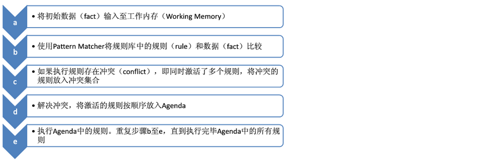

# 各类规则引擎产品分析
## 基于脚本:QLExpress
> 可以认为是另一门基于JVM 的语言,程序运行时即时编译执行。支持**函数**,**运算符重载**,**宏定义**,**运算符扩展**,


## 基于界面:urule
> 是一款已经建模完成的完善的产品,分为开源版本和商业版本,支持基于评分卡,决策表,决策树,决策流等评分规则。是一款功能齐全的规则引擎产品,开源版本支持部分功能

相关概念说明

* 库文件: 对象模型,属性,常量的界面编辑
* 规则集: 提供了通用的规则模板 如果...那么...否则... 使用界面操作或基于脚本的规则集,语法类似drl,是决策表,评分卡,决策树的基本组成(**决策表,决策树,评分卡都可以由规则集来实现**)。
* 决策表: 以表格来表示规则的规则集
* 交叉决策表: 多维度结合计算的维度表与普通决策表相比，交叉决策表的条件由纵向和横向两个维度决定，而普通决策表的条件只是由纵向维度决定；但在普通决策表的动作部分可以是三种类型，分别是赋值、输出和执行方式，而在交叉决策表中动作部分就是纵向和横向两个维度交叉后的单元格的值
* 评分卡: 评分是对个人或机构的相关信息进行分析之后的一种数值表达
* 复杂评分卡: 利用复杂评分卡，可以实现评分时多条件叠加判断，进而使得评分卡的功能更加的完善和强大
* 决策树: 将多个条件按照某个顺序排列形成的树形结构。
* 决策流: 整个的结构类似于工作流，用来对已有的决策集、决策表、交叉决策表、决策树、评分卡、复杂评分卡或其它决策流的执行顺序进行编排，以清晰直观的实现一个大的复杂的业务规则。

## 两者都有
### Drools
>Drools 本身基于脚本 drl 语言,drl 语言和QlExpress 和groovy不一样,它有固定的组成部分,条件匹配,对应执行内容等,结构类似Oracle 存储过程。
```drl
rule "ruleName"
    attributes
    when
        LHS
    then
        RHS
end
```
* rule：关键字，表示规则开始，参数为规则的唯一名称。
* attributes：规则属性，是rule与when之间的参数，为可选项。
* when：关键字，后面跟规则的条件部分。
* LHS(Left Hand Side)：是规则的条件部分的通用名称。它由零个或多个条件元素组成。如果LHS为空，则它将被视为始终为true的条件元素。
* then：关键字，后面跟规则的结果部分。
* RHS(Right Hand Side)：是规则的后果或行动部分的通用名称。
* end：关键字，表示一个规则结束。
#### 执行过程


#### 相关概念说明

* Working Memory：工作内存，drools规则引擎会从Working Memory中获取数据并和规则文件中定义的规则进行模式匹配，所以我们开发的应用程序只需要将我们的数据插入到Working Memory中即可。
* Fact：事实，是指在drools 规则应用当中，将一个普通的JavaBean插入到Working Memory后的对象就是Fact对象。
* Rule Base：规则库，我们在规则文件中定义的规则都会被加载到规则库中。
* Pattern Matcher：匹配器，将Rule Base中的所有规则与Working Memory中的Fact对象进行模式匹配，匹配成功的规则将被激活并放入Agenda中。
* Agenda：议程，用于存放通过匹配器进行模式匹配后被激活的规则。
* Execution Engine：执行引擎，执行Agenda中被激活的规则。
### Workbench

>workbench 基于drools 的web 服务,可以让规则引擎本身和逻辑代码分离。通过上面的核心API可以发现，大部分类名都是以Kie开头。Kie全称为Knowledge Is Everything，即"知识就是一切"的缩写，是Jboss一系列项目的总称。如下图所示，Kie的主要模块有OptaPlanner、Drools、UberFire、jBPM。


### 总结

| 名称      | 社区活跃度                                | 学习成本 | 灵活性                          | 产品完成度                                   | 内聚性                                                                   | 服务化                |
| :-------- | :---------------------------------------- | :------- | :------------------------------ | :------------------------------------------- | :----------------------------------------------------------------------- | --------------------- |
| QLExpress | 3.3k star,216 watching,911 fork,222 user  | 最低     | 灵活,可自己扩展                 | 最低,大部分需要根据业务完善,需要自己设计界面 | 仅单jar包,代码可控                                                       | 无,需要自己开发       |
| Drools    | 4.3k start,290 watching,2.2k fork,79 user | 最高     | 灵活,可自己扩展                 | 适中,有自己的微服务版本,应结合自身业务       | drools 单jar包,WorkBench 涵盖较多JBoss框架,高版本不支持tomcat仅支持JBoss | 有微服务版本,http通信 |
| urule     | 1.4k start,107 watching,251 fork,0 user   | 低       | 具有一定局限性,有自身账号体系等 | 最高,适用于保险,贷款等评估体系,低代码        | 产品完成度高,相对带来的问题较难以排查,并且二开会带来技术债务堆积问题     | 有微服务版本付费      |

## 附录文档
qlExpress: https://github.com/alibaba/QLExpress
drools: https://docs.drools.org/7.68.0.Final/drools-docs/html_single/index.html
urule: http://www.bstek.com/resources/doc/3.x/18diao-shi-xin-xi-shu-chu.html