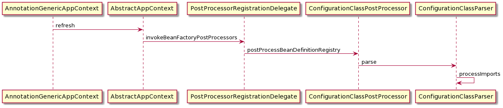
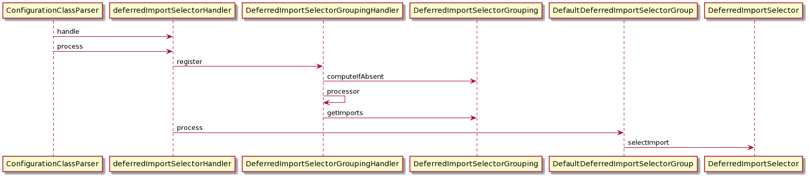

# import 注解用法及源码分析

## 1. import 的三种用法

1. import class 普通类: spring 启动将import 的类转化成 `AnnotatedGenericBeanDefinition` 注册到Spring BeanDefinitionMap 中
2. importSelector: 当返回的class 不能固定写死时,令其填写的class实现 ImportSelector 并重写方法 selectImport返回String 数组,从而获取到多个class,另ImportSelector 有一个子接口 `DeferredImportSelector` 实现该接口会在在该类所有其他候选 Configuration 类解析结束后再解析selectImport 注解
3. importBeanDefinitionRegistrar:  当想直接讲BeanDefinition 直接添加到BeanDefinitonMap时 实现此接口

## 2. import 源码分析

> import 注解在spring refresh 过程的 invokeBeanFactoryPostProcessor 阶段执行ConfigurationClassPostProcessor的postProcessBeanDefinitionRegistry 发生,spring 默认在这个阶段做BeanDefinition扫描并添加到BeanDefinitionMap,此时Spring容器中仅含有**默认注册的class,和AnnotationBeanDefinitionReader需要的5个BeanDefinition**.import 前置流程时序图如下

### 2.1 import 前置流程 


* refresh: spring AppContext的初始化
* invokeBeanFactoryPostProcessor:对BeanFactory 的后置处理,是spring 提供的重要扩展
* postProcessBeanDefinitionRegistry: 是BeanFactoryPostProcessor 的子接口BeanDefinitionRegistryPostProcessor 提供的方法,该方法默认会进行BeanDefinition 扫描解析并添加到BeanDefinitionMap
* parse: 对于javaConfig 方式的配置一般会提供一个基础的class,parse 方法是解析其上带有的所有注解引入其他BeanDefinition的过程
* processImports: 该方法是针对@import 注解的解析

### 2.2 import 解析分析

```java
processImports(configClass, sourceClass, getImports(sourceClass), filter, true);


/**
 * 通过递归collectImport 获得@Import级联导入的所有class 
 * 提供公共的内存 imports 和visited
 * @param import 作为最终收集者,而
 * @param visited 通过过滤已经解析过的class 做剪枝
 */
private Set<SourceClass> getImports(SourceClass sourceClass) throws IOException {
    Set<SourceClass> imports = new LinkedHashSet<>();
    Set<SourceClass> visited = new LinkedHashSet<>();
    collectImports(sourceClass, imports, visited);
    return imports;
}

	
private void collectImports(SourceClass sourceClass, Set<SourceClass> imports, Set<SourceClass> visited)
        throws IOException {
    // visited 列表不存在说明该类导入的内容未被解析过,判断是否有@Import注解确定是否解析
    if (visited.add(sourceClass)) {
        for (SourceClass annotation : sourceClass.getAnnotations()) {
            String annName = annotation.getMetadata().getClassName();
            if (!annName.equals(Import.class.getName())) {
                collectImports(annotation, imports, visited);
            }
        }
        //获得@Import 的value 添加到imports 列表
        imports.addAll(sourceClass.getAnnotationAttributes(Import.class.getName(), "value"));
    }
}

/**
*
* @param configClass the class to search
* @param currentSourceClass the imports collected so far
* @param importCandidates used to track visited classes to prevent infinite recursion
* @param exclusionFilter 过滤器,判断注解是否是普通注解如果是 sourceclass的class是object
* @param checkForCircularImports 检查是否循环import 
* @throws IOException if there is any problem reading metadata from the named class
*/
private void processImports(ConfigurationClass configClass, SourceClass currentSourceClass,
        Collection<SourceClass> importCandidates, Predicate<String> exclusionFilter,
        boolean checkForCircularImports) {
    //当前已经没有import 的内容了 不需要对import 候选者解析
    if (importCandidates.isEmpty()) {
        return;
    }
    //  循环import 这里条件成立说明自己把自己import 进来了 直接抛出异常
    if (checkForCircularImports && isChainedImportOnStack(configClass)) {
        this.problemReporter.error(new CircularImportProblem(configClass, this.importStack));
    }
    else {
        //通过stack 判断是否存在循环解析行为
        this.importStack.push(configClass);
        try {
            for (SourceClass candidate : importCandidates) {
                //解析@Import 内部class判断是否是一个importselector
                if (candidate.isAssignable(ImportSelector.class)) {
                    Class<?> candidateClass = candidate.loadClass();//这里的loadClass 可以不必关心底层是ASM解析的注解还是Annotation解析的,从而获得class
                    // 这里通过反射创建ImportSelector 对象,所以ImpoprtSelector 本质上不是一个Bean,它的存在只是为了执行SelectImport方法而已
                    // 此处反射创建对象时为了能有更多的扩展会执行部分Aware方法填充上对应的对象 如 classloader beanFactory environment resourceLoader
                    ImportSelector selector = ParserStrategyUtils.instantiateClass(candidateClass, ImportSelector.class,
                            this.environment, this.resourceLoader, this.registry);
                    //判断ImportSelector 是否有自身的过滤器,该过滤器会和默认过滤器形成or条件,以过滤某些不想Import的类
                    Predicate<String> selectorFilter = selector.getExclusionFilter();
                    if (selectorFilter != null) {
                        exclusionFilter = exclusionFilter.or(selectorFilter);
                    }
                    // 判断过滤器是不是延迟解析的 这个会在最后一小节进一步分析
                    if (selector instanceof DeferredImportSelector) {
                        this.deferredImportSelectorHandler.handle(configClass, (DeferredImportSelector) selector);
                    }
                    else {
                        // 执行selectImport 方法提供一个 AnnotationMetadata 
                        String[] importClassNames = selector.selectImports(currentSourceClass.getMetadata());
                        Collection<SourceClass> importSourceClasses = asSourceClasses(importClassNames, exclusionFilter);
                        //将获得的class 列表再封装成sourceClass列表,作为当前类的Import 列表继续调用 processImports
                        //也就是 ImportSelector 上的注解不会被解析,但是ImportSelector返回的class 列表仍然作为当前类的Import列表
                        //这个列表里面的class可以是 普通Import,ImportSelector,ImportBeanDefinitionRegistrar
                        // 在selectImport 返回值 执行的阶段不再检查循环依赖
                        processImports(configClass, currentSourceClass, importSourceClasses, exclusionFilter, false);
                    }
                //  
                } else if (candidate.isAssignable(ImportBeanDefinitionRegistrar.class)) {
                    // 上文已经解释过了,此处也可以证明BeanDefinitionRegistrar 也不是一个Bean
                    Class<?> candidateClass = candidate.loadClass();
                    ImportBeanDefinitionRegistrar registrar =
                            ParserStrategyUtils.instantiateClass(candidateClass, ImportBeanDefinitionRegistrar.class,
                                    this.environment, this.resourceLoader, this.registry);
                    // 代码并不立即执行而是添加到当前configClass 的ImportBeanDefinitionRegistrars列表中待其他内容解析完统一运行
                    configClass.addImportBeanDefinitionRegistrar(registrar, currentSourceClass.getMetadata());
                }
                else {
                    // 是普通 Import,注册到ImportStack的Imports 中 key 是@import的value,
                    // value是import by(加了@Import注解的类)这个列表是有顺序的,用于判断循环import,另一方面 也能防止重复Import进来的类被重复解析
                    this.importStack.registerImport(
                            currentSourceClass.getMetadata(), candidate.getMetadata().getClassName());
                    processConfigurationClass(candidate.asConfigClass(configClass), exclusionFilter);
                }
            }
        }
        catch (BeanDefinitionStoreException ex) {
            throw ex;
        }
        catch (Throwable ex) {
            throw new BeanDefinitionStoreException(
                    "Failed to process import candidates for configuration class [" +
                    configClass.getMetadata().getClassName() + "]", ex);
        }
        finally {
            this.importStack.pop();
        }
    }
}


/**
 * 将作为普通类 import 进来的(包含@import 普通类 和ImportSelector 返回的class列表两种)注册到Spring 作为Bean
 *
 */
private void registerBeanDefinitionForImportedConfigurationClass(ConfigurationClass configClass) {
    AnnotationMetadata metadata = configClass.getMetadata();
    AnnotatedGenericBeanDefinition configBeanDef = new AnnotatedGenericBeanDefinition(metadata);

    ScopeMetadata scopeMetadata = scopeMetadataResolver.resolveScopeMetadata(configBeanDef);
    configBeanDef.setScope(scopeMetadata.getScopeName());
    String configBeanName = this.importBeanNameGenerator.generateBeanName(configBeanDef, this.registry);
    AnnotationConfigUtils.processCommonDefinitionAnnotations(configBeanDef, metadata);

    BeanDefinitionHolder definitionHolder = new BeanDefinitionHolder(configBeanDef, configBeanName);
    definitionHolder = AnnotationConfigUtils.applyScopedProxyMode(scopeMetadata, definitionHolder, this.registry);
    this.registry.registerBeanDefinition(definitionHolder.getBeanName(), definitionHolder.getBeanDefinition());
    configClass.setBeanName(configBeanName);

    if (logger.isTraceEnabled()) {
        logger.trace("Registered bean definition for imported class '" + configBeanName + "'");
    }
}

/**
 * 在所有内容加载完后再执行ImportBeanDefinitionRegistrar
 */
private void loadBeanDefinitionsFromRegistrars(Map<ImportBeanDefinitionRegistrar, AnnotationMetadata> registrars) {
    registrars.forEach((registrar, metadata) ->
            registrar.registerBeanDefinitions(metadata, this.registry, this.importBeanNameGenerator));
}

```
### 2.3 DeferImportSelector 调用流程

> deferImportSelector 会使用Handler 先存到默认的列表中,直到所有其他的注解解析完了才执行process方法,process执行selectImport 并形成entry列表，调用processImport 与普通ImportSelector 相似。多了分组和延迟执行的功能




```java
public void handle(ConfigurationClass configClass, DeferredImportSelector importSelector) {
    DeferredImportSelectorHolder holder = new DeferredImportSelectorHolder(configClass, importSelector);
    if (this.deferredImportSelectors == null) {
        // 除非重新设置handler 否则这段代码永远不会执行
        DeferredImportSelectorGroupingHandler handler = new DeferredImportSelectorGroupingHandler();
        handler.register(holder);
        handler.processGroupImports();
    }
    else {
        this.deferredImportSelectors.add(holder);
    }
}

public void process() {
    List<DeferredImportSelectorHolder> deferredImports = this.deferredImportSelectors;
    this.deferredImportSelectors = null;
    try {
        if (deferredImports != null) {
            DeferredImportSelectorGroupingHandler handler = new DeferredImportSelectorGroupingHandler();
            deferredImports.sort(DEFERRED_IMPORT_COMPARATOR);
            // 这里将所有的DeferImportSelector分组,没有返回分组的放入默认分组
            deferredImports.forEach(handler::register);
            handler.processGroupImports();
        }
    }
    finally {
        this.deferredImportSelectors = new ArrayList<>();
    }
}

private class DeferredImportSelectorGroupingHandler {

    
    private final Map<Object, DeferredImportSelectorGrouping> groupings = new LinkedHashMap<>();

    private final Map<AnnotationMetadata, ConfigurationClass> configurationClasses = new HashMap<>();

    public void register(DeferredImportSelectorHolder deferredImport) {
        // deferImportSelector 返回的class作为分组的类别,这个方法可以返回空
        Class<? extends Group> group = deferredImport.getImportSelector().getImportGroup();
        // key 优先使用不为空的Group class如果为空使用Holder对象,value为
        DeferredImportSelectorGrouping grouping = this.groupings.computeIfAbsent(
                (group != null ? group : deferredImport),
                key -> new DeferredImportSelectorGrouping(createGroup(group)));
        grouping.add(deferredImport);
        //保存对应的metadata 和ConfigurationClass 用于selectImport调用
        this.configurationClasses.put(deferredImport.getConfigurationClass().getMetadata(),
                deferredImport.getConfigurationClass());
    }

    public void processGroupImports() {
        for (DeferredImportSelectorGrouping grouping : this.groupings.values()) {
            Predicate<String> exclusionFilter = grouping.getCandidateFilter();
            // getImports 会内部迭代调用selectImports,并组装Entry列表,entry内含调用processImports的入参
            grouping.getImports().forEach(entry -> {
                ConfigurationClass configurationClass = this.configurationClasses.get(entry.getMetadata());
                try {
                    //通过获取的Entry列表重新递归调用 processImports 结束
                    processImports(configurationClass, asSourceClass(configurationClass, exclusionFilter),
                            Collections.singleton(asSourceClass(entry.getImportClassName(), exclusionFilter)),
                            exclusionFilter, false);
                }
                catch (BeanDefinitionStoreException ex) {
                    throw ex;
                }
                catch (Throwable ex) {
                    throw new BeanDefinitionStoreException(
                            "Failed to process import candidates for configuration class [" +
                                    configurationClass.getMetadata().getClassName() + "]", ex);
                }
            });
        }
    }

    private Group createGroup(@Nullable Class<? extends Group> type) {
        // 如果为空,统一认为是DefaultDeferredImportSelectorGroup类型
        Class<? extends Group> effectiveType = (type != null ? type : DefaultDeferredImportSelectorGroup.class);
        //分组对象也支持执行Aware方法,同理group 对象也不是Bean
        return ParserStrategyUtils.instantiateClass(effectiveType, Group.class,
                ConfigurationClassParser.this.environment,
                ConfigurationClassParser.this.resourceLoader,
                ConfigurationClassParser.this.registry);
    }
}

/**
  * getImport 本质上是内部迭代调用group 的process组装Entry列表
  */
public Iterable<Group.Entry> getImports() {
    for (DeferredImportSelectorHolder deferredImport : this.deferredImports) {
        this.group.process(deferredImport.getConfigurationClass().getMetadata(),
                deferredImport.getImportSelector());
    }
    return this.group.selectImports();
}

private static class DefaultDeferredImportSelectorGroup implements Group {

    private final List<Entry> imports = new ArrayList<>();

    @Override
    public void process(AnnotationMetadata metadata, DeferredImportSelector selector) {
        //group内部调用了selectImport 列表 存到Imports 中
        for (String importClassName : selector.selectImports(metadata)) {
            this.imports.add(new Entry(metadata, importClassName));
        }
    }

    @Override
    /**
    * 把process 构建的entry列表返回
    */
    public Iterable<Entry> selectImports() {
        return this.imports;
    }
}
```
## 3. Spring boot 中的实际应用

