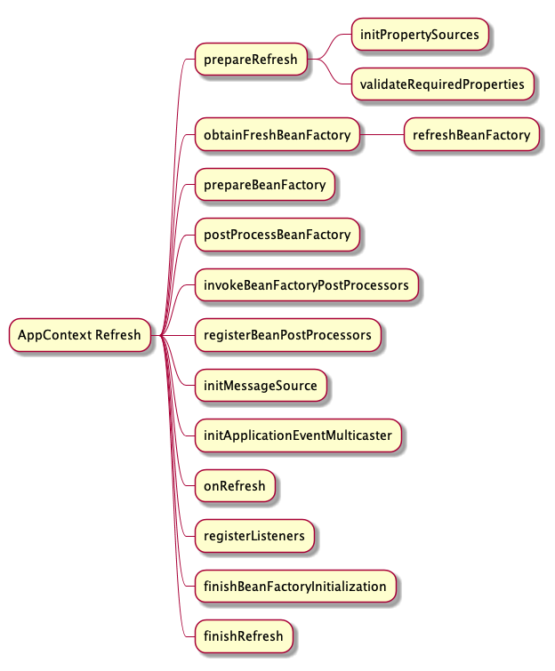

# springboot Refresh 过程


1. **AbstractAppContext**: 提供AppContext 最基础的功能,拥有国际化,事件发布,bean工厂,生命周期处理等基础功能
2. **GenericAppContext**:提供上面抽象类最基础的实现,重写了抽象方法最基础的功能,通用的AppContext
3. **GenericWebAppContext**:提供了一个web 项目相关的ThemeSource和ServletContext 属性的实现,重写了部分初始化方法
4. **AnnotationConfigServletWebAppContext**:该类属于springboot 包下,是在Web基础上提供了包扫描和注解解析的AppContext,是**AnnotationConfigAppContext** 和 **GenericWebAppContext** 的结合体

## 1. refresh 步骤

> refresh 标准流程如下



### 1.1 初始化和校验环境变量 (prepareRefresh)

#### 1.1.1 标准流程

1. 标准流程下修改 `closed`,`active` 两个原子性字段,标识spring容器在启动过程中,
2. 调用 `initPropertySource`空方法
3. 校验必须存在的属性即requireProperty 默认没有,需要自定义扩展可设置environment.setRequiredProperties 设置
4. 初始化 earlyApplicationListeners: 不知道有什么用
5. 初始化 earlyApplicationEvent: 在applicationEventMulticaster 没有初始化之前(也就是AppContext 没有Refresh之前)保存发布的事件,直到applicationEventMulticaster初始化结束后,正式发布这些事件,为了保证refresh 之前发布的事件不丢失

#### 1.1.2 spring boot 流程

1. 重写了prepareRefresh,调用前先清空ASM的历史记录,尽管此时没有内容可清空
2. 然后调用父类的 prepareRefresh
3. 相同流程下调用GenericWebAppContext的有实现的initPropertySources,替换 `environment` 默认的名称为 ***SERVLET_CONTEXT_PROPERTY_SOURCE_NAME*** 的propertySource,从 [environmentPrepared环节](./springboot启动过程.md#123-创建environment)可知创建时使用了stubPropertySource 占位,但由于此时ServletConfig 为空所以不执行
4. 默认requireProperties 为空与标准流程一致

### 1.2 获得并刷新 BeanFactory(obtainFreshBeanFactory)

> 与标准流程相同,主要为设置BeanFactory的SerializationId,该行为会在serializableFactories 中留下一个BeanFactory的弱引用

### 1.3 准备 Beanfactory(prepareBeanFactory)

#### 1.3.1 标准流程

* 获得默认ClassLoader
* 设置SPEL 表达式解析器
* 设置属性解析注册器为addPropertyEditorRegistrar
* 设置autowireByName时跳过的装配属性:aware类型接口统一装配而不走autowireByName
* 设置三个BeanPostProcessor
* 设置自动装配属性池内部对BeanFactory,AppContext 的支持

#### 1.3.2 spring boot 流程

> 与标准流程相同

### 1.4 后处理BeanFactory(PostProcessBeanFactory)

标准流程没内容

#### spring boot 流程

* 新增一个BeanPostProcessor 用于适配ServletContextAware 和ServletConfigAware 填充ServletContext 和 ServletConfig
* 设置扩展的Scope类型 requestScope 和SessionScope

### 1.5 执行BeanFactoryPostProcessor类型对象(invokeBeanFactoryPostProcessors)

#### 1.5.1 标准流程

* 尝试访问AppContext 的beanFactoryPostProcessors 列表判断是否有 BeanDefinitionRegistryPostProcessors 子类型的对象.有就按顺序依次执行 `postProcessBeanDefinitionRegistry`**默认为空列表**
* 尝试调用 getBeanNamesForType 判断BeanFactory 是否有 BeanDefinitionRegistryPostProcessors 类型且实现了PriorityOrdered接口的BeanDefinition,如果有,创建对象/排序/执行 `postProcessBeanDefinitionRegistry`, **默认有一个**`ConfigurationClassPostProcessor` 执行BeanDefinition搜集具体查看附录[@SpringBootApplication ](#springbootapplication-注解分析)
* 尝试调用 getBeanNamesForType 判断BeanFactory 是否有 BeanDefinitionRegistryPostProcessors 类型且实现了Ordered接口,需要重新调用的原因是上一次调用会加入新的BeanDefinition,所以需要重新调用获得,如果有,创建对象/排序/执行 `postProcessBeanDefinitionRegistry`**默认没有**
*

#### 1.5.2 spring boot 流程

* 与标准流程相同,但由于spring boot 扩展 AppliationInitializer 执行,加入了两个新的BeanDefinitionRegistryPostProcessor.
  * CachingMetadataReaderFactoryPostProcessor: 加入MetadataFactory的BeanDefinition,并将其设置给ConfigurationClassPostProcessor
  * ConfigurationWarningsPostProcessor: 检查ComponentScan 扫描的包是否不合理,如包是空串,或包扫描了org 或org.springframework
* 与标准流程相似,区别是CachingMetadataReaderFactoryPostProcessor 置换了MetadataFactory,将缓存替换为弱引用Map,这些缓存一般只用一次,可在回收过程中被GC释放掉,关注applyPropertyValues

## 附录
### @SpringBootApplication 注解分析
> @SpringBootApplication 由多个注解构成,关键注解 @SpringBootConfiguration(本质上与Configuration完全相同),@ComponentScan(包扫描),@EnableAutoConfiguration(和@Import 解析相关),其中包含的比较重要的注解@EnableAutoConfiguration,该注解内部Import了`AutoConfigurationImportSelector`和`AutoConfigurationPackages.Registrar`。AutoConfigurationImportSelector,是一个DeferImportSelector,并且有自己的group,其调用逻辑为

```java
private class DeferredImportSelectorGroupingHandler {
  /**
   * key:如果DeferImportSelector的ImportGroup返回空,使用Holder作为类型,否则使用Group作为类型
   * value: 是一个Grouping 对象,用于进一步包装Group对象
   */
  private final Map<Object, DeferredImportSelectorGrouping> groupings = new LinkedHashMap<>();

  private final Map<AnnotationMetadata, ConfigurationClass> configurationClasses = new HashMap<>();

  public void register(DeferredImportSelectorHolder deferredImport) {
    Class<? extends Group> group = deferredImport.getImportSelector().getImportGroup();
    DeferredImportSelectorGrouping grouping = this.groupings.computeIfAbsent(
        (group != null ? group : deferredImport),
        key -> new DeferredImportSelectorGrouping(createGroup(group)));
    // 一个grouping 需要group 对象和DeferImportSelector 和 ConfigurationClass
    grouping.add(deferredImport);
    this.configurationClasses.put(deferredImport.getConfigurationClass().getMetadata(),
        deferredImport.getConfigurationClass());
  }

  public void processGroupImports() {
    for (DeferredImportSelectorGrouping grouping : this.groupings.values()) {
      //grouping 方法本质上调用Holder列表的所有DeferImportSelector的候选者过滤器,并对过滤器取并集
      Predicate<String> exclusionFilter = grouping.getCandidateFilter();
      // getImport方法会调用Group的process方法对内部DeferImportSelector做统一处理,默认的处理是执行SelectImport
      // spring boot 提供的方法不执行这个方法
      grouping.getImports().forEach(entry -> {
        ConfigurationClass configurationClass = this.configurationClasses.get(entry.getMetadata());
        try {
          processImports(configurationClass, asSourceClass(configurationClass, exclusionFilter),
              Collections.singleton(asSourceClass(entry.getImportClassName(), exclusionFilter)),
              exclusionFilter, false);
        }
        catch (BeanDefinitionStoreException ex) {
          throw ex;
        }
        catch (Throwable ex) {
          throw new BeanDefinitionStoreException(
              "Failed to process import candidates for configuration class [" +
                  configurationClass.getMetadata().getClassName() + "]", ex);
        }
      });
    }
  }

  /**
   * 通过反射创建group 并执行 aware 方法
   * @param type group 的class 可以为空,如果为空用默认类型替代
   */
  private Group createGroup(@Nullable Class<? extends Group> type) {
    Class<? extends Group> effectiveType = (type != null ? type : DefaultDeferredImportSelectorGroup.class);
    return ParserStrategyUtils.instantiateClass(effectiveType, Group.class,
        ConfigurationClassParser.this.environment,
        ConfigurationClassParser.this.resourceLoader,
        ConfigurationClassParser.this.registry);
  }
}

```

