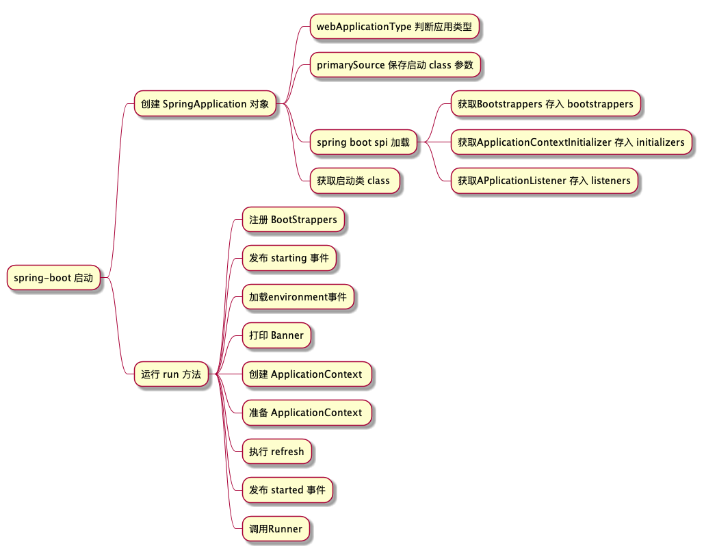

# spring boot 启动过程

> spring boot 启动遵循以下图片显示的过程,本文根据以下过程结合源码分析



## 1.1 springApplication 对象创建

> spring Application对象的创建默认需要六个参数,创建SpringApplication 本质上是填充这六个参数

```java

```

### 1.1.1 缓存启动的Class 参数

* 开发者开发过程中调用spring Application静态方法run的代码示意如下

```java
@SpringBootApplication
public class SpringbootSourceApplication {
    public static void main(String[] args) {
        //第一个参数为某个ConfigurationClass 第二个参数为main方法的命令行参数
        SpringApplication.run(SpringbootSourceApplication.class, args);
    }
}
```

primarySources 保存run方法第一个参数,具体作用如果有阅读过Spring 源码便会清楚,是用于BeanDefintionReader 读取创建

### 1.1.2 判断应用类型

* 如代码所示,本质上是检查classpath下有没有对应class 来判断是web Flux 还是SpringMVC(servlet) 然后保存到 webApplicationType 下 对于Servlet 和 WebFlux 的区别自行百度

```java
NONE,
SERVLET,
REACTIVE;
private static final String[] SERVLET_INDICATOR_CLASSES = { "javax.servlet.Servlet",
        "org.springframework.web.context.ConfigurableWebApplicationContext" };
private static final String WEBMVC_INDICATOR_CLASS = "org.springframework.web.servlet.DispatcherServlet";
private static final String WEBFLUX_INDICATOR_CLASS = "org.springframework.web.reactive.DispatcherHandler";
private static final String JERSEY_INDICATOR_CLASS = "org.glassfish.jersey.servlet.ServletContainer";
private static final String SERVLET_APPLICATION_CONTEXT_CLASS = "org.springframework.web.context.WebApplicationContext";
private static final String REACTIVE_APPLICATION_CONTEXT_CLASS = "org.springframework.boot.web.reactive.context.ReactiveWebApplicationContext";

static WebApplicationType deduceFromClasspath() {
    if (ClassUtils.isPresent(WEBFLUX_INDICATOR_CLASS, null) && !ClassUtils.isPresent(WEBMVC_INDICATOR_CLASS, null)
            && !ClassUtils.isPresent(JERSEY_INDICATOR_CLASS, null)) {
        return WebApplicationType.REACTIVE;
    }
    for (String className : SERVLET_INDICATOR_CLASSES) {
        if (!ClassUtils.isPresent(className, null)) {
            return WebApplicationType.NONE;
        }
    }
    return WebApplicationType.SERVLET;
}
```

### 1.1.3 spring boot SPI 加载流程

* 首个比较重要的流程,spring启动时会加载包下META-INF/spring.factories 文件作为properties, key是固定的class,value 是逗号隔开的class列表,与SpringBean没有任何关系通过调用SpringApplication的 API可以看到具体实现。通过调用 `getSpringFactoriesInstances` 方法可以获得对应的Object 对象,也支持传递自定义参数,所有方法最终会走到下面的代码段

```java
private static Map<String, List<String>> loadSpringFactories(ClassLoader classLoader) {
    // 从缓存中取出Map 如果缓存没有加载Map内容
    Map<String, List<String>> result = cache.get(classLoader);
    if (result != null) {
        return result;
    }

    result = new HashMap<>();
    try {
        // 通过类加载器加载 FACTORIES_RESOURCE_LOCATION(及META-INF/spring.factories)文件
        Enumeration<URL> urls = classLoader.getResources(FACTORIES_RESOURCE_LOCATION);
        while (urls.hasMoreElements()) {
            URL url = urls.nextElement();
            UrlResource resource = new UrlResource(url);
            Properties properties = PropertiesLoaderUtils.loadProperties(resource);
            // key 是某个 class 一般为接口 value一般是该class的具体实现
            for (Map.Entry<?, ?> entry : properties.entrySet()) {
                String factoryTypeName = ((String) entry.getKey()).trim();
                String[] factoryImplementationNames =
                        StringUtils.commaDelimitedListToStringArray((String) entry.getValue());
                for (String factoryImplementationName : factoryImplementationNames) {
                    result.computeIfAbsent(factoryTypeName, key -> new ArrayList<>())
                            .add(factoryImplementationName.trim());
                }
            }
        }

        //  以下代码用于去除重复的value列表 并使用不可变长度的 List装载
        result.replaceAll((factoryType, implementations) -> implementations.stream().distinct()
                .collect(Collectors.collectingAndThen(Collectors.toList(), Collections::unmodifiableList)));
        cache.put(classLoader, result);
    }
    catch (IOException ex) {
        throw new IllegalArgumentException("Unable to load factories from location [" +
                FACTORIES_RESOURCE_LOCATION + "]", ex);
    }
    return result;
}
```

* 最基本的springboot 加载了三个spring.factories分别位于spring-boot,spring-boot-autoconfigure,spring-beans 三个目录下
  * [spring-boot spring.factories](https://github.com/huyiyu/spring-boot/blob/main/spring-boot-project/spring-boot-autoconfigure/src/main/resources/META-INF/spring.factories)
  * [spring-boot-autoconfigure spring.factories](https://github.com/huyiyu/spring-boot/blob/main/spring-boot-project/spring-boot/src/main/resources/META-INF/spring.factories)
  * [spring-beans spring.factories](https://github.com/huyiyu/spring-framework/blob/main/spring-beans/src/main/resources/META-INF/spring.factories)

通过加载此API获得:

* bootstrappers:
* listeners: spring 提供的事件监听器,在spring boot 中被改造成能监听 spring boot 事件
* initializer：

### 1.1.4 获得启动类

* 通过获取异常的堆栈信息获得Class内容

```java
private Class<?> deduceMainApplicationClass() {
    try {
        StackTraceElement[] stackTrace = new RuntimeException().getStackTrace();
        for (StackTraceElement stackTraceElement : stackTrace) {
            if ("main".equals(stackTraceElement.getMethodName())) {
                return Class.forName(stackTraceElement.getClassName());
            }
        }
    }
    catch (ClassNotFoundException ex) {
        // Swallow and continue
    }
    return null;
}
```

## 1.2 springApplication.run 方法

***StopWatch 相关***: StopWatch 是一个对执行时间的统计对象调用start方法时会新建taskInfo对象 记录当前时间,调用stop 会保存当前时间点并结束任务,此时可以通过 API 获取相关信息 如获取最后一个 task 执行时间等
***java.awt.headless***: 当此系统变量设置为 `true` 时,可以在没有外设的条件下调用某些API如在没有显示屏的服务器上使用绘图API生成验证码

### 1.2.1 注册 BootStrappers

> 获取[spring SPI 加载](#113-spring-boot-spi-加载流程)得到的bootstrapper 默认的 Spring boot 的SpringFactory 没有加载 BootStrapper,但在 `spring-cloud-commons`包下会加载 `TextEncryptorConfigBootstrapper` 执行 intitialize 方法

* DefaultBootstrapContext 是一个工厂,存在两级缓存
* 一级缓存 key 是 Class,value 是一个Supplier,二级缓存key 是Class,value 是 Object,用于缓存Supplier的调用结果
* 使用 `register` 往工厂中注册supplier,注册的Bootstrappers 便是利用了该特性在 initiaizer 中注册工厂

### 1.2.2 发布 Starting 事件

> 三个不同的对象

* ***SpringApplicationRunListeners***: 封装了 `SpringApplicationRunListener`对象列表的对象
* ***SpringApplicationRunListener***: spring boot 封装的时间发布订阅工具,默认实现为 `EventPublishingRunListener`, 底层使用spring的发布订阅器 `SimpleApplicationEventMulticaster`
* ***ApplicationListener***: 真正的事件监听器,与原生spring 事件发布订阅保持一致

#### 1.2.2.1 发布事件逻辑

1. 事件发布方法有: `starting`,`environmentPrepare`,`context-prepare`,`contextLoaded`，`started`,`running`,`failed`

```java
void starting(ConfigurableBootstrapContext bootstrapContext, Class<?> mainApplicationClass) {
    doWithListeners("spring.boot.application.starting", (listener) -> listener.starting(bootstrapContext),
            (step) -> {
                if (mainApplicationClass != null) {
                    step.tag("mainApplicationClass", mainApplicationClass.getName());
                }
            });
}
```

2. 当 `SpringApplicationRunListeners` 调用事件发布方法时,本质循环调用了 `SpringApplicationRunListener`列表内部的同名方法,

```java
private void doWithListeners(String stepName, Consumer<SpringApplicationRunListener> listenerAction,
			Consumer<StartupStep> stepAction) {
    StartupStep step = this.applicationStartup.start(stepName);
    // 这里forEach 本质执行 第二个参数(lambda)
    this.listeners.forEach(listenerAction);
    if (stepAction != null) {
        stepAction.accept(step);
    }
    step.end();
}
```

3. 同名方法内部使用SimpleApplicatonEventMulticaster,对[SpringApplication SPI读取的ApplicationListener](#113-spring-boot-spi-加载流程)发布一个对应事件,

```java
public void starting(ConfigurableBootstrapContext bootstrapContext) {
    this.initialMulticaster
            .multicastEvent(new ApplicationStartingEvent(bootstrapContext, this.application, this.args));
}
```

4. 匹配对应的Listener,执行onApplicationEvent方法,匹配的逻辑是 如果Application实现了GenericApplicationListener 直接判断 supportsEventType 和supportsSourceType返回值(自己实现的方法)，否则走Adapter(适配器逻辑)

```java
protected boolean supportsEvent(
        ApplicationListener<?> listener, ResolvableType eventType, @Nullable Class<?> sourceType) {

    GenericApplicationListener smartListener = (listener instanceof GenericApplicationListener ?
            (GenericApplicationListener) listener : new GenericApplicationListenerAdapter(listener));
    return (smartListener.supportsEventType(eventType) && smartListener.supportsSourceType(sourceType));
}

//适配器逻辑 原类型为 SmartApplicationListener 调用supportsEventType 否则 Listener的泛型类型和发布类型能里氏转换,要么没有泛型
public boolean supportsEventType(ResolvableType eventType) {
    if (this.delegate instanceof SmartApplicationListener) {
        Class<? extends ApplicationEvent> eventClass = (Class<? extends ApplicationEvent>) eventType.resolve();
        return (eventClass != null && ((SmartApplicationListener) this.delegate).supportsEventType(eventClass));
    }
    else {
        return (this.declaredEventType == null || this.declaredEventType.isAssignableFrom(eventType));
    }
}

// 是SmartApplicationListener类型 直接调用方法 否则为true
public boolean supportsSourceType(@Nullable Class<?> sourceType) {
    return !(this.delegate instanceof SmartApplicationListener) ||
            ((SmartApplicationListener) this.delegate).supportsSourceType(sourceType);
}

```

#### 1.2.1.2 事件矩阵图

|     事件\监听器     | EnvironmentPostProcessor | `AnsiOutput` | `Logging` | `BackgroundPreinitializer` | `Delegating` | `ParentContextCloser` | `ClearCaches` | `FileEncoding` | `LiquibaseServiceLocator` |
| :-----------------: | :----------------------: | :------------: | :---------- | ---------------------------- | -------------- | :---------------------: | :-------------: | :--------------: | --------------------------- |
|      starting      |            -            |       -       | 1           | 2                            | 3              |            -            |        -        |        -        | 4                           |
| environmentPrepared |                         |               |             |                              |                |                         |                 |                 |                             |
|   contextPrepared   |                         |               |             |                              |                |                         |                 |                 |                             |
|    contextLoaded    |                         |               |             |                              |                |                         |                 |                 |                             |
|       started       |                         |               |             |                              |                |                         |                 |                 |                             |
|       running       |                         |               |             |                              |                |                         |                 |                 |                             |
|       failed       |                         |               |             |                              |                |                         |                 |                 |                             |

1. LoggingApplicationListener-starting: 如果环境变量 `org.springframework.boot.logging.LoggingSystem` 有值反射作为默认日志,否则从[spring-spi](#113-spring-boot-spi-加载流程)中获取第一个LoggingSystem 作为默认日志系统,执行预初始化
2. ~~BackgroundPreinitializer-starting: 没有业务逻辑,因为发布事件类型不属于 ApplicationEnvironmentPreparedEvent 或 ApplicationReadyEvent 或 ApplicationFailedEvent~~
3. ~~DelegatingApplicationListener-starting: 无逻辑 因为事件类型不属于 DelegatingApplicationListener~~
4. ~~LiquibaseServiceLocatorApplicationListener-starting: 无逻辑 没有使用LiquiBase~~

### 1.2.3 创建 Environment 对象
1. 通过判断[webApplicationType](#112-判断应用类型)分别创建不同的Environment对象
2. 设置Environment的转换器 ConvertionService,将命令行传递参数新建PropertySource 设置到最优先级
3. 

### 1.2.4 打印 Banner

### 创建ApplicationContext

### 准备ApplicationContext

### 执行Refresh

### 发布started 事件

### 调用Runner
