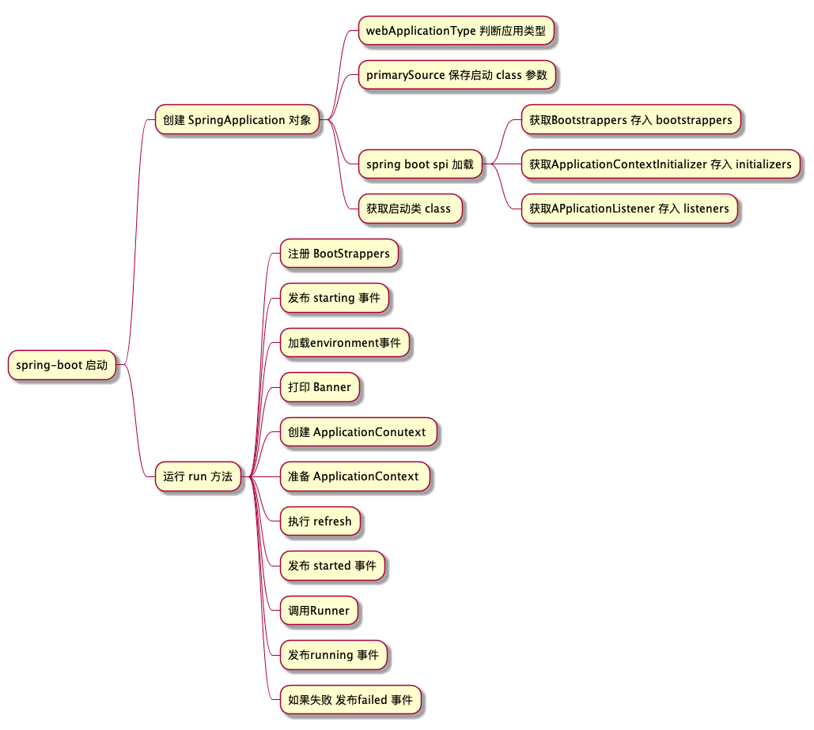

# spring boot 启动过程

> spring boot 启动遵循以下图片显示的过程,本文根据以下过程结合源码分析



## 1.1 springApplication 对象创建

> spring Application对象的创建默认需要七个参数,创建SpringApplication 本质上是填充这七个参数

* resourceLoader: 资源加载器
* primarySources: 启动时传入的class**列表**,其中一个必须带有@SpringApplication 注解
* webApplicationType: 应用类型 servlet 或 webFlux
* bootstrappers: 从SPI加载的 bootstrappers 列表
* initializers: 从SPI加载的 Applicationinitializers 列表
* listeners: 从SPI加载的 ApplicationListener 列表
* mainClass: 写main 方法的类

### 1.1.1 缓存启动的Class 参数

* 开发者开发过程中调用spring Application静态方法run的代码示意如下

```java
@SpringBootApplication
public class SpringbootSourceApplication {
    public static void main(String[] args) {
        //第一个参数为某个ConfigurationClass 第二个参数为main方法的命令行参数
        SpringApplication.run(SpringbootSourceApplication.class, args);
    }
}
```

primarySources 保存run方法第一个参数,具体作用如果有阅读过Spring 源码便会清楚,是用于BeanDefintionReader 读取创建

### 1.1.2 判断应用类型

* 如代码所示,本质上是检查classpath下有没有对应class 来判断是web Flux 还是SpringMVC(servlet) 然后保存到 webApplicationType 下 对于Servlet 和 WebFlux 的区别自行百度

```java
NONE,
SERVLET,
REACTIVE;
private static final String[] SERVLET_INDICATOR_CLASSES = { "javax.servlet.Servlet","org.springframework.web.context.ConfigurableWebApplicationContext" };
private static final String WEBMVC_INDICATOR_CLASS = "org.springframework.web.servlet.DispatcherServlet";
private static final String WEBFLUX_INDICATOR_CLASS = "org.springframework.web.reactive.DispatcherHandler";
private static final String JERSEY_INDICATOR_CLASS = "org.glassfish.jersey.servlet.ServletContainer";
private static final String SERVLET_APPLICATION_CONTEXT_CLASS = "org.springframework.web.context.WebApplicationContext";
private static final String REACTIVE_APPLICATION_CONTEXT_CLASS = "org.springframework.boot.web.reactive.context.ReactiveWebApplicationContext";

static WebApplicationType deduceFromClasspath() {
    if (ClassUtils.isPresent(WEBFLUX_INDICATOR_CLASS, null) && !ClassUtils.isPresent(WEBMVC_INDICATOR_CLASS, null)
            && !ClassUtils.isPresent(JERSEY_INDICATOR_CLASS, null)) {
        return WebApplicationType.REACTIVE;
    }
    for (String className : SERVLET_INDICATOR_CLASSES) {
        if (!ClassUtils.isPresent(className, null)) {
            return WebApplicationType.NONE;
        }
    }
    return WebApplicationType.SERVLET;
}
```

### 1.1.3 spring boot SPI 加载流程

* 首个比较重要的流程,spring启动时会加载包下META-INF/spring.factories 文件作为properties, key是固定的class,value 是逗号隔开的class列表,与SpringBean没有任何关系通过调用SpringApplication的 API可以看到具体实现。通过调用 `getSpringFactoriesInstances` 方法可以获得对应的Object 对象,也支持传递自定义参数,所有方法最终会走到下面的代码段

```java
private static Map<String, List<String>> loadSpringFactories(ClassLoader classLoader) {
    // 从缓存中取出Map 如果缓存没有加载Map内容
    Map<String, List<String>> result = cache.get(classLoader);
    if (result != null) {
        return result;
    }

    result = new HashMap<>();
    try {
        // 通过类加载器加载 FACTORIES_RESOURCE_LOCATION(及META-INF/spring.factories)文件
        Enumeration<URL> urls = classLoader.getResources(FACTORIES_RESOURCE_LOCATION);
        while (urls.hasMoreElements()) {
            URL url = urls.nextElement();
            UrlResource resource = new UrlResource(url);
            Properties properties = PropertiesLoaderUtils.loadProperties(resource);
            // key 是某个 class 一般为接口 value一般是该class的具体实现
            for (Map.Entry<?, ?> entry : properties.entrySet()) {
                String factoryTypeName = ((String) entry.getKey()).trim();
                String[] factoryImplementationNames =
                        StringUtils.commaDelimitedListToStringArray((String) entry.getValue());
                for (String factoryImplementationName : factoryImplementationNames) {
                    result.computeIfAbsent(factoryTypeName, key -> new ArrayList<>())
                            .add(factoryImplementationName.trim());
                }
            }
        }

        //  以下代码用于去除重复的value列表 并使用不可变长度的 List装载
        result.replaceAll((factoryType, implementations) -> implementations.stream().distinct()
                .collect(Collectors.collectingAndThen(Collectors.toList(), Collections::unmodifiableList)));
        cache.put(classLoader, result);
    }
    catch (IOException ex) {
        throw new IllegalArgumentException("Unable to load factories from location [" +
                FACTORIES_RESOURCE_LOCATION + "]", ex);
    }
    return result;
}
```

* 最基本的springboot 加载了三个spring.factories分别位于spring-boot,spring-boot-autoconfigure,spring-beans 三个目录下
  * [spring-boot spring.factories](https://github.com/huyiyu/spring-boot/blob/main/spring-boot-project/spring-boot-autoconfigure/src/main/resources/META-INF/spring.factories)
  * [spring-boot-autoconfigure spring.factories](https://github.com/huyiyu/spring-boot/blob/main/spring-boot-project/spring-boot/src/main/resources/META-INF/spring.factories)
  * [spring-beans spring.factories](https://github.com/huyiyu/spring-framework/blob/main/spring-beans/src/main/resources/META-INF/spring.factories)

通过加载此API获得:

* bootstrappers:
* listeners: spring 提供的事件监听器,在spring boot 中被改造成能监听 spring boot 事件
* initializer：spring boot 提供的在refreshApplication 之前的扩展,实现了该接口可以在prepareRefresh之前执行

### 1.1.4 获得启动类

* 通过获取异常的堆栈信息获得Class内容

```java
private Class<?> deduceMainApplicationClass() {
    try {
        StackTraceElement[] stackTrace = new RuntimeException().getStackTrace();
        for (StackTraceElement stackTraceElement : stackTrace) {
            if ("main".equals(stackTraceElement.getMethodName())) {
                return Class.forName(stackTraceElement.getClassName());
            }
        }
    }
    catch (ClassNotFoundException ex) {
        // Swallow and continue
    }
    return null;
}
```

## 1.2 springApplication.run 方法

***StopWatch 相关***: StopWatch 是一个对执行时间的统计对象调用start方法时会新建taskInfo对象 记录当前时间,调用stop 会保存当前时间点并结束任务,此时可以通过 API 获取相关信息 如获取最后一个 task 执行时间等
***java.awt.headless***: 当此系统变量设置为 `true` 时,可以在没有外设的条件下调用某些API如在没有显示屏的服务器上使用绘图API生成验证码

### 1.2.1 注册 BootStrappers

> 获取[spring SPI 加载](#113-spring-boot-spi-加载流程)得到的bootstrapper 默认的 Spring boot 的SpringFactory 没有加载 BootStrapper,但在 `spring-cloud-commons`包下会加载 `TextEncryptorConfigBootstrapper` 执行 intitialize 方法

* DefaultBootstrapContext 是一个工厂,存在两级缓存
* 一级缓存 key 是 Class,value 是一个Supplier,二级缓存key 是Class,value 是 Object,用于缓存Supplier的调用结果
* 使用 `register` 往工厂中注册supplier,注册的Bootstrappers 便是利用了该特性在 initiaizer 中注册工厂

### 1.2.2 发布 Starting 事件

> 三个不同的对象，具体逻辑参照[事件矩阵图](#事件矩阵图)

* ***SpringApplicationRunListeners***: 封装了 `SpringApplicationRunListener`对象列表的对象
* ***SpringApplicationRunListener***: spring boot 封装的时间发布订阅工具,默认实现为 `EventPublishingRunListener`, 底层使用spring的发布订阅器 `SimpleApplicationEventMulticaster`
* ***ApplicationListener***: 真正的事件监听器,与原生spring 事件发布订阅保持一致

### 1.2.3 创建 Environment 对象

1. 通过判断[webApplicationType](#112-判断应用类型)分别创建不同的Environment对象,通常创建的是Servlet 类型的Environment,所以默认有 `[servletConfigInitParams,servletContextInitParams,systemProperties,systemEnvironment]`四个
2. 设置Environment的转换器 ConvertionService,
3. 将命令行传递参数新建PropertySource(命令行参数传递的规则是--key=value) 设置到最优先级此时如果有命令行参数变成五个 `[commandLineArgs,servletConfigInitParams,servletContextInitParams,systemProperties,systemEnvironment]`
4. ***没有强迫症可以不看,只记住结论!!!*** 将现有的Environment的PropertySource **列表容器** 包装起来提供一个能将 `.`,`-`转换成 `_`去匹配原有PropertySource 的功能,关注[附录:attach 解析](#attach-environment-解析)此时propertySources 六个 `[configurationProperties,commandLineArgs,servletConfigInitParams,servletContextInitParams,systemProperties,systemEnvironment,random]`
5. 发布environment 准备好的消息,参照[事件矩阵图](#事件矩阵图)
6. 将environment 中名称为 `default`的propertySource 移动到最后面,默认没有
7. 配置可选的profile 默认没有
8. 将 `spring.main` 环境变量相关值赋给springApplication
9. 尝试将当前environment根据WebApplicationType 转化成对应类型
10. 尝试再一次执行attach,如果attach过会重新attach

### 1.2.4 打印 Banner

1. 判断BannerMode 是否是开启状态 值从环境变量里面读有 OFF CONSOLE LOG 三种配置
2. Banner 可以有多个,可以支持图片,文本 取名Banner.jpg|gif|jpeg|txt 或配置环境变量spring.banner.location 和 spring.banner.image.location
3. 有 failBackBanner 优先返回
4. 调用 Banner print 方法返回(各个子类去实现)

### 创建ApplicationContext

> 根据[webApplicationType](#112-判断应用类型)创建对应的上下文,一般类型为 AnnotationConfigServletWebServerApplicationContext

### 准备ApplicationContext

1. 设置 environment 对象,ConversionService 对象
2. 将从SPI加载缓存在springApplication 的Initializer设置给ApplicationContext初始化,详看附录[initializer](#initializer-解析)
3. 发布contextPrepared 事件,参照[事件矩阵图](#事件矩阵图)
4. bootstrapContext 发布关闭事件,参照[事件矩阵图](#事件矩阵图)
5. 打印启动信息和profiles 信息
6. 向Spring容器注册启动参数单例
7. 向spring容器注册打印Banner单例
8. 默认设置不允许BeanDefinition 覆盖
9. 判断ApplicationContext类型,提供多种BeanDefinitionReader,解析Main-Class
10. 发布contextLoaded事件,参见附录[事件矩阵图](#事件矩阵图)

### 执行Refresh

参见[springboot Refresh 过程](./springboot%20Refresh%20过程.md)

### 发布started 事件

### 调用Runner


## 附录

### 事件矩阵图

|     事件\监听器     | EnvironmentPostProcessor | `AnsiOutput` | `Logging` | `BackgroundPreinitializer` | `Delegating` | `ParentContextCloser` | `ClearCaches` | `FileEncoding` | `LiquibaseServiceLocator` |
| :-----------------: | :----------------------: | :------------: | :---------: | :--------------------------: | :------------: | :---------------------: | :-------------: | :--------------: | :-------------------------: |
|      starting      |            -            |       -       |      1      |              2              |       3       |            -            |        -        |        -        |              4              |
| environmentPrepared |            1            |       2       |      3      |              4              |       5       |            -            |        -        |        6        |              -              |
|   contextPrepared   |            -            |       -       |      -      |              1              |       2       |            -            |        -        |        -        |              -              |
|    contextLoaded    |            1            |       -       |      2      |              3              |       4       |            -            |        -        |        -        |              -              |
|       started       |            -            |       -       |      1      |              2              |       -       |            -            |        -        |        -        |              -              |
|       running       |                         |               |             |                             |               |                         |                 |                 |                             |
|       failed       |                         |               |             |                             |               |                         |                 |                 |                             |

#### starting

1. LoggingApplicationListener: 如果环境变量 `org.springframework.boot.logging.LoggingSystem` 有值反射作为默认日志,否则从[spring-spi](#113-spring-boot-spi-加载流程)中获取第一个LoggingSystem 作为默认日志系统,执行预初始化
2. ~~BackgroundPreinitializer: 没有业务逻辑,因为发布事件类型不属于 ApplicationEnvironmentPreparedEvent 或 ApplicationReadyEvent 或 ApplicationFailedEvent~~
3. ~~DelegatingApplicationListener: 无逻辑 因为事件类型不属于 DelegatingApplicationListener~~
4. ~~LiquibaseServiceLocatorApplicationListener: 无逻辑 没有使用LiquiBase~~

#### environmentPrepared

1. EnvironmentPostProcessorApplicationListener:  创建从[spring boot SPI](#113-spring-boot-spi-加载流程)加载的EnvironmentPostProcessor 并全量执行postProcessEnvironment,参照[environmentPostProcessor](#environpostprocessor)
2. AnsiOutputApplicationListener:控制台彩色日志输出,`spring.output.ansi.enabled`为 ALWAYS 必开启,为 DETECT 尝试判断 `spring.output.ansi.console-available` 为true 开启,否则都不开启，有意思的是IDEA的spring Boot模板 会在SystemProperties里修改这个默认值为ALWAYS 普通MAIN 方法是DETECT
3. LoggingApplicationListener: 初始化日志相关的环境变量,注册关闭时候的 ShutDownHook
4. BackgroundPreinitializer: 提供提前初始化 DefaultFormattingConversionService Validator AllEncompassingFormHttpMessageConverter ObjectMapper Charset
5. DelegatingApplicationListener:读取环境变量中的 `context.listener.classes` 列表,反射生成对象,new 一个对象,当读取到环境变量准备事件发布时同时发给 `context.listener.classes` 的Listener
6. FileEncodingApplicationListener: 当环境变量 `spring.mandatory-file-encoding` 不等于系统属性 `file.encoding`时异常结束这个应用,默认不写不校验

#### contextPrepared

1. ~~`BackgroundPreinitializer`:无逻辑 因为事件类型匹配不上~~
2. ~~DelegatingApplicationListener: 无逻辑 因为事件类型不属于 DelegatingApplicationListener~~

#### BootstrapContextClosed

没有监听器

#### contextLoaded

> 将从 spring.factories 中加载到的ApplicationListener 放入当前ApplicationContext,并发布contextLoaded事件

1. EnvironmentPostProcessorApplicationListener:
2. LoggingApplicationListener:向spring注册LoggingSystem实例,向spring 注册LoggerGroup实例
3. ~~BackgroundPreinitializer: 没有业务逻辑,因为发布事件类型不属于 ApplicationEnvironmentPreparedEvent 或 ApplicationReadyEvent 或 ApplicationFailedEvent~~
4. ~~DelegatingApplicationListener:没有业务逻辑,因为 `context.listener.classes ` 没有内容~~

#### started

1. ~~`BackgroundPreinitializer`:无逻辑 因为事件类型匹配不上~~
2. ~~DelegatingApplicationListener:没有业务逻辑,因为 `context.listener.classes ` 没有内容~~

#### running


#### failed

### 发布事件逻辑

1. 事件发布方法有: `starting`,`environmentPrepare`,`context-prepare`,`contextLoaded`，`started`,`running`,`failed`

```java
void starting(ConfigurableBootstrapContext bootstrapContext, Class<?> mainApplicationClass) {
    doWithListeners("spring.boot.application.starting", (listener) -> listener.starting(bootstrapContext),
            (step) -> {
                if (mainApplicationClass != null) {
                    step.tag("mainApplicationClass", mainApplicationClass.getName());
                }
            });
}
```

2. 当 `SpringApplicationRunListeners` 调用事件发布方法时,本质循环调用了 `SpringApplicationRunListener`列表内部的同名方法,

```java
private void doWithListeners(String stepName, Consumer<SpringApplicationRunListener> listenerAction,
			Consumer<StartupStep> stepAction) {
    StartupStep step = this.applicationStartup.start(stepName);
    // 这里forEach 本质执行 第二个参数(lambda)
    this.listeners.forEach(listenerAction);
    if (stepAction != null) {
        stepAction.accept(step);
    }
    step.end();
}
```

3. 同名方法内部使用SimpleApplicatonEventMulticaster,对[SpringApplication SPI读取的ApplicationListener](#113-spring-boot-spi-加载流程)发布一个对应事件,

```java
public void starting(ConfigurableBootstrapContext bootstrapContext) {
    this.initialMulticaster
            .multicastEvent(new ApplicationStartingEvent(bootstrapContext, this.application, this.args));
}
```

4. 匹配对应的Listener,执行onApplicationEvent方法,匹配的逻辑是 如果Application实现了GenericApplicationListener 直接判断 supportsEventType 和supportsSourceType返回值(自己实现的方法)，否则走Adapter(适配器逻辑)

```java
protected boolean supportsEvent(
        ApplicationListener<?> listener, ResolvableType eventType, @Nullable Class<?> sourceType) {

    GenericApplicationListener smartListener = (listener instanceof GenericApplicationListener ?
            (GenericApplicationListener) listener : new GenericApplicationListenerAdapter(listener));
    return (smartListener.supportsEventType(eventType) && smartListener.supportsSourceType(sourceType));
}

//适配器逻辑 原类型为 SmartApplicationListener 调用supportsEventType 否则 Listener的泛型类型和发布类型能里氏转换,要么没有泛型
public boolean supportsEventType(ResolvableType eventType) {
    if (this.delegate instanceof SmartApplicationListener) {
        Class<? extends ApplicationEvent> eventClass = (Class<? extends ApplicationEvent>) eventType.resolve();
        return (eventClass != null && ((SmartApplicationListener) this.delegate).supportsEventType(eventClass));
    }
    else {
        return (this.declaredEventType == null || this.declaredEventType.isAssignableFrom(eventType));
    }
}

// 是SmartApplicationListener类型 直接调用方法 否则为true
public boolean supportsSourceType(@Nullable Class<?> sourceType) {
    return !(this.delegate instanceof SmartApplicationListener) ||
            ((SmartApplicationListener) this.delegate).supportsSourceType(sourceType);
}

```

### attach 解析

1. `SpringConfigurationPropertySources`能将普通 `propertySource`列表包装成一个 `configurationPropertySource`

```java
// 实现Iterable接口使其可以使用增强for循环
class SpringConfigurationPropertySources implements Iterable<ConfigurationPropertySource> {


   @Override
   public Iterator<ConfigurationPropertySource> iterator() {
       //source持有普通 ProppertySource 通过adatpt 增强为ConfigurationPropertySource
       return new SourcesIterator(this.sources.iterator(), this::adapt);
   }
}

static SpringConfigurationPropertySource from(PropertySource<?> source) {
   Assert.notNull(source, "Source must not be null");
   // 系统环境变量支持下划线等大小写等解析,并支持-替换_ 普通变量仅支持调用elements.toString
   PropertyMapper[] mappers = getPropertyMappers(source);
   if (isFullEnumerable(source)) {
       // root source 是map的支持
       return new SpringIterableConfigurationPropertySource((EnumerablePropertySource<?>) source, mappers);
   }
   //不是map的
   return new SpringConfigurationPropertySource(source, mappers);
}
```

1. `ConfigurationPropertySourcesPropertySource` 改写了getProperty 使其能从自身的source内部迭代出 `ConfigurationPropertySource`元素,并调用获得ConfigurationProperty value 的功能

```java
//把简单的类似 spring.application.name 转化成elements 对象,elements对象是element的封装 支持 - 中括号等 在返回包装的ConfigurationPropertyName
static ConfigurationPropertyName of(CharSequence name, boolean returnNullIfInvalid) {
 Elements elements = elementsOf(name, returnNullIfInvalid);
 return (elements != null) ? new ConfigurationPropertyName(elements) : null;
}
```

```java
public Object getProperty(String name) {
 // 把原先访问getProperty 转向更复杂的findConfigurationProperty
 ConfigurationProperty configurationProperty = findConfigurationProperty(name);
 return (configurationProperty != null) ? configurationProperty.getValue() : null;
}
private ConfigurationProperty findConfigurationProperty(ConfigurationPropertyName name) {
    if (name == null) {
        return null;
    }
    //从上一步已经解析完成的name中

    for (ConfigurationPropertySource configurationPropertySource : getSource()) {
        ConfigurationProperty configurationProperty = configurationPropertySource.getConfigurationProperty(name);
        if (configurationProperty != null) {
            return configurationProperty;
        }
    }
    return null;
}

// SpringConfigurationPropertySource root source 不是map
public ConfigurationProperty getConfigurationProperty(ConfigurationPropertyName name) {
    if (name == null) {
        return null;
    }
    ConfigurationProperty configurationProperty = super.getConfigurationProperty(name);
    if (configurationProperty != null) {
        return configurationProperty;
    }
    for (String candidate : getMappings().getMapped(name)) {
        Object value = getPropertySource().getProperty(candidate);
        if (value != null) {
            //找到最来源的propertySource
            Origin origin = PropertySourceOrigin.get(getPropertySource(), candidate);
            return ConfigurationProperty.of(name, value, origin);
        }
    }
    return null;
}


//  SpringIterableConfigurationPropertySource root source 是map的
public ConfigurationProperty getConfigurationProperty(ConfigurationPropertyName name) {
    if (name == null) {
        return null;
    }
    // 先调用上面方法看是否能查询到结果
    ConfigurationProperty configurationProperty = super.getConfigurationProperty(name);
    if (configurationProperty != null) {
        return configurationProperty;
    }
    for (String candidate : getMappings().getMapped(name)) {
        Object value = getPropertySource().getProperty(candidate);
        if (value != null) {
            // 找到最开始来源的propertySource
            Origin origin = PropertySourceOrigin.get(getPropertySource(), candidate);
            return ConfigurationProperty.of(name, value, origin);
        }
    }
    return null;
}
```

### environPostProcessor

* ***RandomValuePropertySourceEnvironmentPostProcessor***: 为 environment 新增一个 randomPropertySource 到最后,该 propertySource 支持随机数生成如random.int,random.uuid 此时environement 的propertySource 变成七个 `[configurationProperties,commandLineArgs,servletConfigInitParams,servletContextInitParams,systemProperties,systemEnvironment,random]`
* ***SystemEnvironmentPropertySourceEnvironmentPostProcessor***: 将系统环境变量 `systemEnvironment` 替换成OriginAwareSystemEnvironmentPropertySource
* ***SpringApplicationJsonEnvironmentPostProcessor***: 检查系统内部配置 SPRING_APPLICATION_JSON 或 spring.application.json key 的value  序列化成Map 然后作为一个PropertySource放入Environment
* ***CloudFoundryVcapEnvironmentPostProcessor***: 如果处于 `CloudFoundryVcapEnvironmentPostProcessor` 环境下,新增vcap propertySource
* ***ConfigDataEnvironmentPostProcessor***: 注册 Binder，加载application.properties 和 application.yml 文件
* ***DebugAgentEnvironmentPostProcessor***: 当存在 reactor.tools.agent.ReactorDebugAgent 时执行它的init 方法

### initializer-解析

* **DelegatingApplicationContextInitializer**: 从环境变量 `context.initializer.classes`中获取更多的initializer 执行初始化
* **SharedMetadataReaderFactoryContextInitializer**:新增一个 CachingMetadataReaderFactoryPostProcessor 是 BeanDefinitionRegistryRegistryPostProcessor,这个流程会影响 [refresh](#执行refresh)过程中的InvokeBeanFactoryPostProcessor,可在refresh 环节继续分析
* **ContextIdApplicationContextInitializer**:生成ContextId对象并注册到Spring容器中,名称取环境变量 `spring.application.name` 没有设置成application
* **ConfigurationWarningsApplicationContextInitializer**:新增一个 ConfigurationWarningsPostProcessor 是 BeanDefinitionRegistryRegistryPostProcessor,这个流程会影响 [refresh](#执行refresh)过程中的InvokeBeanFactoryPostProcessor,可在refresh 环节继续分析
* **RSocketPortInfoApplicationContextInitializer**: 添加一个RSocket相关的ApplicationListener RSocket启动时设置端口号到环境变量的 `server.ports`
* **ServerPortInfoApplicationContextInitializer**: 把自己记录到ApplicationListener 当 WebServer 启动时记录端口到 `server.ports`
* **ConditionEvaluationReportLoggingListener**: 添加一个 ApplicationListener，用于打印匹配通过的条件注解
