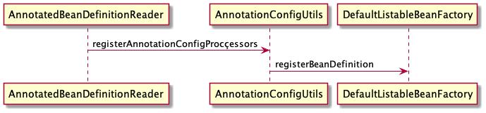

# Java Config 形式 ApplicationContext 启动流程

> spring 启动流程包含以下几个步骤,不同的ApplicationContext实现的流程大同小异,以AnnotationConfigApplicationContext为例
>
> * 调用默认构造方法
> * 注册第一个Configuration对象
> * 执行Refresh过程
>   本文主要以三个过程展开引出后续流程

## 1.1 调用默认构造方法

```java
public AnnotationConfigApplicationContext() {
    // 第一行代码没有任何卵用,所有默认Startup相关的代码预留的通用接口让监控能顺利获取spring运行时的状态,如若要编写监控spring的监控系统可由此扩展,之后看见相关代码都可以跳过
    StartupStep createAnnotatedBeanDefReader = this.getApplicationStartup().start("spring.context.annotated-bean-reader.create");
    this.reader = new AnnotatedBeanDefinitionReader(this);
    // 同理这行代码也不做分析
    createAnnotatedBeanDefReader.end();
    this.scanner = new ClassPathBeanDefinitionScanner(this);
}

public AnnotationConfigApplicationContext(Class<?>... componentClasses) {
    this();
    register(componentClasses);
    refresh();
}

public AnnotationConfigApplicationContext(String... basePackages) {
    this();
    scan(basePackages);
    refresh();
}
```

### 1.1.1 提供启动的简单标记

> 第一行代码没有任何卵用,所有默认Startup相关的代码预留的通用接口让监控能顺利获取spring运行时的状态,如若要编写监控spring的监控系统可由此扩展,之后看见相关代码都可以跳过,同理第三行代码提供结束标记也跳过

### 1.1.2 创建Configuration 的BeanDefinition解析解析器

> 第二行代码创建用于解析onfiguration的对象,该对象仅解析调用applicationContext.register方法的class,(通过构造方法传入class或通过手动调用register 都会直接或间接的调用BeanDefintionReader的register) applicationContext 实际是一个管理者角色,本身不提供实现代码,将内部成员的功能通过包装后提供给外部用户调用,之后讨论的doScan,register,getBean等方法都是此类范畴,这个方法包含environment对象的创建,以及默认5个beanDefiniton的创建。不清楚BeanDefintion可关注[BeanDefintion]()



> registerAnnotationConfigProcessors 源码如下,这里调用registerBeanDefintion 注册了
> * ConfigurationClassPostProcessor
> * AutowiredAnnotationBeanPostProcessor
> * CommonAnnotationBeanPostProcessor
> * EventListenerMethodProcessor
> * DefaultEventListenerFactory
> 五个 **RootBeanDefintion** 
### 1.1.3 创建包扫描器
> ClassPathBeanDefinitionScanner 对象用于提供包扫描,ApplicationContext提供这一行代码,作用是提供doScan方法让外部用户扩展以实现一个包扫描的过程 而@CompomentScan 注解的包扫描用的也是这个Api,但不是ApplicationContext提供的对象,扫描过程中通过手动 new ClassPathBeanDefinitionScanner 操作完成的

## 1.2 注册第一个Configuration对象
> applicationContext 启动时会将当前Spring Application对象的class传入SpringApplication.run方法,本质上也是调用了ApplicationContext.register方法 该方法调用时序图如下
## 1.3 进行包扫描
> 此包扫描类似于@CompomentScan的流程,只需在传入BasePackage 调用scan方法即可,但是@CompomentScan不在这里完成,这个流程经历的步骤如下

1. for循环BasePackage 调用[findCandidateComponents](#findcandidatecomponents)获得符合要求的BeanDefinition列表
2. for循环BeanDefintion列表解析是否需要scope代理
3. 使用用BeanNameGenerate为BeanDefinition生成BeanName,一般为小写短类名 或外部小写短类名.内部类短类名
4. 设置默认的AbstractBeanDefinition的某些值, AutowireMode为NO;DependencyCheck为NO;initMethod为空;DestroyMethod为空;这些对象取自org.springframework.beans.factory.support.BeanDefinitionDefaults,(如果设置了候选规则匹配,会修改autowireCandidate 默认为true)
5. 设置AnnotationBeanDefinition相关属性 扫描 @Lazy @Primary @DependsOn @Role @Description
6. 检查该 class 是否经历过相似的扫描而被重复添加到BeanDefinitionMap中如果是抛出异常 否则正常完成注册
7. **!!!重点**如果Scope的ProxyMode不是NO调用[applyScopedProxyMode](#applyScopedProxyMode)使用FactoryBean注册
8. 注册返回BeanDefinitionHolder

## 1.4 refresh 过程
>打开AbstractApplicationContext 所有的ApplicaitonContext 的refresh 都严格遵循下面代码(删掉了不影响主流程的代码)流程

```java
public void refresh() throws BeansException, IllegalStateException {
    //这个方法内部的内容都是空的主要提供用户初始化或检查环境变量
    prepareRefresh();
    // 这个方法在Generic体系下什么也没做 主要保证不重复执行refresh动作
    // 在 refreshable体系下会执行加载xml或groovy或执行扫描,视具体情况而定
    ConfigurableListableBeanFactory beanFactory = obtainFreshBeanFactory();
    // Prepare the bean factory for use in this context.
    // 注册部分BeanPostProcessor 
    // 将环境变量添加到单例池 
    // 过滤自动装配aware属性
    prepareBeanFactory(beanFactory);
    // 允许在上下文子类中对 bean 工厂进行后处理。
    postProcessBeanFactory(beanFactory);
    // 调用在上下文中注册为 bean 的工厂处理器.这个环节会执行扫描收集对象解析许多常用注解
    invokeBeanFactoryPostProcessors(beanFactory);
    // 注册拦截 bean 创建的 bean 处理器.
    registerBeanPostProcessors(beanFactory);
    // 初始化此上下文的消息源。
    initMessageSource();
    // 为此上下文初始化事件多播器。
    initApplicationEventMulticaster();
    // 初始化特定上下文子类中的其他特殊 bean。
    onRefresh();
    // 检查listener bean 并注册它们。
    registerListeners();
    // 实例化所有剩余的（非延迟初始化）单例。
    finishBeanFactoryInitialization(beanFactory);
    // 最后一步：发布相应的事件。
    finishRefresh();
}
```
筛选过后非常重要的方法如下:
* invokeBeanFactoryPostProcessors
* registerBeanPostProcessors
* finishBeanFactoryInitialization


比较重要的方法如下
* obtainFreshBeanFactory
* prepareBeanFactory
* onRefresh


一般方法如下

* prepareRefresh
* postProcessBeanFactory
* initMessageSource
* initApplicationEventMulticaster
* registerListeners
* finishRefresh

