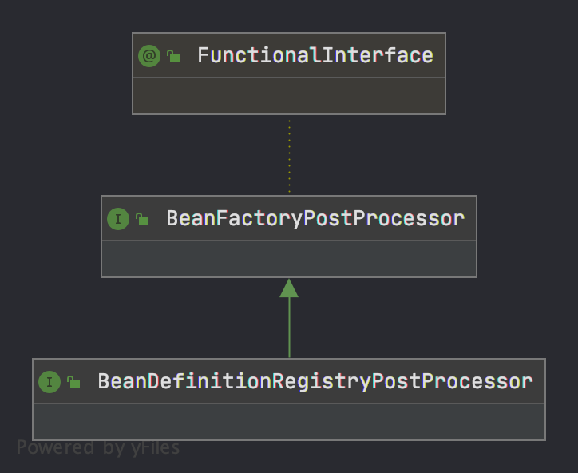

# Spring 执行包扫描的过程
## 1.1  背景
> 日常写的 @Configuration,@Import,@PropertySource,@Bean,@Import ...相关的注解能为spring提供标记创建对象的作用,那么Spring是如何识别这些注解来创建Bean的呢? 读过[BeanDefinition]()相关的读者知道 BeanDefintion是用来形容spring 创建的 "class",而Bean标的是new Object所以本文主要讲的就是spring 如何将class转化为BeanDefinition的过程
## 1.2 看完本文你会明白
1. @Configuration 注解的类能不能是final的 方法能不能final的
2. @ComponentScan 扫描自身吗？
3. @Import 有几种不同的扩展形式？
4. @Bean方法有没有加载顺序,如何保证@Bean方法的加载顺序
5. full类型的Configuration 和lite类型的Configuration 有什么区别
6. 一个类使用@Import 引进另一个类,被引入的先加载还是引入的先加载
7. @Condition注解的原理

## 1.3 正文

spring refresh 过程中有`invokeBeanFactoryPostProcessor`环节,该环节主要逻辑是一段晦涩难懂的代码,首先BeanFactoryPostProcessor接口是Spring提供开发者扩展便于用户在spring 预初始化所有的BeanDefinition后提供扩展的接口,他有子接口BeanDefintionRegistryPostProcessor

```java


```9