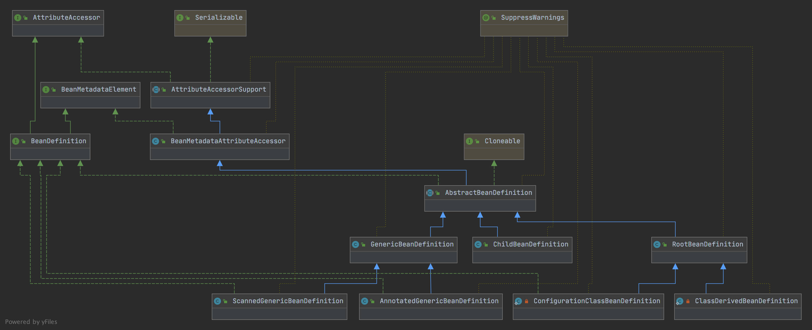

# 第二节 Bean Definiction
> spring 体系复杂,内容繁多,建议初学者先看完[spring体系结构]()以及本节内容，接着再去关心启动流程,生命周期等细节
## 一些问题的回答
* BeanDefiniction 是什么
> BeanDefiniction 是Spring Bean 的抽象,类比 class 是对象的抽象
* 为什么需要 BeanDefiniction 
> spring bean 具有 普通对象无法描述的行为,建立一个描述 spring bean 的行为如(如作用域,自动注入模型,是否作为候选Bean等信息)
## BeanDefiniction 体系结构

* AttributeAccessor: 供了一套对属性CRUD的顶层接口
* AttributeAccessorSupport: 实现了这一组接口内部是一个LinkedHashMap,将Map作为存储空间提供属性的CRUD
* BeanMetaDataElement: 提供了获取 source 的顶层实现
* BeanMetaDataAttributeAccessor: 继承 AttributeAccessorSupport 获得对属性 CRUD 的实现,提供对source get/set 的实现
* BeanDefinition: 是一个子接口,他的两个父接口为 AttributeAccessor(属性访问器),BeanMetadataElement(Bean 元数据元素),
* AbstractBeanDefiniction: 提供一个 Bean Definiction模板并提供一些BeanDefinition 的默认配置它继承AttributeAccessorSupport获得了设置source 和对attrbute 的CRUD,
* GenericBeanDefinition: 通用的BeanDefinition，提供给程序员开发使用,可直接往BeanFactory中设置
* ChildBeanDefinition:***注意, ChildBeanDefinition 不能设置父 BeanDefinition ***
* RootBeanDefinition:***注意, RootBeanDefinition 不能设置父 BeanDefinition ***
* ClassDriverBeanDefinition:
* ScannedGenericBeanDefinition:
* AnnotationGenericBeanDefinition:
## BeanDefinition 属性 (斜体为默认值)
* beanClass: 这个属性决定 该 BeanDefinition 对应的 Bean (以下简称对应的 Bean)类型
* scope: 默认值 SCOPE_DEFAULT 是空字符串,但是判断是否单例为是否 SINGLETON 或 SCOPE_DEFAULT
  * ***SINGLETON***: 对应的 Bean 全局共享单个对象
  * PROTOTYPE: 对应的 Bean 每次使用时创建新对象

* abstractFlag:  默认 ***false***,如果该值为 true 那么该 BeanDefinition 不可用于创建 Bean,仅作为模板使用
* lazyInit: 默认 ***false*** ,如果为 true,对应的 Bean 在启动时不创建,第一次使用时创建
* autowireMode: 自动装配模型
  * ***AUTOWIRE_NO***: 默认类型,不自动装配
  * AUTOWIRED_CONTRACTOR: 构造器装配
  * AUTOWIRED_BY_NAME: 通过指定名称装配
  * AUTOWIRED_BY_TYPE: 通过指定类型装配
  * AUTOWIRE_AUTODETECT: ***已废弃***,如果该方法拥有有参数的构造器,则使用 AUTOWIRED_BY_TYPE,否则使用AUTOWIRED_CONTRACTOR
* dependencyCheck: 依赖检查
  * ***DEPENDENCY_CHECK_NONE***:不检查
  * DEPENDENCY_CHECK_OBJECTS: 检查对象引用
  * DEPENDENCY_CHECK_SIMPLE: 检查基础类型
  * DEPENDENCY_CHECK_ALL: 检查所有类型
* dependsOn: 指定该 BeanDefinition 对应的 Bean 创建时需要先依赖的 Bean 列表
* autowireCandidate: 默认为 ***true*** 指定对应的 Bean 作为自动装配的候选 Bean
* primary: 默认为 ***false***, 对应的 Bean 是否首选自动装配
* qualifiers: 设置装配时名称
* instanceSupplier: 可提供一个 ***Supllier*** 用于提供 Bean
* nonPublicAccessAllowed: 默认为 ***true***,限制是否允许访问非公有构造器和方法
* lenientConstructorResolution: 默认为 ***true***,设置构造方法的宽容模式,用于支持多个构造方法且都满足自动装配的模糊条件
* factoryBeanName: 工厂Bean名称
* factoryMethodName: 工厂方法的名称
* constructorArgumentValues: 构造方法参数
* propertyValues: 对应Bean的属性值
* methodOverrides: 方法覆盖的持有者,用于 `lookup-method`、`replaced-method` 技术
* initMethodName: 设置初始化方法的值
* destroyMethodName: 设置销毁方法的值,这里有一个没营养的知识,当该值为"(inferred)"时,默认使用shutdown 或close的方法名对应方法作为销毁方法
* enforceInitMethod: 判断是否执行init方法
* enforceDestroyMethod: enforceDestroyMethod
* synthetic: 判断该类时程序定义还是用户定义,默认 ***false*** 程序定义,开启aop为true
* role: 指示对应的 Bean 的角色
  * ***ROLE_APPLICATION***: 用户角色
  * ROLE_SUPPORT: 支撑角色,表示是一个大的配置的一部分
  * ROLE_INFRASTRUCTURE: 基础设施角色,表示与用户无关的底层支持
* description: 类的描述,用于备注
* resource: 表示加载类的资源来源