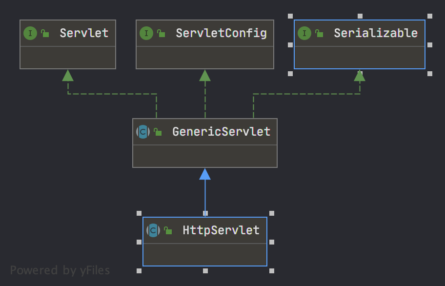

# HttpServlet

> HttpServlet 作为servlet 规范对Http请求的实现,是学习spring mvc 的准备知识



## Servlet 接口

> 由Servlet 规范可知,Servlet 在第一次访问时创建,先执行init 方法,然后使用service 处理请求返回,当容器结束时,调用destroy 清理 servlet,详细信息关注

## GenericServlet

> 作为通用的Servlet 模型,在初始化的时候保存了 servlet 容器传入的 servletConfig(内含web.xml配置中servlet的各种参数),提供了无参数 init 模板方法让子类定制化初始化,提供了简易获取ServletConfig信息的方法

## HttpServlet

> Servlet 规范中实现了Http规范的Servlet,**service** 方法通过判断请求METHOD 的不同分发到doGet,doPost,doPut,doDelete,doHead,doOptions,doTrace 不支持doPatch方法,子类如果不实现 doGet,

```java
 protected void service(HttpServletRequest req, 
    HttpServletResponse resp) throws ServletException, IOException {
    String method = req.getMethod();
    // get会判断当前Servlet是否配置了 Last-Modified (默认-1不生效不支持lastModify用法) 
    // 和 If-Modified-Since 的差异来决定是否执行请求流程,如果设置了lastModified 默认值且
    // 大于If-Modified-Since 此时才会真的执行doGet处理请求返回,如果If-Modified-Since 大
    // 于lastModify 则返回 304告知浏览器资源未改变无需请求
    if (method.equals(METHOD_GET)) {
        long lastModified = getLastModified(req);
        if (lastModified == -1) {
            // servlet 默认不支持 if-modified-since 不想去趟这么复杂的逻辑的坑
            doGet(req, resp);
        } else {
            long ifModifiedSince = req.getDateHeader(HEADER_IFMODSINCE);
            if (ifModifiedSince < lastModified) {
                // 如果servlet 查询的修改时间更大,说明当前前端获得的数据版本已经过期
                // 考虑调用get请求 否则返回304
                // 此时应该将后端的lastModify 写到响应头里面去
                maybeSetLastModified(resp, lastModified);
                doGet(req, resp);
            } else {
                resp.setStatus(HttpServletResponse.SC_NOT_MODIFIED);
            }
        }
    } else if (method.equals(METHOD_HEAD)) {
        // HEAD 方法就当成数据过期的get请求处理来完成,并且HEAD方法不会返回 body
        long lastModified = getLastModified(req);
        maybeSetLastModified(resp, lastModified);
        doHead(req, resp);
    } else if (method.equals(METHOD_POST)) {
        doPost(req, resp);
    
    } else if (method.equals(METHOD_PUT)) {
        doPut(req, resp);
    
    } else if (method.equals(METHOD_DELETE)) {
        doDelete(req, resp);
    
    } else if (method.equals(METHOD_OPTIONS)) {
        doOptions(req,resp);
    
    } else if (method.equals(METHOD_TRACE)) {
        doTrace(req,resp);
    
    } else {
        // 从上面看 HttpServlet 默认不支持PATCH 方法 没有实现返回错误信息
        String errMsg = lStrings.getString("http.method_not_implemented");
        Object[] errArgs = new Object[1];
        errArgs[0] = method;
        errMsg = MessageFormat.format(errMsg, errArgs);
        resp.sendError(HttpServletResponse.SC_NOT_IMPLEMENTED, errMsg);
    }
}
//  doGet,doPost,doPut,doDelete 代码相似,提示语不同
// 从代码结合内部doGet,doPost,doPut,doDelete 四个方法是提供给子类重写的,如果不重写,
// 被调用时会返回405 方法不支持(HTTP1.1版本)/400 不好的请求(HTTP1.0)
protected void doPost(HttpServletRequest req, HttpServletResponse resp)
        throws ServletException, IOException {
    String protocol = req.getProtocol();
    String msg = lStrings.getString("http.method_post_not_supported");
    if (protocol.endsWith("1.1")) {
        resp.sendError(HttpServletResponse.SC_METHOD_NOT_ALLOWED, msg);
    } else {
        resp.sendError(HttpServletResponse.SC_BAD_REQUEST, msg);
    }
}
```

### OPTIONS 方法分析

> 从HTTP规范中,OPTIONS 是服务端对该接口的试探,用于判断当前服务端的当前HTTP接口支持几种请求方法,
> 在HttpServlet的实现中,通过反射来判断 当前请求支持的方法,
> 所以当在springmvc 模式下不支持该方案,***SpringMVC通过其他方案实现了 OPTIONS 方法***

```java
protected void doOptions(HttpServletRequest req, HttpServletResponse resp)
        throws ServletException, IOException{
    // 通过反射获得当前 Servlet 支持的所有方法 默认TRACE 和OPTIONS 一定支持,HEAD 跟随GET
    Method[] methods = getAllDeclaredMethods(this.getClass());
    boolean ALLOW_GET = false;
    boolean ALLOW_HEAD = false;
    boolean ALLOW_POST = false;
    boolean ALLOW_PUT = false;
    boolean ALLOW_DELETE = false;
    boolean ALLOW_TRACE = true;
    boolean ALLOW_OPTIONS = true;
    for (int i=0; i<methods.length; i++) {
        String methodName = methods[i].getName();
        // 当支持doGet方法时,一定支持doHead
        if (methodName.equals("doGet")) {
            ALLOW_GET = true;
            ALLOW_HEAD = true;
        } else if (methodName.equals("doPost")) {
            ALLOW_POST = true;
        } else if (methodName.equals("doPut")) {
            ALLOW_PUT = true;
        } else if (methodName.equals("doDelete")) {
            ALLOW_DELETE = true;
        }
    
    }
    // 拼接字符串并用,分隔 设置到响应头的Allow中
    StringBuilder allow = new StringBuilder();
    if (ALLOW_GET) {
        allow.append(METHOD_GET);
    }
    if (ALLOW_HEAD) {
        if (allow.length() > 0) {
            allow.append(", ");
        }
        allow.append(METHOD_HEAD);
    }
    if (ALLOW_POST) {
        if (allow.length() > 0) {
            allow.append(", ");
        }
        allow.append(METHOD_POST);
    }
    if (ALLOW_PUT) {
        if (allow.length() > 0) {
            allow.append(", ");
        }
        allow.append(METHOD_PUT);
    }
    if (ALLOW_DELETE) {
        if (allow.length() > 0) {
            allow.append(", ");
        }
        allow.append(METHOD_DELETE);
    }
    if (ALLOW_TRACE) {
        if (allow.length() > 0) {
            allow.append(", ");
        }
        allow.append(METHOD_TRACE);
    }
    if (ALLOW_OPTIONS) {
        if (allow.length() > 0) {
            allow.append(", ");
        }
        allow.append(METHOD_OPTIONS);
    }
  
    resp.setHeader("Allow", allow.toString());
}
```

### TRACE 方法分析

> trace 方法直接打印请求的,tomcat 默认不支持trace 请求,应使用方法(tomcat 下修改xml,而spring下直接从AppContext 修改webServer)设置connector 支持TRACE测试

```java
protected void doTrace(HttpServletRequest req, HttpServletResponse resp) 
        throws ServletException, IOException {
    int responseLength;
    // 这里垃圾代码 不同平台换行符号不一样,应该获取系统属性换行符
    String CRLF = "\r\n";
    // 凭借 请求方法 空格 请求URI 协议
    StringBuilder buffer = new StringBuilder("TRACE ").append(req.getRequestURI())
        .append(" ").append(req.getProtocol());
    Enumeration<String> reqHeaderEnum = req.getHeaderNames();
    while( reqHeaderEnum.hasMoreElements() ) {
        String headerName = reqHeaderEnum.nextElement();
        buffer.append(CRLF).append(headerName).append(": ")
            .append(req.getHeader(headerName));
    }
    buffer.append(CRLF);
    // 计算长度返回到response HEADER
    responseLength = buffer.length();
    resp.setContentType("message/http");
    resp.setContentLength(responseLength);
    ServletOutputStream out = resp.getOutputStream();
    out.print(buffer.toString());
}
// spring boot 下修改 可支持Trace方法测试
((TomcatWebServer)((AnnotationConfigServletWebServerApplicationContext)SpringApplication
			.run(PetClinicApplication.class, args))
			.getWebServer())
			.getTomcat()
			.getConnector().
			setAllowTrace(true);
```
