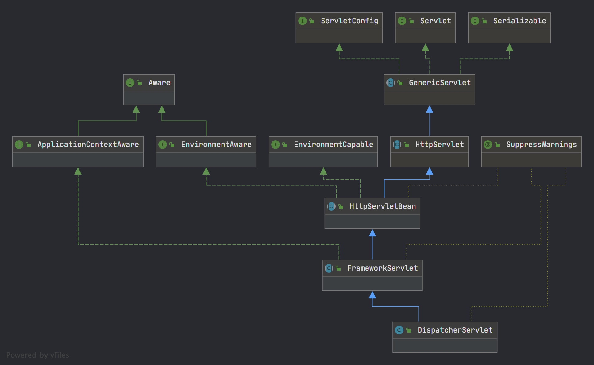

# DispatcherServlet

> DispatcherServlet 是spring mvc 请求入口,通过DispatcherServlet 将所有请求转发到各个Controller,DispatcherServlet类图如下



## HttpServletBean

> HttpServletBean 继承HttpServlet,所以它满足Servlet HTTP 实现的规范,如果不理解请翻阅[HttpServlet](./1_HttpServlet.md)。同时,实现了EnvironmentAware 令其在Spring 加载InitializingBean过程中会为其提供一个Environment对象,作为HttpServlet 的子类 也会执行生命周期规范,在Servlet 加载过程中执行init方法(spring boot 环境下DispatcherServlet是一个spring Bean,而普通tomcat项目中DispatcherServlet 不是,此时spring mvc 给的方案是 重写getEnvironment)。HttpServletBean init方法是最重要的,实际也仅需阅读init 方法,实际在Spring boot项目中虽然不走从web.xml获取参数封装,但我们也可以文艺复兴一下

```java
public final void init() throws ServletException {
    // 验证 servlet 初始化参数有没有漏填必填属性 创建propertyValues
    PropertyValues pvs = new ServletConfigPropertyValues(getServletConfig(), this.requiredProperties);
    if (!pvs.isEmpty()) {
        try {
            // 将当前对象封装成BeanWrapper,实际运行环节 this 不是HttpServletBean 
            // 而应该是DispatcherServlet 所以这里提供了修改DispatcherServlet 属性的方式
            BeanWrapper bw = PropertyAccessorFactory.forBeanPropertyAccess(this);
            ResourceLoader resourceLoader = new ServletContextResourceLoader(getServletContext());
            bw.registerCustomEditor(Resource.class, new ResourceEditor(resourceLoader, getEnvironment()));
            initBeanWrapper(bw);
            //	考虑到最终实现类是 Dispatcher ,预示着可以在 initParam 中配置 DispatcherServlet 的属性
            bw.setPropertyValues(pvs, true);
        } catch (BeansException ex) {
            if (logger.isErrorEnabled()) {
                logger.error("Failed to set bean properties on servlet '" + getServletName() + "'", ex);
            }
            throw ex;
        }
    }
    // 提供一个新的模板方法用于被子类继承实现 init扩展
    initServletBean();
}
/**
 * 实现PropertyValus 将内部Servlet 初始化参数搬运到PropertyValues 封装给DispatcherServlet
 */
private static class ServletConfigPropertyValues extends MutablePropertyValues {
    /**
      * @param config servletConfig 代表Web.xml 中servlet 标签下的配置,从ServletConfig中可获得全局 ServletContext 和 initParam 并留下 initServletBean扩展提供子类初始化
      * @param requiredProperties httpServletBean 提供设置必填属性的集合
      * @throws ServletException 如果必填属性在initParam中没有配置
      */
    public ServletConfigPropertyValues(ServletConfig config, Set<String> requiredProperties)
            throws ServletException {

        Set<String> missingProps = (!CollectionUtils.isEmpty(requiredProperties) ?
                new HashSet<>(requiredProperties) : null);

        Enumeration<String> paramNames = config.getInitParameterNames();
        while (paramNames.hasMoreElements()) {
            String property = paramNames.nextElement();
            Object value = config.getInitParameter(property);
            addPropertyValue(new PropertyValue(property, value));
            if (missingProps != null) {
                missingProps.remove(property);
            }
        }

        // 如果必填属性在web.xml中没有配置
        if (!CollectionUtils.isEmpty(missingProps)) {
            throw new ServletException(
                    "Initialization from ServletConfig for servlet '" + config.getServletName() +
                    "' failed; the following required properties were missing: " +
                    StringUtils.collectionToDelimitedString(missingProps, ", "));
        }
    }
}
```

## FrameworkServlet

> 这个类主导了 DispatcherServlet 启动过程的预热行为,它尤为重要,作为实现了ApplicationContextAware接口的Bean,启动时会为其提供一个ApplicationContext。同理它也通过继承拥有了一个Servlet生命周期的初始化方法 `initServletBean`这个初始化方法主做两件事,初始化Spring mvc 的子容器(spring boot 项目中,spring mvc 与spring 共用一个容器);留下另一个模板方法initFrameworkServlet。而在initAppContext 过程中,FrameworkServlet 根据普通Springmvc 加载和spring boot 项目的特点提供了机制确保onRefresh 必执行且只执行一次(后文中DispatcherServlet利用该方法初始化)。

### Frameworkservlet 初始化阶段
```java
/**
 * 初始化SpringMvc 子容器
 * 重点!!! spring boot 项目中没有父子容器的说法,由于 DispatcherServlet 作为Bean 被创建
 * 执行初始化获得了当前的spring 容器,所以不会走子容器创建,要手动执行 refresh
 */
protected WebApplicationContext initWebApplicationContext() {
    // 先获取 parentContext 固定key ROOT_WEB_APPLICATION_CONTEXT_ATTRIBUTE
    WebApplicationContext rootContext =
            WebApplicationContextUtils.getWebApplicationContext(getServletContext());
    WebApplicationContext wac = null;
    // 判断 当前属性 webApplicationContext 是否已经有值,如果有没启动且没有parent如果有设置rootContext 作为父容器
    if (this.webApplicationContext != null) {
        // 子容器在创建过程中注入,例如 springboot 通过ApplicationContextAware 注入
        wac = this.webApplicationContext;
        if (wac instanceof ConfigurableWebApplicationContext) {
            ConfigurableWebApplicationContext cwac = (ConfigurableWebApplicationContext) wac;
            // 判断子容器是否已经 refresh 过了 这部分代码是为了保证健壮性的可以忽略几乎不执行 因为springboot 是在 refresh 过程中创建的Tomcat 从而加载DispatcherServlet
            if (!cwac.isActive()) {
                if (cwac.getParent() == null) {
                    cwac.setParent(rootContext);
                }
                configureAndRefreshWebApplicationContext(cwac);
            }
        }
    }
    // 查询或创建子容器代码将不会再执行,直接使用一个容器启动
    if (wac == null) {
        // 还没有注入Context 实例 ->
        //看看是否有 已在 servletContext 中注册。 如果存在，则假设
        //已经设置了 ParentContext（如果有）并且用户已经执行了任何初始化，例如设置 contextId
        // 如果 webApplicationContext 没有值,尝试从ServletContext 获取
        wac = findWebApplicationContext();
    }
    if (wac == null) {
        // 实在找不到子容器,自己创建 普通Springmvc 工程的做法
        wac = createWebApplicationContext(rootContext);
    }
    // 尽最大能力保证onRefresh方法一定会执行 无论是Listener 还是在结束后主动调用
    if (!this.refreshEventReceived) {
        synchronized (this.onRefreshMonitor) {
            onRefresh(wac);
        }
    }
    // 当创建完成AppContext 后,如果开启了publishContext保存到ServletContext
    if (this.publishContext) {
        String attrName = getServletContextAttributeName();
        getServletContext().setAttribute(attrName, wac);
    }

    return wac;
}

// 上面代码中无论什么方案 如果 AppContext 没有 refresh 过,则一定会调用 configureAndRefreshWebApplicationContext,

protected void configureAndRefreshWebApplicationContext(ConfigurableWebApplicationContext wac) {
    if (ObjectUtils.identityToString(wac).equals(wac.getId())) {
        // The application context id is still set to its original default value
        // -> assign a more useful id based on available information
        if (this.contextId != null) {
            wac.setId(this.contextId);
        }
        else {
            // Generate default id...
            wac.setId(ConfigurableWebApplicationContext.APPLICATION_CONTEXT_ID_PREFIX +
                    ObjectUtils.getDisplayString(getServletContext().getContextPath()) + '/' + getServletName());
        }
    }
    // 设置ServletContext
    wac.setServletContext(getServletContext());
    // 设置ServletConfig
    wac.setServletConfig(getServletConfig());
    wac.setNamespace(getNamespace());// 将当前
    // 提供一个回调,当执行到发布refresh完成事件时,利用监听机制和内部类机制,回调FrameworkSerlvet的OnApplicationEvent方法
    wac.addApplicationListener(new SourceFilteringListener(wac, new ContextRefreshListener()));
    // appContecxt refresh 过程中回调用 initPropertySource,这里主动保证Servlet 相关的propertySources
    // 能在refresh 之前就绪且初始化完毕
    ConfigurableEnvironment env = wac.getEnvironment();
    if (env instanceof ConfigurableWebEnvironment) {
        // 将原先用于占位的stubPropertySource 更换为真正的 ServletConfig PropertySource 和servletContext PropertySource
        ((ConfigurableWebEnvironment) env).initPropertySources(getServletContext(), getServletConfig());
    }
    // 这是个空方法 目前没有对此处子容器的预初始化
    postProcessWebApplicationContext(wac);
    // 接受初始化器 允许外部对初始化的增强
    applyInitializers(wac);
    // 执行初始化
    wac.refresh();
}
```
### FrameworkServlet 请求处理阶段
>除了对init阶段的干预,FrameworkServlet 重写了service 和 doGet,doPost,doPut,doDelete,doOptions,doTrace 方法导向了processRequest,作为对请求的统一处理

```java
/**
 * patch 方法调用springmvc 流程处理 其他的先委托父类处理
 * @param request servlet 提供的request 对象
 * @param response servlet 提供的response 对象
 */
@Override
protected void service(HttpServletRequest request, HttpServletResponse response)
        throws ServletException, IOException {

    HttpMethod httpMethod = HttpMethod.resolve(request.getMethod());
    //这里支持了 HTTP PATCH 方法
    if (httpMethod == HttpMethod.PATCH || httpMethod == null) {
        processRequest(request, response);
    }
    else {
        super.service(request, response);
    }
}

/**
 * Delegate GET requests to processRequest/doService.
 * <p>Will also be invoked by HttpServlet's default implementation of {@code doHead},
 * with a {@code NoBodyResponse} that just captures the content length.
 * @see #doService
 * @see #doHead
 */
@Override
protected final void doGet(HttpServletRequest request, HttpServletResponse response)
        throws ServletException, IOException {

    processRequest(request, response);
}

/**
 * Delegate POST requests to {@link #processRequest}.
 * @see #doService
 */
@Override
protected final void doPost(HttpServletRequest request, HttpServletResponse response)
        throws ServletException, IOException {

    processRequest(request, response);
}

/**
 * Delegate PUT requests to {@link #processRequest}.
 * @see #doService
 */
@Override
protected final void doPut(HttpServletRequest request, HttpServletResponse response)
        throws ServletException, IOException {

    processRequest(request, response);
}

/**
 * Delegate DELETE requests to {@link #processRequest}.
 * @see #doService
 */
@Override
protected final void doDelete(HttpServletRequest request, HttpServletResponse response)
        throws ServletException, IOException {
    processRequest(request, response);
}

/**
 * HTTP 规范中 options 方法用途为询问系统当前方法可支持什么请求
 * 并在 响应头的Allow 属性中返回,所以默认option请求不必经过 spring mvc 的请求流程
 * springmvc 提供了扩展,首先patch方法允许接受任意方法 其次通过调用HttpServlet 默认的doOptions方法
 * 判断子类是否有覆盖doGet方法,doPost方法，doDelete方法,doPut方法 而doPatch方法一定支持
 */
@Override
protected void doOptions(HttpServletRequest request, HttpServletResponse response)
        throws ServletException, IOException {
    // 判断是否允许转发option 默认允许因为spring mvc 的扩展已经打破了原有的策略,必须写一个新的方案兼容 options 请求
    if (this.dispatchOptionsRequest || CorsUtils.isPreFlightRequest(request)) {
        processRequest(request, response);
        if (response.containsHeader("Allow")) {
            // Proper OPTIONS response coming from a handler - we're done.
            return;
        }
    }

    // 除了允许常规方法之外,也允许提供提供patch方法
    super.doOptions(request, new HttpServletResponseWrapper(response) {
        @Override
        public void setHeader(String name, String value) {
            if ("Allow".equals(name)) {
                value = (StringUtils.hasLength(value) ? value + ", " : "") + HttpMethod.PATCH.name();
            }
            super.setHeader(name, value);
        }
    });
}

/**
  * 提供doTrace 的实现,支持当开关打开时可将tracce 当成一种业务逻辑走
  * spring mvc 的请求链路 但此操作违背了http 规范,所以默认不开启,
  * 而是打印http 请求的详细信息
  *
  */
@Override
protected void doTrace(HttpServletRequest request, HttpServletResponse response)
        throws ServletException, IOException {
    // 判断是否允许转发trace 默认不允许因为如果允许就违背了http规范的初衷 下面代码绝对不会执行
    if (this.dispatchTraceRequest) {
        processRequest(request, response);
        if ("message/http".equals(response.getContentType())) {
            // Proper TRACE response coming from a handler - we're done.
            return;
        }
    }
    super.doTrace(request, response);
}
```

>上面的修改比较次要,便是将所有method 除trace 外导向同一个入口,接下来我们着重讲统一入口processRequest
此处记录了tomcat 封装request 的时区和语言,替换成自定义的规则,在请求处理完成后,又reset回去。同时打印请求日志,使用AppContext 发布请求处理完成事件

```java
/**
 * 全局处理Servlet.service 请求流程的方法 所有 doGet doPost doPut doDelete doPatch doOptions 等
 * 类型的方法最终都会走到这里
 */
protected final void processRequest(HttpServletRequest request, HttpServletResponse response)
        throws ServletException, IOException {
    // 记录开始时间
    long startTime = System.currentTimeMillis();
    // 提供引发错误的异常变量接收
    Throwable failureCause = null;
    // requestContextFilter 环节会根据 request 解析的 locale 内容设置
    // locale context 本质上记录的是语言和时区
    LocaleContext previousLocaleContext = LocaleContextHolder.getLocaleContext();
    LocaleContext localeContext = buildLocaleContext(request);

    RequestAttributes previousAttributes = RequestContextHolder.getRequestAttributes();
    // 本质上旧的requestAttribute 和旧的没有区别,但作者可能为了不修改到tomcat requestAttribute的信息,
    // 在这里新增了一个requestAttribute绑定到当前线程不会修改到tomcat 的requestAttribute
    ServletRequestAttributes requestAttributes = buildRequestAttributes(request, response, previousAttributes);
    WebAsyncManager asyncManager = WebAsyncUtils.getAsyncManager(request);
    // 添加了一个替换ContextHolder的过滤器
    asyncManager.registerCallableInterceptor(FrameworkServlet.class.getName(), new RequestBindingInterceptor());
    // 使用这个方法临时改变localContext 内部的Locale 值,不通过locale 而是从request Header 中获取
    initContextHolders(request, localeContext, requestAttributes);

    try {
        doService(request, response);
    } catch (ServletException | IOException ex) {
        failureCause = ex;
        throw ex;
    } catch (Throwable ex) {
        failureCause = ex;
        throw new NestedServletException("Request processing failed", ex);
    } finally {
        // finally 块中重置ContextHolder
        resetContextHolders(request, previousLocaleContext, previousAttributes);
        if (requestAttributes != null) {
            requestAttributes.requestCompleted();
        }
        // 打印请求返回结果,对请求参数AOP的增强毫无意义,仅需开启FrameworkServlet的日志打印功能即可
        logResult(request, response, failureCause, asyncManager);
        // 发布处理请求事件,可用于审计日志的处理
        publishRequestHandledEvent(request, response, startTime, failureCause);
    }
}

```

## DispatcherServlet

> 从上文可知,DispatcherServlet必定存在两个重要方法,`onRefresh`来提供springmvc 的启动,而 `doService`处理请求逻辑
