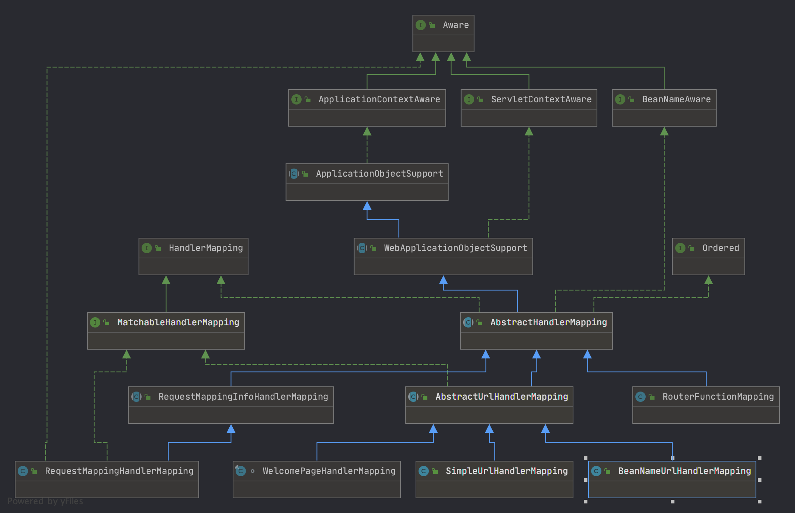

# HandlerMapping (@RequestMapping注解解析) 
> HandlerMapping 是spring mvc 的组件之一,它维护不同的 request 对应的 HandlerExecutionChain 的关系的映射关系，它在初始化的时候扫描系统中的 Handler (Controller 只是Http 的一种实现,其他类似静态文件加载,webSocket,也有自己对应的Handler)对象注册到mappingRegistry 中，请求时通过getHandler 方法分析 request 并组装对应的HandlerExecutionChain 提供给Dispatcher执行后续操作的功能。其继承关系如下图所示



## HandlerMapping 结构(以requestMappingHandlerMapping 为例)

### ApplicationObjectSupport

> 提供对ApplicationContext 和 MessageSourceAccessor 的管理;且ApplicationContext 是MessageSource 的子接口,所以可用ApplicationContext 加上LocaleHolder 构造出消息的国际化处理,子类通过内置方法获得ApplicationContext 和MessageSourceAccessor 在其 Bean 生命周期内,会执行setApplicationContext 方法,此时ApplicationObjectSupport 会执行写好的模板方法如 isContextRequired，requireContextClass,initApplicationContext 等方法从获得的ApplicationContext 对象中获得足够的信息从而加载

```java
public final void setApplicationContext(@Nullable ApplicationContext context) throws BeansException {
    // context 不可能为null,该代码写死在AbstractApplicationContext 上 
    // isContextRequired 判断当context 是不是必须的 所以if成立的条件 context 为null 且 ContextRequired 不是必要的
    if (context == null && !isContextRequired()) {
        // 这个时候都赋值为空就行了
        this.applicationContext = null;
        this.messageSourceAccessor = null;
    }
    else if (this.applicationContext == null) {
        // 当注入的Context有内容 时 先判断一下Context 类型符不符合要求 不符合要求抛异常
        if (!requiredContextClass().isInstance(context)) {
            throw new ApplicationContextException(
                    "Invalid application context: needs to be of type [" + requiredContextClass().getName() + "]");
        }
        this.applicationContext = context;
        // 由于ApplicationContext 是messageSource 的子接口 这里自动里氏转换
        this.messageSourceAccessor = new MessageSourceAccessor(context);
        // 提供子类实现的模板方法 初始化Context 
        initApplicationContext(context);
    }
    else {
       // 如果执行生命周期内 已经有 this.applicationContext 已经有内容 直接抛出异常
        if (this.applicationContext != context) {
            throw new ApplicationContextException(
                    "Cannot reinitialize with different application context: current one is [" +
                    this.applicationContext + "], passed-in one is [" + context + "]");
        }
    }
}
```

### WebApplicationObjectSupport

> 在原有ApplicationObjectSupport 的基础上,添加了基于web环境的适配,例如:contextRequire 为true;装配ApplicationContext 的类型修改为必须为webApplicationContext类型(***一定有ServletContext 对象***),并且顺便提取一下ServletContext,初始化ApplicationContext 也初始化一下ServletContext 本质上基于ApplicationObjectSupport 对 web环境的扩展 ***实际上这个流程并没有使用到servletContext*** 本质上用applicationObjectSupport 就够了

### AbstractHandlerMapping

> HandlerMapping的雏形类,当bean创建过程 InitializingBean 调用模板方法时执行设置好的initApplicationContext方法,此时扫描容器内注册的interceptor 方法,并对webRequestInterceptor 拦截器做适配

```java
/**
 * 重写父类的方法,用于搜索注册成Bean的拦截器 适配拦截器
 */
protected void initApplicationContext() throws BeansException {
    // 扩展处理 spring mvc 拦截器这个方法一般为空
    extendInterceptors(this.interceptors);
    // 搜索spring 各层级容器(包含多级parent) 中是否存在 MappedInterceptor 拦截器
    detectMappedInterceptors(this.adaptedInterceptors);
    // 这里做对webRequestInterceptor 的适配
    initInterceptors();  
}

/**
 * 搜索当前多层级Beanfactory 中类型是 MappedInterceptor 的Bean
 * MappedInterceptor 支持请求路径匹配是否拦截
 * @param mappedInterceptors
 */
protected void detectMappedInterceptors(List<HandlerInterceptor> mappedInterceptors) {
    mappedInterceptors.addAll(BeanFactoryUtils.beansOfTypeIncludingAncestors(
        obtainApplicationContext(), MappedInterceptor.class, true, false).values());
}

/**
 * 将拦截器从 interceptors 列表
 * 迁移到 adaptedInterceptors
 * 并调用 adaptInterceptor适配 WebRequestInterceptor 类型的拦截器
 */
protected void initInterceptors() {
if (!this.interceptors.isEmpty()) {
    for (int i = 0; i < this.interceptors.size(); i++) {
        Object interceptor = this.interceptors.get(i);
        if (interceptor == null) {
            throw new IllegalArgumentException("Entry number " + i + " in interceptors array is null");
        }
        this.adaptedInterceptors.add(adaptInterceptor(interceptor));
    }
}
}

/**
 * 将 WebRequestInterceptor 转成 HandlerInterceptor
 * @param interceptor 原适配器
 * @return 转化后的适配器
 */
protected HandlerInterceptor adaptInterceptor(Object interceptor) {
    if (interceptor instanceof HandlerInterceptor) {
        return (HandlerInterceptor) interceptor;
    }
    else if (interceptor instanceof WebRequestInterceptor) {
        return new WebRequestHandlerInterceptorAdapter((WebRequestInterceptor) interceptor);
    }
    else {
        throw new IllegalArgumentException("Interceptor type not supported: " + interceptor.getClass().getName());
    }
}
```

> 同时,AbstractHandlerMapping 定义了公共的返回Handler返回模板 `getHandler` 方法,留下 `getHandlerInternal`抽象方法给子类实现,getHandler定义了一个HandlerExecutionChain 的组成和执行流程

```java
public final HandlerExecutionChain getHandler(HttpServletRequest request) throws Exception {
    // 通过这个方法获取到对应的HandlerMappings,该方法由子类实现自主返回
    Object handler = getHandlerInternal(request);

    if (handler == null) {
        handler = getDefaultHandler();
    }
    if (handler == null) {
        return null;
    }
    // 如果返回的是String 默认认为返回的内容为BeanName 尝试去BeanFactory内部找
    if (handler instanceof String) {
        String handlerName = (String) handler;
        handler = obtainApplicationContext().getBean(handlerName);
    }
    // 解析请求路径,可能使用旧的urlHelper 或 SPRING 5.3 requestPath
    if (!ServletRequestPathUtils.hasCachedPath(request)) {
        initLookupPath(request);
    }
    // HandlerExecutionChain 本质上是Handler 和Interceptor列表的包装
    HandlerExecutionChain executionChain = getHandlerExecutionChain(handler, request);
    if (logger.isTraceEnabled()) {
        logger.trace("Mapped to " + handler);
    }
    else if (logger.isDebugEnabled() && !DispatcherType.ASYNC.equals(request.getDispatcherType())) {
        logger.debug("Mapped to " + executionChain.getHandler());
    }
    // 当前请求是 CORS的预请求,且当前Handler 继承自CorsConfiguration(也支持CORS)
    if (hasCorsConfigurationSource(handler) || CorsUtils.isPreFlightRequest(request)) {
        // 获取当前请求的配置
        CorsConfiguration config = getCorsConfiguration(handler, request);
        if (getCorsConfigurationSource() != null) {
            // 获取当前的CORS统一配置
            CorsConfiguration globalConfig = getCorsConfigurationSource().getCorsConfiguration(request);
            // 对统一配置和自定义配置做汇总处理
            config = (globalConfig != null ? globalConfig.combine(config) : config);
        }
        if (config != null) {
            // 校验汇总后的CORS配置是否符合要求
            config.validateAllowCredentials();
        }
        // CORS预请求走不一样的请求链路 不执行逻辑 而执行检查请求是否有权限
        executionChain = getCorsHandlerExecutionChain(request, executionChain, config);
    }
    // 返回请求链路
    return executionChain;
}

/**
 * 拦截器需要经过初始化才能使用，所以adapatedInterceptors 保存初始化
 * 完成的拦截器,Mapped拦截器需要关注requestURI 普通拦截器都拦截
 * @param handler 当前选定的Handler
 * @param request 当前request 用于判断MappedHandler 生不生效
 * @return 调用链对象
 */
protected HandlerExecutionChain getHandlerExecutionChain(Object handler, HttpServletRequest request) {
    HandlerExecutionChain chain = (handler instanceof HandlerExecutionChain ?
            (HandlerExecutionChain) handler : new HandlerExecutionChain(handler));

    for (HandlerInterceptor interceptor : this.adaptedInterceptors) {
        // 从当前已注册的拦截器中获取到拦截器列表 如果普通拦截器直接放入
        if (interceptor instanceof MappedInterceptor) {
            MappedInterceptor mappedInterceptor = (MappedInterceptor) interceptor;
            if (mappedInterceptor.matches(request)) {
                chain.addInterceptor(mappedInterceptor.getInterceptor());
            }
        }
        else {
            chain.addInterceptor(interceptor);
        }
    }
    return chain;
}
```

### AbstractHandlerMethodMapping

> AbstractHandlerMethodMapping 提供了对一个Handler 的模板定义,对上,通过对父类 getHandlerInternal 的实现,编写出基于HandlerMetod 模型的请求模板。内部持有的MappingRegistry 维护了注册到HandlerMapping 的所有请求执行流程,对下，实现了启动过程中Handler 扫描的通用模板的同时，预留了子类对Handler 扩展的通用接口

#### AbstractHandlerMethodMapping 预留给子类的接口

```java

/**
 * 确定了 能找到对应的Handler 之后,把 HandlerMaping 固定字符串 匹配的 URI 和缓存到request attr
 * @param mapping the matching mapping 当前方法这个参数没有用
 * @param lookupPath mapping lookup path within the current servlet mapping
 * @param request the current request
 */
protected void handleMatch(T mapping, String lookupPath, HttpServletRequest request) {
    request.setAttribute(HandlerMapping.PATH_WITHIN_HANDLER_MAPPING_ATTRIBUTE, lookupPath);
}

/**
  * 当没有找到对应的 Handler 时的处理
  * @param mappings all registered mappings
  * @param lookupPath mapping lookup path within the current servlet mapping
  * @param request the current request
  * @throws ServletException in case of errors
  */
@Nullable
protected HandlerMethod handleNoMatch(Set<T> mappings, String lookupPath, HttpServletRequest request)
        throws Exception {

    return null;
}

/**
 * 提供给子类实现的识别当前Bean类型是否是一个Handler的方法
 * 默认实现是检查既有@Controller 又有@RequestMapping
 * @param beanType 当前Bean的类型
 * @return 如果满足handler 要求返回true
 */
protected abstract boolean isHandler(Class<?> beanType);

/**
 * 提供给子类实现作为注册到MappingRegistry 的value 的值,这个值作为后面
 * 处理请求逻辑的执行器 默认RequestMappingHandlerMapping 封装了对RequestMapping 注解的解析
 * @param method 带有RequestMapping 的可执行方法
 * @param handlerType 对应的处理类型可能是当前类或当前类的子类
 * @return the mapping, or {@code null} if the method is not mapped
 */
@Nullable
protected abstract T getMappingForMethod(Method method, Class<?> handlerType);

/**
 * 该方法逻辑已经被废弃,用于返回 mapping 的没有参数(@PathVariable) uri
 * @since 5.3
 */
protected Set<String> getDirectPaths(T mapping) {
    Set<String> urls = Collections.emptySet();
    for (String path : getMappingPathPatterns(mapping)) {
        if (!getPathMatcher().isPattern(path)) {
            urls = (urls.isEmpty() ? new HashSet<>(1) : urls);
            urls.add(path);
        }
    }
    return urls;
}

/**
 * 检查映射是否与当前请求匹配，并返回一个（可能是新的）映射，其中包含与当前请求相关的条件。\
 * @param mapping 匹配的映射 通常是一个requestMappingInfo
 * @param request Servlet 提供的request 
 * @return the match, or {@code null} if the mapping doesn't match
 */
@Nullable
protected abstract T getMatchingMapping(T mapping, HttpServletRequest request);

/**
 * 子类实现这个方法通过传入的request 获得一个对不同handler 的比较器
 * requestMappingHandlerMapping 实现了对于@RequestMappingInfo 的比较器
 * @param request 当前请求
 * @return 返回一个比较器
 */
protected abstract Comparator<T> getMappingComparator(HttpServletRequest request);
```

#### AbstractHandlerMethodMapping 初始化过程

> AbstractHandlerMethodMapping 实现了 InitializingBean 接口，在初始化生命周期过程中执行afterPropertyset方法,搜索符合要求的Handler对象,并注册给MappingRegistry

```java
/**
 * spring bean初始化生命周期过程中
 * 执行的方法 即使被子类重写,子类也会回调父类
 * @see #initHandlerMethods
 */
@Override
public void afterPropertiesSet() {
    initHandlerMethods();
}

/**
 * 生命周期执行时,调用的方法 获取所有
 * spring 容器的Bean(开关控制是否获取祖先的) f
 * 过滤掉scopeProxy类(因为scopeproxyFactoryBean一定不是Controller)
 * 然后执行 handlerMethodsInitialized 打印日志记录当前注册了多少个 HandlerMethod
 */
protected void initHandlerMethods() {
    for (String beanName : getCandidateBeanNames()) {
        if (!beanName.startsWith(SCOPED_TARGET_NAME_PREFIX)) {
            // 检查所有BeanName 是否同时具备又有 @RequestMapping 又有 @Controller
            processCandidateBean(beanName);
        }
    }
    // 打印生成了多少个Handler映射关系
    handlerMethodsInitialized(getHandlerMethods());
}

/**
 * 获取所有的Bean 的BeanName 根据 detectHandlerMethodsInAncestorContexts
 * 判断是否从祖先中查询 controller
 */
protected String[] getCandidateBeanNames() {
    return (this.detectHandlerMethodsInAncestorContexts ?
            BeanFactoryUtils.beanNamesForTypeIncludingAncestors(obtainApplicationContext(), Object.class) :
            obtainApplicationContext().getBeanNamesForType(Object.class));
}


/**
  * 对传入的BeanName 判断是不是一个Controller
  * 如果是,注册到mappingRegistry (生成requestMappingInfo 和 HandlerMethod 对应关系)
  * 不是忽略
  * @param beanName bean 名称
  */
protected void processCandidateBean(String beanName) {
    Class<?> beanType = null;
    try {
        // 根据BeanName获取类型 本质上调用 BeanFactory的getType
        beanType = obtainApplicationContext().getType(beanName);
    }
    catch (Throwable ex) {
        // 无法识别的Bean类型 可以直接跳过
        if (logger.isTraceEnabled()) {
            logger.trace("Could not resolve type for bean '" + beanName + "'", ex);
        }
    }
    // getType 异常可能导致beanType为空
    // 判断是否是Handler 条件是 有@RequestMapping 和@Controller 两个注解
    if (beanType != null && isHandler(beanType)) {
        // 通过benName搜索带 requestMapping 的方法,从而向MapperRegistry 注册
        detectHandlerMethods(beanName);
    }
}

/**
 * 扫描Controller 有多少方法
 * 默认 Handler	是  一个 beanname string类型.
 * 仅有processCandidateBean 调用了 该方法
 * @param handler controller 对象的 beanName
 */
protected void detectHandlerMethods(Object handler) {
    // 获取对应的类型,仅有一个方法调用,此处一定走BeanFactory.getType 获取Bean类型
    Class<?> handlerType = (handler instanceof String ?
            obtainApplicationContext().getType((String) handler) : handler.getClass());

    if (handlerType != null) {
        // 去掉 Spring AOP代理 返回用户编写的类
        Class<?> userType = ClassUtils.getUserClass(handlerType);
        // 获取class 反射(自身+接口)获得 method  传递给外部回调接口调用getMappingForMethod 生成valueß
        Map<Method, T> methods = MethodIntrospector.selectMethods(userType,
                (MethodIntrospector.MetadataLookup<T>) method -> {
                    try {
                        // 子类实现这个接口从而提供注册到mappingRegistry 的mapping 对象
                        return getMappingForMethod(method, userType);
                    }
                    catch (Throwable ex) {
                        throw new IllegalStateException("Invalid mapping on handler class [" +
                                userType.getName() + "]: " + method, ex);
                    }
                });
        // 打印requestMapping 扫描过程
        if (logger.isTraceEnabled()) {
            logger.trace(formatMappings(userType, methods));
        }
        else if (mappingsLogger.isDebugEnabled()) {
            mappingsLogger.debug(formatMappings(userType, methods));
        }
        methods.forEach((method, mapping) -> {
            // 查找可运行的方法,之前拿到的Method 可能是接口的
            Method invocableMethod = AopUtils.selectInvocableMethod(method, userType);
            // 向 mappingRegistry 注册这个requestMapping
            registerHandlerMethod(handler, invocableMethod, mapping);
        });
    }
}

/**
 * 根据关联元数据的查找，选择给定目标类型的方法。
 * <p>调用者通过 {@link MetadataLookup} 参数定义感兴趣的方法，允许将相关元数据收集到结果映射中。
 * @param targetType 目标类型
 * @param metadataLookup 一个 {@link MetadataLookup} 回调来检查感兴趣的方法，
 * 如果存在匹配，则返回与给定方法关联的非空元数据，或者 {@code null} 不匹配
 * @return 与其元数据关联的选定方法（按检索顺序），或者在不匹配的情况下为空映射
 */
public static <T> Map<Method, T> selectMethods(Class<?> targetType, final MetadataLookup<T> metadataLookup) {
    // 定义收集回调结果并作为结果返回的容器
    final Map<Method, T> methodMap = new LinkedHashMap<>();
    Set<Class<?>> handlerTypes = new LinkedHashSet<>();
    Class<?> specificHandlerType = null;

    if (!Proxy.isProxyClass(targetType)) {
        specificHandlerType = ClassUtils.getUserClass(targetType);
        // 将当前类添加到handlerTypes 里
        handlerTypes.add(specificHandlerType);
    }
    // 获得当前Controller 实现的所有接口名称 以及本身
    handlerTypes.addAll(ClassUtils.getAllInterfacesForClassAsSet(targetType));
    for (Class<?> currentHandlerType : handlerTypes) {
        //获得 targetClass 如果当前Controller 有Cglib代理那么targetClass 是原类 否则是当前 迭代的类型（类或接口）
        final Class<?> targetClass = (specificHandlerType != null ? specificHandlerType : currentHandlerType);
        ReflectionUtils.doWithMethods(currentHandlerType, method -> {
            // 通过targetClass 尝试获取到实现类的对应Method 对象
            Method specificMethod = ClassUtils.getMostSpecificMethod(method, targetClass);
            // 将获取的方法回调用外部传入的lambda 表达式
            T result = metadataLookup.inspect(specificMethod);
            if (result != null) {
                // 获取对应的 泛型桥接方法
                Method bridgedMethod = BridgeMethodResolver.findBridgedMethod(specificMethod);
                // 两者相等说明没有桥接方法，
                // 返回为空说明泛型方法没有独立的@RequestMapping 注解 此时可以直接put 如果不为空说明当前的Method 可能不符合规范,先不存
                if (bridgedMethod == specificMethod || metadataLookup.inspect(bridgedMethod) == null) {
                    methodMap.put(specificMethod, result);
                }
            }
        }, ReflectionUtils.USER_DECLARED_METHODS);
    }
    // 返回处理的Method 方法key 是Method value 是 RequestMappingInfo 对象(注意Spring mvc和web-flux返回的类对象名称一样,但是类不再同一个包下)
    return methodMap;
}

```

#### AbstractHandlerMethodMapping 注册到MappingRegistry流程

```java
/**
 * 透传给mappingRegistry 注册 requestMapping
 * @param mapping requestMappingInfo 对象(mvc 或webflux)
 * @param handler beanName
 * @param method 对应的Method
 */
public void register(T mapping, Object handler, Method method) {
    this.readWriteLock.writeLock().lock();
    try {
        // 创建 HandlerMethod 对象 需要beanName 和对应方法
        HandlerMethod handlerMethod = createHandlerMethod(handler, method);
        // 验证对应的RequestMappingInfo是否已经存在
        validateMethodMapping(handlerMethod, mapping);
        // 这里通过类名.this 获取的是外部类的this 但不一定是当前类内部的方法 有可能是子类的方法
        // 另外 directPaths 获取的是URL上没有参数的路径
        Set<String> directPaths = AbstractHandlerMethodMapping.this.getDirectPaths(mapping);
        for (String path : directPaths) {
            this.pathLookup.add(path, mapping);
        }
        // 注册到nameLookup key 是当前类大写字母组合#方法名 value 是 对应的handlerMethod对象
        String name = null;
        if (getNamingStrategy() != null) {
            name = getNamingStrategy().getName(handlerMethod, mapping);
            addMappingName(name, handlerMethod);
        }
        // 检查@CorsOrigin注解 并结合默认cors配置获得corsConfig 配置
        CorsConfiguration corsConfig = initCorsConfiguration(handler, method, mapping);
        if (corsConfig != null) {
            corsConfig.validateAllowCredentials();
            this.corsLookup.put(handlerMethod, corsConfig);
        }
        // 保存当前 requestMappingInfo
        this.registry.put(mapping,
                new MappingRegistration<>(mapping, handlerMethod, directPaths, name, corsConfig != null));
    }
    finally {
        this.readWriteLock.writeLock().unlock();
    }
}

private void validateMethodMapping(HandlerMethod handlerMethod, T mapping) {
    // 由于registry 是普通的HashMap 所以requestMappingInfo 对象必然重写了 equals 和 hashcode 方法
    // 通过统计所有成员是否相等来判断两个requestMappingInfo是否相等
    MappingRegistration<T> registration = this.registry.get(mapping);
    //如果当前持有的requestMappingInfo有对应的HandlerMethod 说明该 Handler 已经注册,抛出异常
    HandlerMethod existingHandlerMethod = (registration != null ? registration.getHandlerMethod() : null);
    if (existingHandlerMethod != null && !existingHandlerMethod.equals(handlerMethod)) {
        throw new IllegalStateException(
                "Ambiguous mapping. Cannot map '" + handlerMethod.getBean() + "' method \n" +
                handlerMethod + "\nto " + mapping + ": There is already '" +
                existingHandlerMethod.getBean() + "' bean method\n" + existingHandlerMethod + " mapped.");
    }
}
```

#### AbstractHandlerMethodMapping 对 getHandlerInternal 的通用实现
```java
/**
 * 通用的通过request 获取对应HandlerMethod 的做法
 */
@Override
protected HandlerMethod getHandlerInternal(HttpServletRequest request) throws Exception {
    // 解析request 请求 获得整个path
    String lookupPath = initLookupPath(request);
    this.mappingRegistry.acquireReadLock();
    try {
        //通过lookupHandlerMethod 获取对应的	HandlerMethod 方法
        HandlerMethod handlerMethod = lookupHandlerMethod(lookupPath, request);
        return (handlerMethod != null ? handlerMethod.createWithResolvedBean() : null);
    }
    finally {
        this.mappingRegistry.releaseReadLock();
    }
}

/**
 * 查找当前请求的最佳匹配处理程序方法。如果找到多个匹配项，则选择最佳匹配项。
 * @param lookupPath 通过解析获得的URI
 * @param request the current request 当前request
 * @return  返回最佳匹配项的handlerMethod 如果没有匹配 那么关注
 * @see #handleMatch(Object, String, HttpServletRequest)
 * @see #handleNoMatch(Set, String, HttpServletRequest)
 */
@Nullable
protected HandlerMethod lookupHandlerMethod(String lookupPath, HttpServletRequest request) throws Exception {
    List<Match> matches = new ArrayList<>();
    // 先匹配所有URL 没有参数的方法 看是否能拿到RequestMappingInfo
    List<T> directPathMatches = this.mappingRegistry.getMappingsByDirectPath(lookupPath);

    if (directPathMatches != null) {
        addMatchingMappings(directPathMatches, matches, request);
    }
    // 如果匹配直接路径匹配不上 那么 遍历所有registry 获得registrations匹配
    if (matches.isEmpty()) {
        addMatchingMappings(this.mappingRegistry.getRegistrations().keySet(), matches, request);
    }
    // 当matches 有内容意味着 匹配通过
    if (!matches.isEmpty()) {
        //获取第一个元素作为临时最佳匹配
        Match bestMatch = matches.get(0);
        // 如果匹配的Matches 不止一个
        if (matches.size() > 1) {
            // 提供一个比较器对匹配结果进行排序 然后 获取第一个
            Comparator<Match> comparator = new MatchComparator(getMappingComparator(request));
            matches.sort(comparator);
            bestMatch = matches.get(0);
            if (logger.isTraceEnabled()) {
                logger.trace(matches.size() + " matching mappings: " + matches);
            }
            // 如果请求是 CORS的options 请求 那么选择CORS-OPTIONS 独有的HandlerMethod
            if (CorsUtils.isPreFlightRequest(request)) {
                for (Match match : matches) {
                    if (match.hasCorsConfig()) {
                        return PREFLIGHT_AMBIGUOUS_MATCH;
                    }
                }
            }
            else {
                // 否则获取 次优 的 requestMapping 方案 和最优的进行比较
                Match secondBestMatch = matches.get(1);
                // 如果 两者比较结果返回0 (评分相同) 那么抛出异常 匹配到多个 HandlerMethod
            if (comparator.compare(bestMatch, secondBestMatch) == 0) {
                    Method m1 = bestMatch.getHandlerMethod().getMethod();
                    Method m2 = secondBestMatch.getHandlerMethod().getMethod();
                    String uri = request.getRequestURI();
                    throw new IllegalStateException(
                            "Ambiguous handler methods mapped for '" + uri + "': {" + m1 + ", " + m2 + "}");
                }
            }
        }
        // 没有异常情况的环境下会匹配到仅有一个,此时 request attr 保存最优匹配
        request.setAttribute(BEST_MATCHING_HANDLER_ATTRIBUTE, bestMatch.getHandlerMethod());
        // request attr 保存匹配结果
        handleMatch(bestMatch.mapping, lookupPath, request);
        // 返回对应的HandlerMethod
        return bestMatch.getHandlerMethod();
    }
    else {
        // 调用HandleNoMatch 尝试匹配普通 OPTIONS 或返回404 匹配不到
        return handleNoMatch(this.mappingRegistry.getRegistrations().keySet(), lookupPath, request);
    }
}

/**
  * 匹配 mappings 列表中符合request 请求的对象
  * 然后转化成Match对象转存入matches l列表
  * @param mappings 待匹配的requestMappingInfo
  * @param matches 匹配通过的Match对象
  * @param request 待匹配的request
  */
private void addMatchingMappings(Collection<T> mappings, List<Match> matches, HttpServletRequest request) {
    for (T mapping : mappings) {
        // 子类实现自己的MatchingMapping 判断是否匹配
        T match = getMatchingMapping(mapping, request);
        if (match != null) {
            // 如果匹配转化成Match对象存match列表
            matches.add(new Match(match, this.mappingRegistry.getRegistrations().get(mapping)));
        }
    }
}
```
### RequestMappingInfoHandlerMapping 
> 这个类的职能就比较简单了,实现 AbstractHandlerMethodMapping 留下的方法,

```java
/**
 * 获得不带参数的请求路径
 * @param info 对应的RequestMappingInfo 即@RequestMapping 注解解析的信息
 * @return 返回解析的直接路径
 */
@Override
protected Set<String> getDirectPaths(RequestMappingInfo info) {
    return info.getDirectPaths();
}

/**
 * 匹配request 是否可以用当前的 requestMappingInfo 处理,如果可以构造Match对象返回,否则返回null
 * @param info 对应的RequestMappingInfo 即@RequestMapping 注解解析的信息
 * @param request 当前请求的request对象
 * @return 如果可以构造Match对象返回,否则返回null
 */
@Override
protected RequestMappingInfo getMatchingMapping(RequestMappingInfo info, HttpServletRequest request) {
	return info.getMatchingCondition(request);
}

/**
 * 为当前请求提供一个比较器,该比较器是根据request临时生成的
 * 用于判断哪个requestMapping 更加适合当前请求
 * @param request 当前request 对象
 * @return 对应的比较器
 */
@Override
protected Comparator<RequestMappingInfo> getMappingComparator(final HttpServletRequest request) {
	return (info1, info2) -> info1.compareTo(info2, request);
}

/**
 * 在请求中公开 URI 模板变量、矩阵变量和可生产的媒体类型。
 * @see HandlerMapping#URI_TEMPLATE_VARIABLES_ATTRIBUTE
 * @see HandlerMapping#MATRIX_VARIABLES_ATTRIBUTE
 * @see HandlerMapping#PRODUCIBLE_MEDIA_TYPES_ATTRIBUTE
 */
@Override
protected void handleMatch(RequestMappingInfo info, String lookupPath, HttpServletRequest request) {
    super.handleMatch(info, lookupPath, request);
    RequestCondition<?> condition = info.getActivePatternsCondition();
    //判断路径解析采用什么Condition的方式调用不同的解析方法
    if (condition instanceof PathPatternsRequestCondition) {
        extractMatchDetails((PathPatternsRequestCondition) condition, lookupPath, request);
    }
    else {
        extractMatchDetails((PatternsRequestCondition) condition, lookupPath, request);
    }

    if (!info.getProducesCondition().getProducibleMediaTypes().isEmpty()) {
        Set<MediaType> mediaTypes = info.getProducesCondition().getProducibleMediaTypes();
        request.setAttribute(PRODUCIBLE_MEDIA_TYPES_ATTRIBUTE, mediaTypes);
    }
}

/**
 * Iterate all RequestMappingInfo's once again, look if any match by URL at
 * least and raise exceptions according to what doesn't match.
 * @throws HttpRequestMethodNotSupportedException if there are matches by URL
 * but not by HTTP method
 * @throws HttpMediaTypeNotAcceptableException if there are matches by URL
 * but not by consumable/producible media types
 */
@Override
protected HandlerMethod handleNoMatch(
        Set<RequestMappingInfo> infos, String lookupPath, HttpServletRequest request) throws ServletException {

    PartialMatchHelper helper = new PartialMatchHelper(infos, request);
    if (helper.isEmpty()) {
        return null;
    }
    // 当 http method 不匹配时
    if (helper.hasMethodsMismatch()) {
        // 获取所有允许的HttpMethod
        Set<String> methods = helper.getAllowedMethods();
        // 如果当前request 是options 请求 使用提供个options 专用的handlerMethod
        if (HttpMethod.OPTIONS.matches(request.getMethod())) {
            HttpOptionsHandler handler = new HttpOptionsHandler(methods);
            return new HandlerMethod(handler, HTTP_OPTIONS_HANDLE_METHOD);
        }
        // 如果 当前方法不是option 说明真不支持,直接抛出异常
        throw new HttpRequestMethodNotSupportedException(request.getMethod(), methods);
    }
    // 如果是request content-type 不匹配
    if (helper.hasConsumesMismatch()) {
        Set<MediaType> mediaTypes = helper.getConsumableMediaTypes();
        MediaType contentType = null;
        if (StringUtils.hasLength(request.getContentType())) {
            try {
                contentType = MediaType.parseMediaType(request.getContentType());
            }
            catch (InvalidMediaTypeException ex) {
                throw new HttpMediaTypeNotSupportedException(ex.getMessage());
            }
        }
        throw new HttpMediaTypeNotSupportedException(contentType, new ArrayList<>(mediaTypes));
    }
    // 如果是 response content-type 不匹配
    if (helper.hasProducesMismatch()) {
        Set<MediaType> mediaTypes = helper.getProducibleMediaTypes();
        throw new HttpMediaTypeNotAcceptableException(new ArrayList<>(mediaTypes));
    }
    // 如果是参数不匹配
    if (helper.hasParamsMismatch()) {
        List<String[]> conditions = helper.getParamConditions();
        throw new UnsatisfiedServletRequestParameterException(conditions, request.getParameterMap());
    }

    return null;
}

/**
 * 提供给普通Options 处理嗅探当前请求允许的方法
 */
private static class HttpOptionsHandler {

    private final HttpHeaders headers = new HttpHeaders();

    public HttpOptionsHandler(Set<String> declaredMethods) {
        this.headers.setAllow(initAllowedHttpMethods(declaredMethods));
    }

    private static Set<HttpMethod> initAllowedHttpMethods(Set<String> declaredMethods) {
        Set<HttpMethod> result = new LinkedHashSet<>(declaredMethods.size());
        if (declaredMethods.isEmpty()) {
            for (HttpMethod method : HttpMethod.values()) {
                if (method != HttpMethod.TRACE) {
                    result.add(method);
                }
            }
        }
        else {
            for (String method : declaredMethods) {
                HttpMethod httpMethod = HttpMethod.valueOf(method);
                result.add(httpMethod);
                if (httpMethod == HttpMethod.GET) {
                    result.add(HttpMethod.HEAD);
                }
            }
            result.add(HttpMethod.OPTIONS);
        }
        return result;
    }

    @SuppressWarnings("unused")
    public HttpHeaders handle() {
        return this.headers;
    }
}
```
### RequestMappingHandlerMapping
> 配置父类的相关配置,执行创建 requestMappingInfo 的工作

```java
/** 
 * 定义了符合什么样要求的Bean是一个Handler,带有@Controller 或者有RequestMapping 注解的类型
 * @Param beanType bean的class
 */
protected boolean isHandler(Class<?> beanType) {
    return (AnnotatedElementUtils.hasAnnotation(beanType, Controller.class) ||
            AnnotatedElementUtils.hasAnnotation(beanType, RequestMapping.class));
}

public void afterPropertiesSet() {

    this.config = new RequestMappingInfo.BuilderConfiguration();
    // 设置是否允许尾部斜杠匹配 默认为true 匹配
    this.config.setTrailingSlashMatch(useTrailingSlashMatch());
    this.config.setContentNegotiationManager(getContentNegotiationManager());

    if (getPatternParser() != null) {
        this.config.setPatternParser(getPatternParser());
        Assert.isTrue(!this.useSuffixPatternMatch && !this.useRegisteredSuffixPatternMatch,
                "Suffix pattern matching not supported with PathPatternParser.");
    }
    else {
            // 设置后缀匹配
        this.config.setSuffixPatternMatch(useSuffixPatternMatch());
        this.config.setRegisteredSuffixPatternMatch(useRegisteredSuffixPatternMatch());
        this.config.setPathMatcher(getPathMatcher());//设置路径匹配器
    }
    // 调用父类的HandlerMapping
    super.afterPropertiesSet();
}

/**
 * 扫描回调中提供根据Method 和type 以及当前类的配置生成requestMapping Info的过程
 */
protected RequestMappingInfo getMappingForMethod(Method method, Class<?> handlerType) {
    // 获取当前方法上的requestMapping信息
    RequestMappingInfo info = createRequestMappingInfo(method);
    if (info != null) {
        RequestMappingInfo typeInfo = createRequestMappingInfo(handlerType);
        if (typeInfo != null) {
            info = typeInfo.combine(info);
        }
        String prefix = getPathPrefix(handlerType);
        if (prefix != null) {
            info = RequestMappingInfo.paths(prefix).options(this.config).build().combine(info);
        }
    }
    return info;
}

/**
 *获取requestMapping 解析的信息
 *
 */
private RequestMappingInfo createRequestMappingInfo(AnnotatedElement element) {
    RequestMapping requestMapping = AnnotatedElementUtils.findMergedAnnotation(element, RequestMapping.class);
    RequestCondition<?> condition = (element instanceof Class ?
            getCustomTypeCondition((Class<?>) element) : getCustomMethodCondition((Method) element));
    return (requestMapping != null ? createRequestMappingInfo(requestMapping, condition) : null);
}

protected RequestMappingInfo createRequestMappingInfo(
        RequestMapping requestMapping, @Nullable RequestCondition<?> customCondition) {

    RequestMappingInfo.Builder builder = RequestMappingInfo
            .paths(resolveEmbeddedValuesInPatterns(requestMapping.path()))
            .methods(requestMapping.method())
            .params(requestMapping.params())
            .headers(requestMapping.headers())
            .consumes(requestMapping.consumes())
            .produces(requestMapping.produces())
            .mappingName(requestMapping.name());
    if (customCondition != null) {
        builder.customCondition(customCondition);
    }
    return builder.options(this.config).build();
}

```
## HandlerMapping 在springmvc 初始化过程

> 回顾DispatcherServlet 在onRefresh 过程中对Spring MVC的初始化, 执行了 `initHandlerMappings` 方法,此时获得的HandlerMappings已经是一系列完整的HandlerMapping 对象列表

```java
private void initHandlerMappings(ApplicationContext context) {
    this.handlerMappings = null;
    // 探测所有的HandlerMapping 还是仅探测叫做handlerMapping 的HanderMapping
    if (this.detectAllHandlerMappings) {
        // 在拥有父子层级的BeanFactory 中获取所有的 HandlerMapping spring boot 环境下默认只有单个AppContext
        Map<String, HandlerMapping> matchingBeans =
                BeanFactoryUtils.beansOfTypeIncludingAncestors(context, HandlerMapping.class, true, false);
        if (!matchingBeans.isEmpty()) {
            this.handlerMappings = new ArrayList<>(matchingBeans.values());
            // 根据 Priority 接口判断顺序
            AnnotationAwareOrderComparator.sort(this.handlerMappings);
        }
    }
    else {
        try {
            //	只获取单个 beanName 为 handlerMapping 的BeanName
            HandlerMapping hm = context.getBean(HANDLER_MAPPING_BEAN_NAME, HandlerMapping.class);
            this.handlerMappings = Collections.singletonList(hm);
        }
        catch (NoSuchBeanDefinitionException ex) {
            // 抛出异常忽略 使用 默认策略兜底
        }
    }
    // 如果一个HandlerMapping 也没有,那么读取当前目录下的 dispatcherServlet.properties 文件
    // 获得里面的 HandlerMapping 配置创建HandlerMapping
    if (this.handlerMappings == null) {
        this.handlerMappings = getDefaultStrategies(context, HandlerMapping.class);
        if (logger.isTraceEnabled()) {
            logger.trace("No HandlerMappings declared for servlet '" + getServletName() +
                    "': using default strategies from DispatcherServlet.properties");
        }
    }
    // 只要内部有一个使用路径匹配 那么当前DispatcherServlet 的 parseRequestPath 就为true
    for (HandlerMapping mapping : this.handlerMappings) {
        if (mapping.usesPathPatterns()) {
            this.parseRequestPath = true;
            break;
        }
    }
}
```
