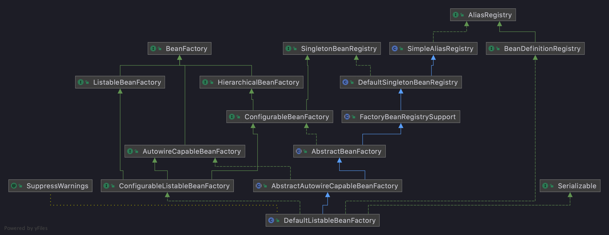
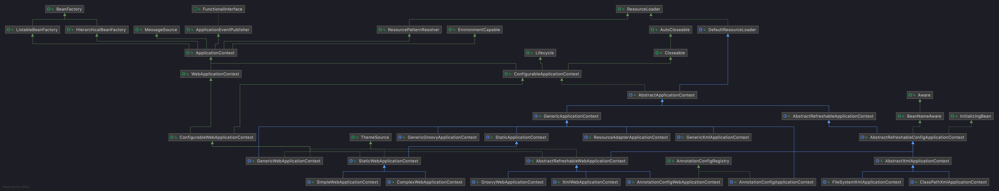

# Spring 顶层接口体系结构

## BeanFactory 体系结构

### SimpleAliasRegistry  
> 别名注册表
#### 属性
* aliasMap: 保存所有别名的Map,BeanName 是特殊的别名(只有key 没有value),别名可以指向另一个别名
#### 方法
* registerAlias: 注册别名
  * 别名和自身相同时,尝试移除这个别名
  * 别名已经存在
    * value 存在则跳过
    * 是否允许别名覆盖,不允许抛出异常,允许直接覆盖,默认是允许的
    * 检查是否有循环依赖问题(别名最终指向了自己成为循环依赖)
* allowAliasOverriding: 默认返回true,但需要考虑子类重写逻辑
* canonicalName: 这个方法可以返回最终的名称 BeanName,逻辑是遍历aliasMap 直到找到最终没有value 的key
* checkForAliasCircle: 这个方法输入两个入参,用于判断是否循环别名依赖,逻辑是递归 hasAlias 判断是否 key 最终指向value 且value 最终指向key
* hasAlias: 同上文介绍
* getAliases: 使用 retrieveAliases 获取所有别名
* retrieveAliases: 传递取回所有别名
  * 使用递归的方式取回,最终添加到取回的List里面
* resolveAliases: 解析aliasMap中的 占位符
  * 需要传入一个 valueRelover 解析占位符
### DefaultSingletonBeanRegistry
> 单例注册表
#### 属性
* SUPPRESSED_EXCEPTIONS_LIMIT: 最多可忽略的异常次数,默认100个,可结合
* singletonObjects: 一级缓存,单例池，key 是beanName value 是bean
* singletonFactories: 三级缓存,key是BeanName value 是一个Supplier,提供一个获取Bean的方法
* earlySingletonObjects: 二级缓存, 与一级缓存的区别是该对象没有进行属性装配
* registeredSingletons: 所有已经注册的单例名称 ***列表***
* singletonsCurrentlyInCreation: 处于创建中的Bean的名称 ***列表***
* inCreationCheckExclusions:
* suppressedExceptions: 对象创建抛出的可忽略的异常列表
* singletonsCurrentlyInDestruction:指示当前是否处于 spring 销毁状态
* disposableBeans: 单例Bean 销毁时的辅助类,具有生命周期销毁回调的bean 将会被注册
* containedBeanMap: 包含关系的映射表 key 是外部bean名称
* dependentBeanMap: bean 依赖的映射表 key是被依赖bean名称 value 是依赖这个 bean 的名称集合
* dependenciesForBeanMap: bean 依赖的映射表 key 某个需要依赖bean的bean value 是需要依赖的 bean 名称集合
#### 方法
* registerSingleton: 直接将某个对象丢入一级缓存
  * 入参: beanName 和 beanObject 都不能为空
  * beanName 已经存在会报错
  * 调用 addSingleton 添加
* addSingleton: 添加到一级缓存,移除二级,三级缓存,并把beanName添加到 registeredSingletons列表
* addSingletonFactory: 添加一个获取Bean的方法到三级缓存,添加到三级缓存时移除二级缓存
* getSingleton:根据BeanName 获取Bean 
  * 首先尝试从一级缓存获取
  * 如果一级缓存为空 尝试从二级缓存获取
  * 如果二级缓存为空,且支持早期对象获取
  * 继续尝试加锁获取一级缓存,二级缓存
  * 如果还是没有尝试三级缓存获取
  * 如果有三级缓存,那么尝试将三级缓存的内容复制一份到二级缓存,然后尝试移除一级缓存的内容
* getSingleton(接受一个SingleFactory回调的):从一级缓存获取,如果没有尝试调用SingletonFactory的回调创建一个Bean
  * 首先尝试从一级缓存获取,
  * 如果不存在,尝试添加singletonsCurrentlyInCreation列表
  * 如果suppressedExceptions为空,初始化suppressedExceptions空列表(乐观加锁)
  * 调用 singletonFactory 的回调创建Bean
  * 如果Bean创建成功 添加到一级缓存
* onSuppressedException: 尝试将对象创建过程的异常保存到 suppressedExcept·ions
* removeSingleton: 移除某个单例
* containsSingleton: 根据名称判断某个对象是否存在一级缓存中
* getSingletonNames: 获取所有已经注册的单例名称
* isDependent: 检查某个Bean是否传递依赖(直接或间接都算)于另一个 bean
* hasDependentBean: 判断某个被依赖的Bean是否已经注册
* getDependentBeans: 获取直接依赖于当前 BeanName 的 Bean 列表
* getDependenciesForBean: 获取当前Bean 的直接依赖列表
* destroySingletons: 销毁单例
  * singletonsCurrentlyInDestruction 设置为 true;
  * 销毁disposableBeans 中 bean 的列表
    * 调用removeSingleton 移除一二三级缓存中的bean
      * 获取辅助销毁对象 DisposableBean 并调用 destroyBean
        * 尝试移除 dependentBeanMap 中的key，获取依赖当前 Bean 的列表 递归调用 destroySingletons
        * 如果有 DisposableBean 调用其 destroy 方法 触发destory 生命周期回调
        * 如果该Bean 有内部 Bean 递归调用 destroySingletons 销毁内部Bean
        * 销毁自依赖的bean

* getSingletonMutex:这个方法用于给创建对象加锁
### FactoryBeanRegistrySupport
#### 属性
* factoryBeanObjectCache: FactoryBean 的缓存对象 key: BeanName value: FactoryBean 调用 getObject的返回对象,简称FO对象

#### 方法
* getTypeForFactoryBean: 通过调用FactoryBean 的getIObjectType获取类类型
* getCachedObjectForFactoryBean: 从 factoryBeanObjectCache 中获取  FO 对象
* getObjectFromFactoryBean: 从给定的 FactoryBean 获取要公开的对象。
  * 尝试从 factoryBeanObjectCache 中获取对象
  * 如果没有 调用 factoryBean的getObject 获取
  * 如果对象处于创建状态中,此时直接返回
  * 当且仅当对象创建完成时,且需要执行后处理器,且仍未放入 factoryBeanObjectCache 时执行后处理器
  * 如果获取的对象不是单例的,如(SqlSession) 那么每次创建都会执行后处理器 并且不放入缓存
* doGetObjectFromFactoryBean: 尝试从FactoryBean中调用getObject方法,返回值为Null时处理返回位NullBean
* postProcessObjectFromFactoryBean: 此处直接返回,实际运行时执行子类方法
* getFactoryBean:将Object 强转为 FactoryBean 如果不是此类型报错
* removeSingleton: 重写并移除 factoryBeanObjectCache 中的缓存
* clearSingletonCache: 重写并清空 factoryBeanObjectCache 中的缓存
* getAccessControlContext: 访问控制器
### AbstractBeanFactory

#### 属性
* parentBeanFactory: 父 bean 工厂
* beanClassLoader: bean 的类加载器,默认从当前线程取,否则获取应用类加载器
* tempClassLoader: 临时类加载器
* cacheBeanMetadata: 是否缓存 Bean 的元数据
* beanExpressionResolver: bean 表达式解析器
* conversionService: 转换器
* propertyEditorRegistrars:
* customEditors:
* typeConverter:
* embeddedValueResolvers:
* beanPostProcessors: 要应用的BeanPostProcessors
* beanPostProcessorCache: 分类好的beanPostProcessors 缓存
* scopes: 将字符串映射成Scope对象的映射表
* securityContextProvider:
* mergedBeanDefinitions: 合并的最终 bean 映射
* alreadyCreated: 已经创建过的 bean 名称的集合,FactoryBean 的创建不会加入该列表
* prototypesCurrentlyInCreation: 当前正在创建的 prototype 类型的bean
* applicationStartup: 用于性能监控对象,默认没卵用
#### 方法
* getBean: 调用doGetBean 获取一个Bean,没有则创建
* doGetBean: 提供getBean 调用,可接受四个参数（bean 名称,创建Bean的构造方法参数,bean 类型)
  * typeCheckOnly 这个参数个人理解是为了判断获取 FactoryBean 中的类型的
  * 调用 transformedBeanName 解析 bean 名称,首先去掉FactoryBean的 & 特殊符号开头,其次调用 canonicalName 转化成实际 bean 名称
  * 首先检查 Bean 是否存在单例缓存(允许获取早期对象),如果存在且创建参数为空,认为是该对象是单例,并且已存在
    * getObjectForBeanInstance 获得对象 
      * 如果是普通 Bean 直接获取
      * 如果是Factory Bean 调用 getCachedObjectForFactoryBean 从FactoryBean 的缓存获取
      * 缓存没有,调用 getObjectFromFactoryBean 执行,是否需要执行后置处理,取决于BeanDefinition 的 synthetic 值,一般不执行
  * 判断当前对象处于 prototype 对象创建的 threadLocal 内部,(是 prototype 且该对象正处于创建周期内)
  * 如果有 parent BeanFactory 尝试从 parent BeanFactory 中获取(指重新走 parent BeanFactory 的getBean方法或 doGetBean 方法)
  * 如果不是 FactoryBean 调用 markBeanAsCreated 
    1. 把 Bean 名称添加到alreadyCreated 集合里
    2. 把 BeanDefinition 的 stale 属性设置为 true 表示需要重新合并
  * 调用 getMergedLocalBeanDefinition 重新解析BeanDefinition 从BeanDefinitionMap  根据BeanName取出对应的BeanDefinition 然后转化成RootBeanDefinition
    * containingBd 为空时往 mergeBeanDefinitionMap 查询 BeanDefinition
    * stale 为 true 才会重新解析Bean Definition
    * 如果 原始的 bd 没有 parent
      1. 原始的 BD 是 rootBeanDefinition 那么直接调用RootBeandefinition 的CloneBeanDefinition
      2. 否则调用rootBeanDefinition 的使用父接口空构造(会比1少复制 RootBeanDefinition 的特有属性)
    * 有 parent 
      * parentBeanName 不等于自己 先解析ParentBeanName 解析的过程就是调用 getMergedLocalBeanDefinition,BeanDefinition 然后获得MergeBeanDefiniton
      * parentBeanName 等于自己,(很反人类的操作)从 parentBeanFactory 调用 getMergedLocalBeanDefinition 解析生成RootBeanDefiniton 然后调用 overrideFrom 子 Beandefinition 覆盖父 Beandefinition
    * 如果第二次解析要防止覆盖一些相关的属性如(isFactoryBean,targetType) 
  * 
### AbstractAutowireCapableBeanFactory

### DefaultListBeanFactory
## ApplicationContext 体系结构

