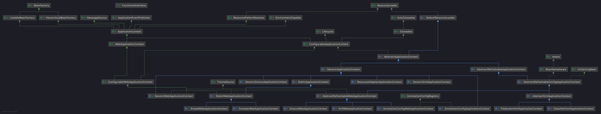

# Spring 顶层接口体系结构

## BeanFactory 体系结构

* [1.1 SimpleAliasRegistry ](./1.1_SimpleAliasRegistry.md)
* [1.2 DefaultSingletonBeanRegistry](1.2_DefaultSingletonBeanRegistry.md)
* [1.3 FactoryBeanRegistrySupport](1.3_FactoryBeanRegistrySupport.md)
* [1.4 AbstractBeanFactory](1.4_AbstractBeanFactory.md)
* [1.5 AbstractAutowireCapableBeanFactory](1.5_AbstractAutowireCapableBeanFactory.md)
* [1.6 DefaultListableBeanFactory](1.6_AbstractBeanFactory.md)
## ApplicationContext 体系结构

