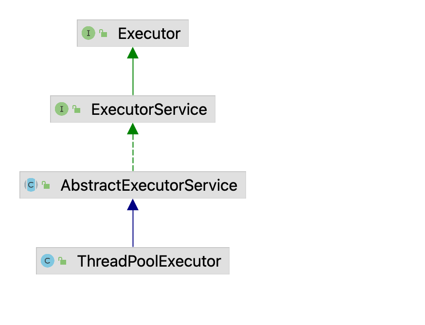

# 线程池ThreadPoolExecutor 笔记
## 1.继承关系
 

## 2.类分析
### 2.1 Executor 
>Executor 是最顶层的接口 内部只有一个方法 `void execute(Runnable command)` 表示执行某个行为,该行为放在封装好的runnable里面

### 2.2 ExecutorService
>ExecutorService 是子接口,定义了线程池生命周期中的运行规范,这些方法都直接或间接的和`execute` 有关

| 方法             | 行为描述                                                                                                     |
| ---------------- | ------------------------------------------------------------------------------------------------------------ |
| shutdown         | 不再接受新的任务，启动有序关闭,如果线程池已经退出,执行不影响，不会等待任务执行完成                           |
| shutdownNow      | 尝试停止所有正在执行的任务,并返回列表，不会等待任务执行完                                                    |
| isShutdown       | 如果线程池已经停止运行返回 `true`                                                                            |
| isTerminated     | 是否所有任务已经完全运行完且退出,使用 `shutdown`和`shutdownNow`关闭返回 `false`                              |
| awaitTermination | 等待所有任务执行完毕退出,可以设置超时时间,如果触发超时,那么返回`false`,优雅停机返回 `true`                   |
| submit           | 提交一个带返回值的`callable`给线程池,并在执行完成后返回,如果想阻塞调用则使用get 阻塞住                       |
| submit           | 提交一个返回值和`runnable`给线程池,并在执行完成后返回,如果想阻塞调用则使用get 阻塞住                         |
| submit           | 提交一个`runnable`给线程池,并在执行完成后返回,如果执行成功get会返回null                                      |
| invokeAll        | 批量执行一批任务并返回Future,Future.isDone 都是true,完成可能是正常完成或异常，不要再运行时修改传入的任务列表 |
| invokeAll        | 与上面相同,新增了设置超时时间                                                                                |
| invokeAny        | 执行给定的任务，当第一个任务完成时,其他的任务将被取消，不要修改任务列表入参                                  |
| invokeAll        | 与上面相同,新增了设置超时时间                                                                                |

### 2.3 AbstractExecutorService
>已经开始做一些简单的实现,意在抽取一些线程池的共性而不去管具体的实现方案,作为模板方法

1. `RunnableFuture` -> `FutureTask`
- `RunnableFuture` 是`Future`和`Runnable` 的子类,意义在于定义一个通用的执行返回结果,Runnable 拥有执行具体任务的行为(run 方法),Future 拥有任务状态管理如获取返回值(get方法),取消任务(cancel),判断任务是否取消(isCancelled),是否完成(isDone);
- `FutureTask` 是 `RunnableFuture` 的具体实现,同时它对 `Runnable`+`Result` 以及Callable 做了统一适配(使用 `RunnableAdaptor` 作为 `Runnable` 向 `Callable` 的转化,是一种适配器模式,作用就是解决 `Runnable` 无返回值的问题)

2. AbstractExecutorService 的一个通用模板方法的解释

| 方法            | 行为描述                                                                                                            |
| --------------- | ------------------------------------------------------------------------------------------------------------------- |
| newTaskFor      | 将Runnable 或 Callable 转化为FutureTask                                                                             |
| submit          | 这里定义了submit 的通用实现,先把Runnable,和Callable 转化为 FutureTask,再执行Executor,这样做的好处是任务统一且有状态 |
| invokeAny       | 透传参数给`doInvokeAny`尝试处理超时异常                                                                             |
| ***cancelAll*** | 这是一个`static`方法,用于取消所有任务                                                                               |

3. 分析 `doInvokeAny` 方法

```java
private <T> T doInvokeAny(Collection<? extends Callable<T>> tasks,boolean timed, long nanos) throws InterruptedException, ExecutionException, TimeoutException {
    // 对任务做校验没啥好说的
    if (tasks == null)
        throw new NullPointerException();
    int ntasks = tasks.size();
    if (ntasks == 0)
        throw new IllegalArgumentException();
    ArrayList<Future<T>> futures = new ArrayList<>(ntasks);
    // 这里的 this 指代实际运行时的对象(是一个完整的线程池而非AbstractExecutorService) 
    // ecs 是一个特殊的对象,他对执行器做了包装,基于 AbstractExecutorService 的线程池执行返回结果会包装成带阻塞队列的Future,且所有结果共享在阻塞队列中
    ExecutorCompletionService<T> ecs = new ExecutorCompletionService<T>(this);
    try {
        // 记录出现的异常
        ExecutionException ee = null;
        // 超时时间
        final long deadline = timed ? System.nanoTime() + nanos : 0L;
        // 任务列表的迭代器
        Iterator<? extends Callable<T>> it = tasks.iterator();
        // 新添加一个任务执行(是异步的)
        futures.add(ecs.submit(it.next()));
        // 任务数-1
        --ntasks;
        // 活跃数+1
        int active = 1;
        // 死循环
        for (;;) {
            // 检查是否能获取第一个结果,
            // 写在这里的目的是每次添加完一个任务就查看一下结果,避免出现同时执行两个任务的情况
            Future<T> f = ecs.poll();
            if (f == null) {
                // 没有获取到第一个结果,还有任务未执行,尝试添加其他任务
                if (ntasks > 0) {
                    --ntasks;
                    futures.add(ecs.submit(it.next()));
                    ++active;
                }
                else if (active == 0)
                    // 没有待执行任务,且没有活跃任务 说明任务全部结束 跳出循环
                    break;
                else if (timed) {
                    // 有超时时间的调用,尝试等待队列返回,没返回则报错超时
                    f = ecs.poll(nanos, NANOSECONDS);
                    if (f == null)
                        throw new TimeoutException();
                    nanos = deadline - System.nanoTime();
                }
                else
                    f = ecs.take();
            }
            if (f != null) {
                // 获取到了执行结果,活跃数-1
                --active;
                try {
                    // 尝试获取最终的执行结果(callable 或runnable的值)
                    return f.get();
                } catch (ExecutionException eex) {
                    // 有执行异常记录异常
                    ee = eex;
                } catch (RuntimeException rex) {
                     // 非执行异常包装一下放到cause中
                    ee = new ExecutionException(rex);
                }
            }
        }
        // 如果出了死循环说明已经有任务执行完成 则抛出异常结束该流程
        if (ee == null)
            ee = new ExecutionException();
        throw ee;
    } finally {
        // 一旦出现返回则取消所有待执行任务
        cancelAll(futures);
    }
}
```
4. 分析带超时时间的 `invokeAll` 方法

```java
public <T> List<Future<T>> invokeAll(Collection<? extends Callable<T>> tasks, long timeout, TimeUnit unit) throws InterruptedException {
    if (tasks == null)
        throw new NullPointerException();
    // 计算超时纳秒数
    final long nanos = unit.toNanos(timeout);
    // 计算结束时刻
    final long deadline = System.nanoTime() + nanos;
    // 封装任务
    ArrayList<Future<T>> futures = new ArrayList<>(tasks.size());
    int j = 0;
    timedOut: try {
        // 添加任务到列表中
        for (Callable<T> t : tasks)
            futures.add(newTaskFor(t));
        // 获取任务数
        final int size = futures.size();
        for (int i = 0; i < size; i++) {
            // 如果截止时间还有的话, 将任务提交给线程池执行，否则直接跳转到 timeOut 代码块
            // 注释认为有可能计算时间期间,线程可能获取不到CPU执行的时间片
            if (((i == 0) ? nanos : deadline - System.nanoTime()) <= 0L)
                break timedOut;
            execute((Runnable)futures.get(i));
        }
        for (; j < size; j++) {
            Future<T> f = futures.get(j);
            // 尝试获取执行结果,如果出现错误直接考虑跳到timeOut
            if (!f.isDone()) {
                try { f.get(deadline - System.nanoTime(), NANOSECONDS); }
                catch (CancellationException | ExecutionException ignore) {}
                catch (TimeoutException timedOut) {
                    break timedOut;
                }
            }
        }
        // 直接返回
        return futures;
    } catch (Throwable t) {
        // 抛出异常就取消所有任务
        cancelAll(futures);
        throw t;
    }
    // 如果代码走到这里说明 break 到了 timeOut 那么取消未完成的所有任务
    cancelAll(futures, j);
    return futures;
}
```
> 这里可以借鉴一下 AbstractExecutorService 的特点,把执行任务阶段的逻辑通过调用仍未实现的 `execuse` 实现,封装的是通用的调度逻辑,从而实现模板化代码的设计,同时也让我们知道ThreadPoolExecutor 的核心方法是 `execuse`

## 3.线程池工作原理

### 3.1 FutureTask 分析
> 上一节我们简单讲了 FutureTask 是一个任务的规范,他是线程池调度的基本单位, Callable 和 Runnable 都能通过某些方式转化为 FutureTask,转化路径如下

* Callable: Callable => FutureTask
* Runnable: Runnable + Result => RunnableAdaptor => Callable => FutureTask

#### 3.1.1 VarHandler 
> VarHandler 是 jdk9 之后出现的API,支持在不同访问模型下对这些变量的访问,如cas volatile,关注FutureTask 静态代码块如下,此处构造了三个变量句柄,之后通过句柄实现对状态,执行线程,等待者的操作

```java 
// 
private static final VarHandle STATE;
private static final VarHandle RUNNER;
private static final VarHandle WAITERS;
static {
    try {
        MethodHandles.Lookup l = MethodHandles.lookup();
        STATE = l.findVarHandle(FutureTask.class, "state", int.class);
        RUNNER = l.findVarHandle(FutureTask.class, "runner", Thread.class);
        WAITERS = l.findVarHandle(FutureTask.class, "waiters", WaitNode.class);
    } catch (ReflectiveOperationException e) {
        throw new ExceptionInInitializerError(e);
    }
    // Reduce the risk of rare disastrous classloading in first call to
    // LockSupport.park: https://bugs.openjdk.java.net/browse/JDK-8074773
    Class<?> ensureLoaded = LockSupport.class;
}
```
#### 3.1.2 任务状态变更
> 任务刚创建时(由Runnable和Callable转化)为 NEW,在 set,setException,cancel 方法后进入终态,在到达终态期间状态可能瞬时变更为 COMPLETING(在设置返回值时)或INTERRUPTING(cancel(true)中断正在执行的任务时)。从中间状态到最终态的转换使用更为高效的延迟有序写入(VarHandler ? 等我研究清楚操作系统再来填这里的坑)

可能存在的状态变更
* 创建 -> 执行结束 -> 成功
* 创建 -> 执行结束 -> 异常
* 创建 -> 取消
* 创建 -> 执行结束 -> 中断任务中 -> 中断成功

```java
private volatile int state;
// 创建,刚new 出来任务,提交给线程池
private static final int NEW          = 0; 
// 结束,任务已经执行完成并且获取到返回值
private static final int COMPLETING   = 1;
// 成功,任务正常完成,修改为成功
private static final int NORMAL       = 2;
// 执行出现异常,为什么异常也会出现执行结束? 因为执行结束并不意味着任务成功,也有可能是异常结束
private static final int EXCEPTIONAL  = 3;
// 执行被取消(任务在未进入就绪状态的时候被取消)
private static final int CANCELLED    = 4;
// 调用 cancel,先把状态使用属性句柄cas改为正在中断
private static final int INTERRUPTING = 5;
// 调用 cancel,已经获得修改资格(cas 成功)并且已经中断(解阻塞)
private static final int INTERRUPTED  = 6;
```
#### 3.1.3 其他属性

* callable: 任务的详情
* runner: 执行任务的线程
* outcome: 任务的执行结果
* waiters: 等待任务执行线程的链表

#### 3.1.4 核心方法
```java
public void run() {
    // 判断运行条件 任务未执行,且没有执行线程(runner没有值)
    if (state != NEW || !RUNNER.compareAndSet(this, null, Thread.currentThread()))
        return;
    try {
        // 如果没退出说明执行线程设置成功此时开始执行任务
        Callable<V> c = callable;
        // 获取callable 执行, 此时state 可能被cancel 方法修改为其他状态,所以要再判断一次
        if (c != null && state == NEW) {
            V result;
            boolean ran;
            try {
                result = c.call();
                ran = true;
            } catch (Throwable ex) {
                result = null;
                ran = false;
                // 如果出现异常,捕捉起来,设置在 outcome 中,等查询的线程调用 get 抛出去
                // 状态变更为 COMPLETING 后又变更为 EXCEPTIONAL 并执行清理操作
                setException(ex);
            }
            // 执行成功设置返回值相关操作
            if (ran)
                // 状态变更为 COMPLETING 后又变更为 NORMAL 并执行清理操作
                set(result);
        }
    } finally {
        // 为了防止并发调用run runner 在执行阶段要非空
        runner = null;
        // 要重新载入状态值 将 INTERRUPTING 修改为 INTERRUPTTED 
        int s = state;
        if (s >= INTERRUPTING)
            // 尝试让出线程执行权,直到其他线程修改状态为INTERRUPTTED
            handlePossibleCancellationInterrupt(s);
    }
}
```
4.2 awaitDone 
>下面的代码非常微妙，以实现这些目标： 
- 每次调用寄存时精确调用一次 
- 如果 nanos <= 0L，则立即返回而不分配或 nanoTime 
- 如果 nanos == Long.MIN_VALUE，不要下溢 
- 如果 nanos == Long.MAX_VALUE，并且 nanoTime 是非单调的，并且我们遭受了虚假的唤醒，我们不会比自旋一段时间更糟糕
```java
private int awaitDone(boolean timed, long nanos) throws InterruptedException {
    // 特殊值0表示不驻留
    long startTime = 0L;
    WaitNode q = null;
    boolean queued = false;
    for (;;) {
        // 获取任务状态
        int s = state;
        if (s > COMPLETING) {
            // 如果状态大于COMPLETING 说明已经到达终态
            // 无需考虑处于INTERRUPTING 因为INTERRUPTING 会无限让出执行权直到变成INTERRUPTTED
            if (q != null)
                q.thread = null;
            return s;
        }
        else if (s == COMPLETING)
            // 等于完成状态 让出执行权 等待死循环下一次访问其他块
            // 该代码等于 Thread.sleep(0)
            Thread.yield();
        else if (Thread.interrupted()) {
            // 线程处于中断状态,说明任务被取消移除等待线程抛出异常
            removeWaiter(q);
            throw new InterruptedException();
        }
        else if (q == null) {
            // q = null,说明首次循环,分两种情况,如果
            // 1. 有超时时间但具体值小于0 表示立即返回 
            if (timed && nanos <= 0L)
                return s;
            // 2. 没有过期时间 设置q,q 是作为等待链表的备选头节点
            q = new WaitNode();
        }
        else if (!queued)
            // 无锁编程,保证监听者的链表上一节点争抢结果正确,并且只争抢一次
            // 争抢成功后多了一个前驱节点,争抢成功后不再进来
            queued = WAITERS.weakCompareAndSet(this, q.next = waiters, q);
        else if (timed) {
            // 有设置超时时间,
            final long parkNanos;
            if (startTime == 0L) { 
                // 首次循环设置线程驻留时间
                startTime = System.nanoTime();
                if (startTime == 0L)
                    startTime = 1L;
                parkNanos = nanos;
            } else {
                // 否则计算是否超时,如果已经超时移除等待者 返回状态
                long elapsed = System.nanoTime() - startTime;
                if (elapsed >= nanos) {
                    removeWaiter(q);
                    return state;
                }
                // 计算等待时间
                parkNanos = nanos - elapsed;
            }
            // 小于completing 说明处于new 状态,说明程序可能正在执行相关逻辑
            // 加判断是因为,纳秒太小了,可能执行过程中就过去了,
            // 为了严谨性价格判断,因为等待多久是上面计算出来的
            if (state < COMPLETING)
                LockSupport.parkNanos(this, parkNanos);
                // 下次释放等待的线程会进入超时判断,如果真的超时则移除等待链表中的节点
        }
        else
            // 表示无限等待
            LockSupport.park(this);
    }
}

```
4.3 cancel
```java
public boolean cancel(boolean mayInterruptIfRunning) {
    // 状态为 NEW 或者执行 CAS 失败则不能取消,
    // 先判断 NEW 是因为直接短路性能比执行 CAS 更高
    // 如果不允许中断则直接把状态改为CANCELLED
    if (!(state == NEW && STATE.compareAndSet
            (this, NEW, mayInterruptIfRunning ? INTERRUPTING : CANCELLED)))
        return false;
    try {   
        // mayInterruptIfRunning 为true 才可以调用 interrupt 强制中断任务
        if (mayInterruptIfRunning) {
            try {
                Thread t = runner;
                // 尝试中断线程
                if (t != null)
                    t.interrupt();
            } finally { // final state
                // 走到这里说明可以强制中断任务
                STATE.setRelease(this, INTERRUPTED);
            }
        }
    } finally {
        // 清理工作,清空waiters,unpark waiters 的线程,调用done 方法
        finishCompletion();
    }
    // 返回取消成功
    return true;
}

```
4.4 removeWaiter
>移除等待链表中的节点,此时要么等待结果超时，要么等待的线程被中断
```java
private void removeWaiter(WaitNode node) {
    // 当等待节点未执行cas 过程就被interrupt时，node 是有可能为空的,并且大概率不一定是头节点
    if (node != null) {
        // 先把要移除的节点thread 置空作为移除的判断条件
        node.thread = null;
        // 重点!!! 移除节点的工作到这里就结束了 后面是协助清理工作
        retry: for (;;) {    
            // q 表示头节点,直接等于waiters
            // s 表示下一个节点作为循环因子
            for (WaitNode pred = null, q = waiters, s; q != null; q = s) {
                s = q.next;
                // 当任务完成时 thread 值会被置空
                if (q.thread != null)
                    //不为空说明当前节点不是要移除的
                    pred = q;
                else if (pred != null) {
                    // 此时判断它是否存在前驱节点,考虑并发条件下是有可能两个线程同时不满足等待条件(超时或线程被中断)
                    pred.next = s;
                    if (pred.thread == null) // check for race
                        // 前置为空说明有其他线程正在移除前置节点的thread 属性
                        continue retry;
                } else if (!WAITERS.compareAndSet(this, q, s))
                    /* 能走到该if 条件的前提是 
                    1. q.thread == null 即该监视节点已经没有存在的意义
                    2. pred == null 即q 节点没有前驱节点(第一次循环 或通过 continue retry 跳转)
                    当不满足以上两个if条件时,尝试CAS链表头,一旦CAS成功,说明链表头不需要存在
                    如果CAS 失败,说明有其他线程正在同时清理/或者任务执行结束正在完整清理
                    */
                    continue retry;
            }
            // 退出循环的条件是 q==null 
            break;
        }
    }
}
```
4.5 finishCompletion 
> 当所有线程任务执行完(成功或失败),即将返回时,对监视链表的清理操作
```java
private void finishCompletion() {
    // 从头节点开始 对每个park 的线程执行unpark 操作,并把他们的 q.thread 置空，方便removeWaiter 方法清理
    for (WaitNode q; (q = waiters) != null;) {
        if (WAITERS.weakCompareAndSet(this, q, null)) {
            for (;;) {
                Thread t = q.thread;
                if (t != null) {
                    q.thread = null;
                    LockSupport.unpark(t);
                }
                WaitNode next = q.next;
                if (next == null)
                    break;
                // 协助gc
                q.next = null; 
                q = next;
            }
            break;
        }
    }
    // 调用futureTask 的done 方法
    done();
    // 清空callable 协助 gc
    callable = null;
}
```
### 3.1.5 总结 
1. 使用varHandler 对变量做无锁编程
2. waiters 保存了所有回调线程,他们调用awaitDone park 到方法中,并CAS waiters 链表头
3. 若任务执行完毕,首先更改任务状态,其次响应放行回调线程获取outcome 的结果,同时完整清理waiters 链表
4. 若任务执行超时,中断,获取结果的线程中断,都会移除链表中的q.thread=,同时会尝试辅助清理链表头(贪婪处理)
## 3.2 ThreadPoolExecutor 线程池实现
### 3.2.1 结构说明 

1. 二进制表查询

| 名称       | 二进制值                         | 十进制值   |
| ---------- | -------------------------------- | ---------- |
| ctl        | 11100000000000000000000000000000 | -536870912 |
| COUNT_MASK | 00011111111111111111111111111111 | 536870911  |
| RUNNING    | 11100000000000000000000000000000 | -536870912 |
| SHUTDOWN   | 00000000000000000000000000000000 | 0          |
| STOP       | 00100000000000000000000000000000 | 536870912  |
| TIDYING    | 01000000000000000000000000000000 | 1073741824 |
| TERMINATED | 01100000000000000000000000000000 | 1610612736 |

* 内部类
    * worker 工作负载,封装了任务执行的逻辑,AQS的单机实现
    * CallerRunsPolicy: 拒绝策略,调用者执行
    * AbortPolicy: 拒绝策略,直接抛异常
    * DiscardPolicy: 拒绝策略,直接丢弃当前任务 不处理
    * DiscardOldPolicy: 丢弃队列中的下一个任务,并提交当前任务
* 属性
    * ctl: 全局状态记录器 二进制数: 11100000000000000000000000000000
    * workQueue: 工作队列,八股文常说的阻塞队列
    * mainLock: 全局锁,保证任务的添加移除/全局成功任务数... 线程池的指标手机修改
    * workers: 工作负载集合
    * 
* 常量
    * COUNT_BITS: 值为 29,表示使用到了29个位 (前三个位标志线程池状态)
    * COUNT_MASK: 前29位都为1,是一个标志位,
    * RUNNING: 线程池状态,运行 前三位为111
    * SHUTDOWN: 线程池状态,结束 前三位为000
    * STOP: 线程池状态,停止 前三位为001
    * TIDYING: 线程池状态,清理 前三位为010
    * TERMINATED: 线程池状态,终止 前三位为011
* 位运算方法
    * workerCountOf: 求低29位ctl 的值
    * runStateAtLeast: 对比前一个数是否大于等于后一个数
    * compareAndIncrementWorkerCount: ctl + 1 
    * isRunning: 判断是否大于shutdown 只有Running 状态大于shutdown 
    * ctlOf: 按位或,


### 3.2.3 任务执行流程
> execute 方法分析: 从上文看,executor 是线程池的入口方法和核心方法，所以我们从该方法开始看
```java
public void execute(Runnable command) {
    // 提交的任务是空的则报空指针
    if (command == null) {
        throw new NullPointerException();
    }
    int c = ctl.get(); 
    // 全局状态统计 默认为 11100000000000000000000000000000
    // workerCountOf 计算方式 c & COUNT_MASK 本质上是获取其低29位的值
    if (workerCountOf(c) < corePoolSize) {
        // 添加到worker 中,如果成功直接返回
        if (addWorker(command, true))
            return;
        // addWalker 返回false 则获取到 c的值,因为addWarker 本质上是抢占式调度,会不断修改c的值
        // 假如失败说明执行机会被其他线程抢占了
        c = ctl.get();
    }
    // 代码走到这说明任务提交的比较快核心线程数都在使用 于是加入到阻塞队列中
    if (isRunning(c) && workQueue.offer(command)) {
        int recheck = ctl.get();
        // 假如阻塞队列成功后尝试继续判断线程池状态 
        if (! isRunning(recheck) && remove(command))
            // 处于关闭时期的线程池,移除任务然后执行拒绝策略
            reject(command);
        // 如果一个工作线程都没有 那么尝试创建非核心线程非核心线程不会附带任务的提交
        else if (workerCountOf(recheck) == 0)
            addWorker(null, false);
    }
    // 放不进去工作队列且无法创建非核心线程则执行拒绝策略
    else if (!addWorker(command, false)){
         reject(command);
    }
}
```
>addWorker 方法分析: 尝试创建一个核心或非核心线程,具体取决于 core 的值,如果是非核心线程,则firstTask可以为空,此时主动去队列中poll任务出来执行

```java
private boolean addWorker(Runnable firstTask, boolean core) {
    retry:
    for (int c = ctl.get();;) {
        if (runStateAtLeast(c, SHUTDOWN) // 表示 状态是RUNNING 因为 RUNNING 是负数(第一位是1) 其他都是正数
            && (runStateAtLeast(c, STOP)  // 表示状态可能是RUNNING 或 SHUTDOWN 
                || firstTask != null // 仅在 execute 提交上来的带有任务
                || workQueue.isEmpty())) // 工作队列为空 2.3.4 满足一点即可 则直接返回false 
            // TODO 待说明
            return false;

        // 如果不返回source 则进入死循环
        for (;;) {
            // 在计算一次 workCount 判断有多少工作线程 根据 core 的值来决定是与核心线程数还是最大线程数比较 如果大于 也不要这个结果
            if (workerCountOf(c)
                >= ((core ? corePoolSize : maximumPoolSize) & COUNT_MASK))
                // 未抢到任务的最终都会从这里返回
                return false;
              // 双重检查的变种,如果没返回进入第二次比较
            if (compareAndIncrementWorkerCount(c))
                // cas 替换ctl 的值+1,成功则跳出这个死循环,只要线程池在运行,且满足小于 core 或 max 的条件,最终都会抢到任务
                break retry;
            c = ctl.get();  // Re-read ctl
            // 大于等于shutdown 说明线程池处于非运行状态 此时跳回retry 循环说明此时不适合添加任务 
            if (runStateAtLeast(c, SHUTDOWN))
                continue retry;
            // 只要线程池任务正常,就会不断的在这个内层循环里争抢执行机会
        }
    }
    // 能从上面内卷出来的都是抢到执行任务的人,此时开始执行任务逻辑
    boolean workerStarted = false;
    boolean workerAdded = false;
    Worker w = null;
    try {
        //worker 是一个持有线程的Runnable,并且线程默认运行的是worker 本身而不是task,只是worker运行过程中顺便回调了task的run方法,同时它也不是直接回调run方法 而是通过Thread.start 调用了worker 本身的run方法使线程在死循环中park（通过调用阻塞队列）
        w = new Worker(firstTask);
        final Thread t = w.thread;
        if (t != null) {
            final ReentrantLock mainLock = this.mainLock;
            mainLock.lock();
            try {
                int c = ctl.get();
                if (isRunning(c) ||
                    (runStateLessThan(c, STOP) && firstTask == null)) {
                    if (t.getState() != Thread.State.NEW)
                        throw new IllegalThreadStateException();
                    // 这个是核心代码,修改了workers 列表和largestPoolSize 
                    workers.add(w);
                    workerAdded = true;
                    int s = workers.size();
                    if (s > largestPoolSize)
                        largestPoolSize = s;
                    // 这个是核心代码,修改了workers 列表和largestPoolSize 
                }
            } finally {
                mainLock.unlock();
            }
            if (workerAdded) {
                // 添加核心任务还有核心线程创建之后,线程开始调度,执行runWorker方法
                t.start();
                // 保证finilly 块中代码合理清理 
                workerStarted = true;
            
            }
        }
    } finally {
        if (! workerStarted)
            // 处理添加工作负载失败的工作
            addWorkerFailed(w);
    }
    return workerStarted;
}
```
> worker 是对工作负载的封装,new 一个worker 会把worker自身当成runnable 传给线程,调用start 方法后运行worker 的run方法进而运行runWorker 方法
```java
final void runWorker(Worker w) {
    Thread wt = Thread.currentThread();
    // 如果是核心线程,则它是带任务过来的,非核心线程不带任务
    Runnable task = w.firstTask; 
    w.firstTask = null;
    w.unlock(); // allow interrupts
    boolean completedAbruptly = true;
    try {
        // 这个是个死循环 永远不会退出去,因为getTask 方法在取不出结果的时候是阻塞的
        // 这个阻塞如果是核心线程则永远不会返回,因为使用了take 方法
        // 如果是非核心线程则在park一定时间之后返回因为使用了poll 方法
        while (task != null || (task = getTask()) != null) {
            w.lock();
            // 判断一下线程池状态,如果正在停止,或者线程中断了 或者是停止之后的状态,这是线程池关闭的信号
            if ((runStateAtLeast(ctl.get(), STOP) ||
                    (Thread.interrupted() &&
                    runStateAtLeast(ctl.get(), STOP))) &&
                !wt.isInterrupted())
                wt.interrupt();
            try {
                // 提供任务执行开始时的回调
                beforeExecute(wt, task);
                try {
                    // 运行task run方法 然后run 方法再去找callable方法 经历了上文说的过程,线程回调后结束做waiters 的清理动作
                    task.run();
                    // 提供给子类线程池实现的任务完成后的统一处理
                    afterExecute(task, null);
                } catch (Throwable ex) {
                    // 万一抛异常也要统一处理一下任务执行后的
                    afterExecute(task, ex);
                    throw ex;
                }
            } finally {
                task = null;
                w.completedTasks++;
                w.unlock();
            }
        }
        completedAbruptly = false;
    } finally {
        // 再任务完成后统一处理任务退出需要的工作
        processWorkerExit(w, completedAbruptly);
    }
}

```
> 任务完成后统一处理任务退出,

```java
private void processWorkerExit(Worker w, boolean completedAbruptly) {
    if (completedAbruptly) // If abrupt, then workerCount wasn't adjusted
        decrementWorkerCount();
    // 首先全居锁修改完成任务数
    final ReentrantLock mainLock = this.mainLock;
    mainLock.lock();
    try {
        completedTaskCount += w.completedTasks;
        workers.remove(w);
    } finally {
        mainLock.unlock();
    }
    tryTerminate();
    int c = ctl.get();
    if (runStateLessThan(c, STOP)) {
        // 判断任务是否正常完成,
        if (!completedAbruptly) {
            int min = allowCoreThreadTimeOut ? 0 : corePoolSize;
            if (min == 0 && ! workQueue.isEmpty())
                min = 1;
            if (workerCountOf(c) >= min)
                return; // replacement not needed
        }
        // 添加一个非核心线程
        addWorker(null, false);
    }
}
```


### 3.2.3 停机流程
## 八股文问题
* 解释Thread 的对象方法 interrupt() 和 isInterrupted 以及 interrupt() 三个方法的区别
* interrupt 方法调用后,对应的线程会发生什么情况
* 等待线程如何知道任务已经执行完成,FutureTask 是如何管理等待线程的
* 线程池如何判断线程满了
* 不考虑内存溢出,工作线程最多可以声明多少个?


