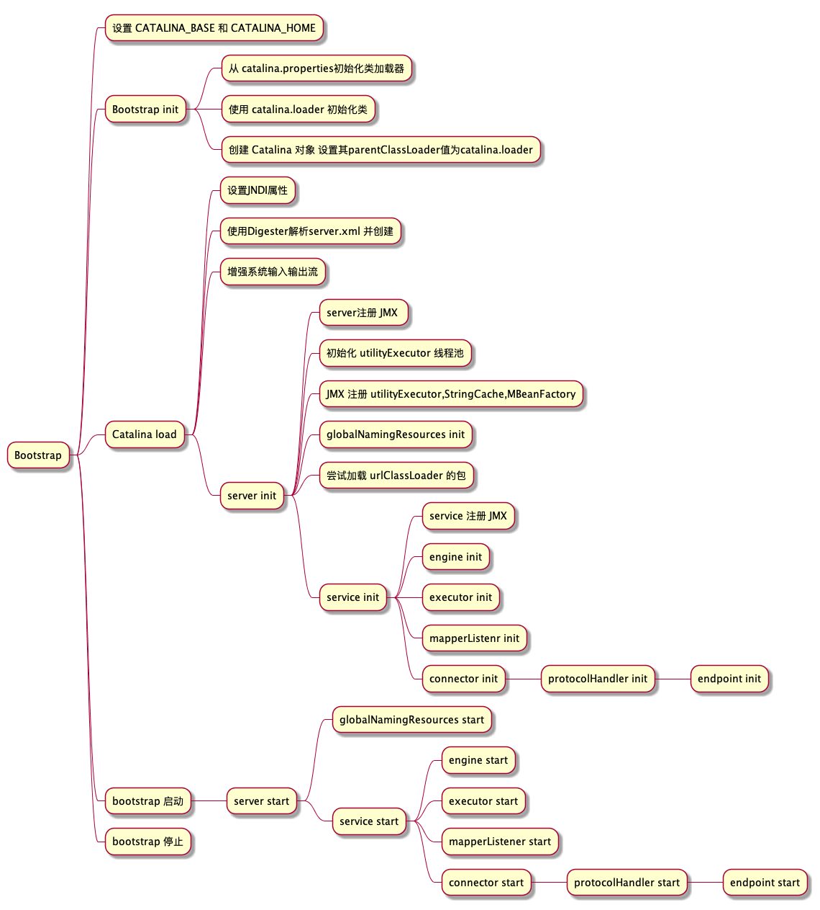

# tomcat 工作原理

## 1. Lifecycle 接口

> Lifecycle是组件标准生命周期方法的顶层接口,组件会实现部分或全部方法来提供一定的机制启动和停止组件,拥有init,start,stop,destroy,状态如下所示。

```
 -----------------------------
|                            |
|  init()                    |
NEW -»-- INITIALIZING        |
| |           |              |     ------------------«-----------------------
| |           |auto          |     |                                        |
| |          \|/    start() \|/   \|/     auto          auto         stop() |
| |      INITIALIZED --»-- STARTING_PREP --»- STARTING --»- STARTED --»---  |
| |         |                                                            |  |
| |destroy()|                                                            |  |
| --»-----«--    ------------------------«--------------------------------  ^
|     |          |                                                          |
|     |         \|/          auto                 auto              start() |
|     |     STOPPING_PREP ----»---- STOPPING ------»----- STOPPED -----»-----
|    \|/                               ^                     |  ^
|     |               stop()           |                     |  |
|     |       --------------------------                     |  |
|     |       |                                              |  |
|     |       |    destroy()                       destroy() |  |
|     |    FAILED ----»------ DESTROYING ---«-----------------  |
|     |                        ^     |                          |
|     |     destroy()          |     |auto                      |
|     --------»-----------------    \|/                         |
|                                 DESTROYED                     |
|                                                               |
|                            stop()                             |
----»-----------------------------»------------------------------
```

而所有 lifecycleBase 的子类都会继承LifeCycleBase 通用模板,所以子类均遵循以下规定

* 新建对象时 **state**  为 **NEW**
* 执行 **init** 方法会先将状态设置成 **INITIALIZING** ,并触发监听器的 **lifecycleEvent** 各个监听器去实现 **lifecycleEvent** 并通过判断事件的方式执行不同的逻辑,子类自行实现  **initInternal** 执行初始化逻辑 初始化完成后发布  **INITIALIZED** 事件
* 执行  **start**  方法先判断是否执行过  **init**,  没有先执行  **init** 方法,使 **state** 流转到  **INITIALIZED**  。后续 start方法执行逻辑和init 相似，发布  **STARTING_PREP**  事件,执行各个子类实现的不同的  **startInternal** 如果成功内部需要把 state 改为  **STARTING** ,失败改为 **FAILED** ；**start** 对 **startInternal** 所修改的状态做判断来决定是否执行**stop** 或 **destroy**
* 当容器优雅停止时通过方法  **setStateInternal** 发布停止事件,启动失败时通过 **fireLifecycleEvent**  发布停止事件,两方法逻辑没有差别启动失败时,应立即停止相关事物所以调用
  **fireLifecycleEvent** 。然后执行 **stopInternal** 真正停止。停止后将状态改为 **STOPPED** 最终在finally块中调用 **destroy** 做清理工作释放资源
* 调用 **destroy** 方法时,如果状态为 **FAILED**  先尝试执行 **stop** 停止,发布 **DESTROYING** 事件,调用 **destroyInternal** 方法,最终发布 **DESTROYED** 事件

## 2. tomcat 启动流程

> tomcat 启动流程可用下图表示,本质上就是各个LifeCycle子类对象的 init 和 start 过程
> 

### 设置 CATALINA_BASE 和 CATALINA_HOME

> [官网](https://tomcat.apache.org/tomcat-9.0-doc/introduction.html)对CATALINA_BASE 和CATALINA_HOME 的解释认为 CATALINA_HOME 是tomcat 的安装目录,而CATALINA_BASE是配置目录,设置该信息的代码存在于 [Bootstrap]([https://github.](https://github.com/huyiyu/tomcat/blob/huyiyu/java/org/apache/catalina/startup/Bootstrap.java#L81))的 static 代码块中,具体可看代码注释

### 初始化 Bootstrap

1. 通过 配置的catalina.properties 的 common.loader catalina.loader shared.loader 创建三个 URLClassLoader并配置类加载目录,
2. 默认情况下commonLoader加载的目录为 CATALINA_BASE/lib 下面的内容,该内容将会在 server.init 过程中加载这些 class 和 jar 包。而catalina.loader 和shared.loader默认为空,不加载任何内容 但仍会新建urlClassLoader
3. 使用Catalina.loader 初始化类,反射调用Catalina 对象的setParentClassLoader 设置进去

### 加载 Catalina

* 执行 initNaming 设置JNDI所需的系统属性
  * catalina.useNaming=true
  * java.naming.factory.initial=org.apache.naming.java.javaURLContextFactory`;
* 其次进入 digester 解析并创建;
* 最后调用server.init来做自顶向下的初始化

#### Digester 解析server.xml

> xml 从parseServerXml 找到 createStartDigester,此处介绍下 Digester 的逻辑,当 Digester 调用Parse 时会开始解析并匹配 XML标签 并在匹配过程中调用 Rule 的 begin(标签开始时)，body(标签体内部),end(标签结束时)的逻辑, 通过自定义实现 Rule 来达到解析的目的

| 规则类            | 描述                                                                                                                     |
| ----------------- | ------------------------------------------------------------------------------------------------------------------------ |
| ObjectCreateRule  | begin 调用时通过 xml 对应属性 ClassName 记录的类创建对象,如果 className 为空,使用参数传入的 ClassName , end() 调用时取出 |
| SetPropertiesRule | begin调用时通过解析set方法将属性值装配给栈顶的对象                                                                       |
| SetNextRule       | end 方法调用时将当前对象通过某个方法敷给栈上的下一个对象                                                                 |
| 原始的server.xml  |                                                                                                                          |

```xml
<?xml version="1.0" encoding="UTF-8"?>
<Server port="8005" shutdown="SHUTDOWN">
  <Listener className="org.apache.catalina.startup.VersionLoggerListener" />
  <Listener className="org.apache.catalina.core.AprLifecycleListener" SSLEngine="on" />
  <Listener className="org.apache.catalina.core.JreMemoryLeakPreventionListener" />
  <Listener className="org.apache.catalina.mbeans.GlobalResourcesLifecycleListener" />
  <Listener className="org.apache.catalina.core.ThreadLocalLeakPreventionListener" />
  <GlobalNamingResources>
    <Resource name="UserDatabase" auth="Container" type="org.apache.catalina.UserDatabase" description="User database that can be updated and saved" factory="org.apache.catalina.users.MemoryUserDatabaseFactory" pathname="conf/tomcat-users.xml" />
  </GlobalNamingResources>
  <Service name="Catalina">
    <Connector port="8080" protocol="HTTP/1.1" connectionTimeout="20000" redirectPort="8443" />
    <Engine name="Catalina" defaultHost="localhost">
      <Realm className="org.apache.catalina.realm.LockOutRealm">
        <Realm className="org.apache.catalina.realm.UserDatabaseRealm" resourceName="UserDatabase"/>
      </Realm>
      <Host name="localhost"  appBase="webapps" unpackWARs="true" autoDeploy="true">
        <Valve className="org.apache.catalina.valves.AccessLogValve" directory="logs" prefix="localhost_access_log" suffix=".txt" pattern="%h %l %u %t "%r" %s %b" />
      </Host>
    </Engine>
  </Service>
</Server>
```

解析完成后 server 对象结构如下：

```yaml
standardServer:
  lifecycleListeners: 
  - NamingContextListener 
  - VersionLoggerListener 
  - AprLifecycleListener
  - JreMemoryLeakPreventionListener
  - GlobalResourcesLifecycleListener
  - ThreadLocalLeakPreventionListener
  globalNamingResources:
    resources:
      UserDatabase:
        auth: Container
        scope: Shareable
        type: org.apache.catalina.UserDatabase
        description: User database that can be updated and saved
        name: UserDatabase
  namingContextListener: # 构造方法提供不是从xml解析
  port: 8005
  portOffset: 0
  address: localhost
  shutdown: SHUTDOWN
  services:
  - standardService:
      lifecycleListeners: []
      name: catalina
      engine:
        lifecycleListeners: [EngineConfig]
        defaultHost: localhost
        name: Catalina
        pipeline:
          lifecycleListeners: []
        realm: LockoutRealm
          realms:
          - resourceName: UserDatabase
        children:
          localhost: standardHost
            lifecycleListeners: [HostConfig]
            name: localhost
            appBase: webapps
            unpackWARs: true
            autoDeploy: true
            pipeline:
              lifecycleListeners: []
              first: AccessLogValve
                lifecycleListeners: []
                directory: logs
                prefix: localhost_access_log
                suffix: .txt
                pattern: %h %l %u %t "%r" %s %b
      connectors:
      - lifecycleListeners: []
        connectionTimeout: 20000
        redirectPort: 8443
        protocolHandlerClassName: org.apache.coyote.http11.Http11NioProtocol
        protocolHandler:
        schema: http
      lifecycleListeners: []
      mapperListener:
```
### 初始化 server
>lifecycle 的初始化模板在本文开头已经介绍过会先将 Server/Service/Engine/Host/connector 的 state 修改为 INITIALIZING 此时向自身持有的 Listener 发布广播,所有Listener 接收广播后执行 lifecycleEvent 方法,接着执行自身实现的 initInternal 方法。执行完成后再次广播,事件名称为INITIALIZING 所以我们面对茫茫代码时要有重点的去看,从上图 YAML 可知大部分组件是没有监听器的,并且监听器的逻辑几乎不影响主流程,所以此处可以考虑只关注这些组件的主流程。而不关注事件发布到底做了啥,笔者把事件发布的内容统统总结到附录里面供大家查看,本节只关注实际实现的重点关心initInternal逻辑
#### Server 初始化
> INITISLIZING 阶段会执行versionLoggerListener,AprLifecycleListener,JreMemoryLeakPreventionlListener 逻辑,具体参见[附录](#tomcat-监听器和生命周期对象关系逻辑),INITIALIZED阶段不执行任何 Listener 逻辑。
> 总结一下逻辑为,向监控平台注册线程池,Server对象,string 缓存,MBeanFactory,加载类加载器绑定的jar 内部的清单文件便于web应用启动验证,触发service 初始化
```java
// 向JMX 注册自身对象
super.initInternal();
// Initialize utility executor
reconfigureUtilityExecutor(getUtilityThreadsInternal(utilityThreads));
// 向JMX 注册线程池对象
register(utilityExecutor, "type=UtilityExecutor");
//注册StringCache
onameStringCache = register(new StringCache(), "type=StringCache");
//将MBeanFactory 注册到JMX
MBeanFactory factory = new MBeanFactory();
factory.setContainer(this);
onameMBeanFactory = register(factory, "type=MBeanFactory");
// Register the naming resources
globalNamingResources.init();
// 源码阶段这些内容为空,但一旦到达生产环境,此时默认加载从 catalina.loader配置的 jar 资源执行 addSystemResource
// 这里做法是收集 jar 内部的 Manifest.MF 文件做验证
// 对 catalina.loader 配置做验证
if (getCatalina() != null) {
    ClassLoader cl = getCatalina().getParentClassLoader();
    while (cl != null && cl != ClassLoader.getSystemClassLoader()) {
        if (cl instanceof URLClassLoader) {
            URL[] urls = ((URLClassLoader) cl).getURLs();
            for (URL url : urls) {
                if (url.getProtocol().equals("file")) {
                    try {
                        File f = new File (url.toURI());
                        if (f.isFile() &&
                                f.getName().endsWith(".jar")) {
                            ExtensionValidator.addSystemResource(f);
                        }
                    } catch (URISyntaxException | IOException e) {
                    }
                }
            }
        }
        cl = cl.getParent();
    }
}
// 初始化server 内部的service列表,默认只有一个 StandardService 
// 一个server 可以有多个Service
for (Service service : services) {
    service.init();
}
```
#### Service 初始化
> service 初始化默认没有Listener 所以不必关注这些内容
```java
// 将standardService 注册到JMX
super.initInternal();
// 初始化engine 本质上是判断有没有默认的Realm 如果没有设置为NullRealm
if (engine != null) {
    engine.init();
}
// 判断 是否有为service 配置线程池（这个线程池需要实现lifecycle接口)默认没有
// tomcat 提供了默认实现 StandardThreadExecutor 如果有执行init方法走生命周期 init 注册JMX
// 这个线程池将分不同的名称提供给不同的 protocolHandler 使用
for (Executor executor : findExecutors()) {
    if (executor instanceof JmxEnabled) {
        ((JmxEnabled) executor).setDomain(getDomain());
    }
    executor.init();
}
// mapperListener 没有覆盖父类的方法所以默认为向JMX注册MBean
mapperListener.init();
// service 触发不同的connector init
synchronized (connectorsLock) {
    for (Connector connector : connectors) {
        connector.init();
    }
}
```
#### Engine 初始化 
> Engine init事件会打印日志可忽略初始化engine 本质上是判断有没有默认的Realm 如果没有设置为NullRealm(默认 xml 配置了LockoutRealm),除此之外,Engine 会调用父类 ContainerBase 和 LifecycleMBeanBase 的initInternal方法 
```java
// 判断有没有默认设置的realm 如果没有设置为NullRealm
Realm configured = super.getRealm();
if (configured == null) {
    configured = new NullRealm();
    this.setRealm(configured);
}
```
```java
private void reconfigureStartStopExecutor(int threads) {
    if (threads == 1) {
        // 使用一个假的线程池本质上是当前线程在运行
        if (!(startStopExecutor instanceof InlineExecutorService)) {
            startStopExecutor = new InlineExecutorService();
        }
    } else {
        // 获取server 的utilityExecutor 线程池用来启动停止 children 
        Server server = Container.getService(this).getServer();
        server.setUtilityThreads(threads);
        startStopExecutor = server.getUtilityExecutor();
    }
}
```
#### MapperListener 初始化
>MapperListener没有任何 LifecycleListener,同时 MapperListener 没有重写父类方法调用父类方法将自身注册到 JMX 对象中
#### Connector 初始化
>Connector 也没有任何 LifecycleListener 不触发任何事件,工作是初始化了连接适配器 提供解析方法集 然后 protocolHandler init
```java
protected void initInternal() throws LifecycleException {
  // 向JMX 注册connector 对象
  super.initInternal();
  // server.xml 默认配置了Http1.1NIO的实现 可以改成 AIO 或APR的实现
  if (protocolHandler == null) {
      throw new LifecycleException(
              sm.getString("coyoteConnector.protocolHandlerInstantiationFailed"));
  }
  // 初始化连接适配器
  adapter = new CoyoteAdapter(this);
  protocolHandler.setAdapter(adapter);
  if (service != null) {
      protocolHandler.setUtilityExecutor(service.getServer().getUtilityExecutor());
  }
  // 保证parseBodyMethodsSet 有默认值POST 调用反射设置给 protocolHandler
  if (null == parseBodyMethodsSet) {
      setParseBodyMethods(getParseBodyMethods());
  }
  // 判断 server.xml APR 是否开启 以及APR 对象是否存在 如果开启 APR 但没有 APR库支持出异常
  if (protocolHandler.isAprRequired() && !AprStatus.isInstanceCreated()) {
      throw new LifecycleException(sm.getString("coyoteConnector.protocolHandlerNoAprListener",
              getProtocolHandlerClassName()));
  }
  if (protocolHandler.isAprRequired() && !AprStatus.isAprAvailable()) {
      throw new LifecycleException(sm.getString("coyoteConnector.protocolHandlerNoAprLibrary",
              getProtocolHandlerClassName()));
  }
  // 支持APR 且使用OPENSSL 且protocol是 http11Jsse 协议 设置协议为Openssl
  if (AprStatus.isAprAvailable() && AprStatus.getUseOpenSSL() &&
          protocolHandler instanceof AbstractHttp11JsseProtocol) {
      AbstractHttp11JsseProtocol<?> jsseProtocolHandler =
              (AbstractHttp11JsseProtocol<?>) protocolHandler;
      if (jsseProtocolHandler.isSSLEnabled() &&
              jsseProtocolHandler.getSslImplementationName() == null) {
          // OpenSSL is compatible with the JSSE configuration, so use it if APR is available
          jsseProtocolHandler.setSslImplementationName(OpenSSLImplementation.class.getName());
      }
  }
  try {
      // 初始化协议适配器
      protocolHandler.init();
  } catch (Exception e) {
      throw new LifecycleException(
              sm.getString("coyoteConnector.protocolHandlerInitializationFailed"), e);
  }
}
```
#### ProtocolHandler
>ProtocolHandler 不是lifecycle子类了,不触发任何事件,主要逻辑为提供更新协议初始化(可选),自身注册JMX,RequestGroupInfo注册JMX,触发 endpoint init
```java
// super.init
public void init() throws Exception {
    // 设置http1.1 到HTTP2.0更新协议
    for (UpgradeProtocol upgradeProtocol : upgradeProtocols) {
        configureUpgradeProtocol(upgradeProtocol);
    }
    super.init();
    //提供给更新协议当前协议 参见hTTP 2.0 协议配置,
    for (UpgradeProtocol upgradeProtocol : upgradeProtocols) {
        upgradeProtocol.setHttp11Protocol(this);
    }
}
// super.super.init
public void init() throws Exception {
    if (getLog().isInfoEnabled()) {
        getLog().info(sm.getString("abstractProtocolHandler.init", getName()));
        logPortOffset();
    }
    // 手动将自身注册到JMX
    if (oname == null) {
        // Component not pre-registered so register it
        oname = createObjectName();
        if (oname != null) {
            Registry.getRegistry(null, null).registerComponent(this, oname, null);
        }
    }
    // JMX注册globalRequestProcessor
    if (this.domain != null) {
        ObjectName rgOname = new ObjectName(domain + ":type=GlobalRequestProcessor,name=" + getName());
        this.rgOname = rgOname;
        Registry.getRegistry(null, null).registerComponent(
                getHandler().getGlobal(), rgOname, null);
    }

    String endpointName = getName();
    // 截取多余的字符串
    endpoint.setName(endpointName.substring(1, endpointName.length()-1));
    endpoint.setDomain(domain);
    endpoint.init();
}
```
#### Endpinit 
> Endpinit不是lifecycle子类了,有三个实现NIOEndpoint NIO2Endpoint AprEndpoint 从endpoint便是4层协议到七层协议的拆包
```java
// 统一父类的方法
public final void init() throws Exception {
    if (bindOnInit) {
        // 这个方法调用各个子类自己实现的 bind 方法,分为Nio Nio2 apr 的不同实现
        bindWithCleanup();
        bindState = BindState.BOUND_ON_INIT;
    }
    // 如果端口绑定好了
    if (this.domain != null) { 
        // 向JMX 注册 endpoint 对象
        oname = new ObjectName(domain + ":type=ThreadPool,name=\"" + getName() + "\"");
        Registry.getRegistry(null, null).registerComponent(this, oname, null);
        ObjectName socketPropertiesOname = new ObjectName(domain + ":type=SocketProperties,name=\"" + getName() + "\"");
        // 向 JMX 注册 socketproperties 这个对象包含了socket 的配置信息 
        socketProperties.setObjectName(socketPropertiesOname);
        Registry.getRegistry(null, null).registerComponent(socketProperties, socketPropertiesOname, null);
        // 如果server.xml 配置了 sslHostConfig 相关的内容 也注册
        for (SSLHostConfig sslHostConfig : findSslHostConfigs()) {
            registerJmx(sslHostConfig);
        }
    }
}
```
##### nio 的实现
```java
protected void initServerSocket() throws Exception {
    if (getUseInheritedChannel()) {
        // Retrieve the channel provided by the OS
        Channel ic = System.inheritedChannel();
        if (ic instanceof ServerSocketChannel) {
            serverSock = (ServerSocketChannel) ic;
        }
        if (serverSock == null) {
            throw new IllegalArgumentException(sm.getString("endpoint.init.bind.inherited"));
        }
    } else if (getUnixDomainSocketPath() != null) {
        SocketAddress sa = JreCompat.getInstance().getUnixDomainSocketAddress(getUnixDomainSocketPath());
        serverSock = JreCompat.getInstance().openUnixDomainServerSocketChannel();
        serverSock.bind(sa, getAcceptCount());
        if (getUnixDomainSocketPathPermissions() != null) {
            Path path = Paths.get(getUnixDomainSocketPath());
            Set<PosixFilePermission> permissions =
                    PosixFilePermissions.fromString(getUnixDomainSocketPathPermissions());
            if (path.getFileSystem().supportedFileAttributeViews().contains("posix")) {
                FileAttribute<Set<PosixFilePermission>> attrs = PosixFilePermissions.asFileAttribute(permissions);
                Files.setAttribute(path, attrs.name(), attrs.value());
            } else {
                java.io.File file = path.toFile();
                if (permissions.contains(PosixFilePermission.OTHERS_READ) && !file.setReadable(true, false)) {
                    log.warn(sm.getString("endpoint.nio.perms.readFail", file.getPath()));
                }
                if (permissions.contains(PosixFilePermission.OTHERS_WRITE) && !file.setWritable(true, false)) {
                    log.warn(sm.getString("endpoint.nio.perms.writeFail", file.getPath()));
                }
            }
        }
    } else {
        serverSock = ServerSocketChannel.open();
        socketProperties.setProperties(serverSock.socket());
        InetSocketAddress addr = new InetSocketAddress(getAddress(), getPortWithOffset());
        serverSock.bind(addr, getAcceptCount());
    }
    serverSock.configureBlocking(true); //mimic APR behavior
}
```
##### nio2 的实现
```java
// nio2 的实现
public void bind() throws Exception {
    // Create worker collection
    if (getExecutor() == null) {
        createExecutor();
    }
    if (getExecutor() instanceof ExecutorService) {
        threadGroup = AsynchronousChannelGroup.withThreadPool((ExecutorService) getExecutor());
    }
    // AsynchronousChannelGroup needs exclusive access to its executor service
    if (!internalExecutor) {
        log.warn(sm.getString("endpoint.nio2.exclusiveExecutor"));
    }
    serverSock = AsynchronousServerSocketChannel.open(threadGroup);
    socketProperties.setProperties(serverSock);
    InetSocketAddress addr = new InetSocketAddress(getAddress(), getPortWithOffset());
    serverSock.bind(addr, getAcceptCount());
    // Initialize SSL if needed
    initialiseSsl();
}
```
##### apr 的实现
```java
public void bind() throws Exception {
    // Create the root APR memory pool
    try {
        rootPool = Pool.create(0);
    } catch (UnsatisfiedLinkError e) {
        throw new Exception(sm.getString("endpoint.init.notavail"));
    }

    // Create the pool for the server socket
    serverSockPool = Pool.create(rootPool);
    // Create the APR address that will be bound
    String addressStr = null;
    if (getAddress() != null) {
        addressStr = getAddress().getHostAddress();
    }
    int family = Socket.APR_INET;
    if (Library.APR_HAVE_IPV6) {
        if (addressStr == null) {
            if (!OS.IS_BSD) {
                family = Socket.APR_UNSPEC;
            }
        } else if (addressStr.indexOf(':') >= 0) {
            family = Socket.APR_UNSPEC;
        }
    }

    long inetAddress = Address.info(addressStr, family, getPortWithOffset(), 0, rootPool);
    // Create the APR server socket
    serverSock = Socket.create(Address.getInfo(inetAddress).family,
            Socket.SOCK_STREAM,
            Socket.APR_PROTO_TCP, rootPool);
    if (OS.IS_UNIX) {
        Socket.optSet(serverSock, Socket.APR_SO_REUSEADDR, 1);
    }
    if (Library.APR_HAVE_IPV6) {
        if (getIpv6v6only()) {
            Socket.optSet(serverSock, Socket.APR_IPV6_V6ONLY, 1);
        } else {
            Socket.optSet(serverSock, Socket.APR_IPV6_V6ONLY, 0);
        }
    }
    // Deal with the firewalls that tend to drop the inactive sockets
    Socket.optSet(serverSock, Socket.APR_SO_KEEPALIVE, 1);
    // Bind the server socket
    int ret = Socket.bind(serverSock, inetAddress);
    if (ret != 0) {
        throw new Exception(sm.getString("endpoint.init.bind", "" + ret, Error.strerror(ret)));
    }
    // Start listening on the server socket
    ret = Socket.listen(serverSock, getAcceptCount());
    if (ret != 0) {
        throw new Exception(sm.getString("endpoint.init.listen", "" + ret, Error.strerror(ret)));
    }
    if (OS.IS_WIN32 || OS.IS_WIN64) {
        // On Windows set the reuseaddr flag after the bind/listen
        Socket.optSet(serverSock, Socket.APR_SO_REUSEADDR, 1);
    }

    // Enable Sendfile by default if it has not been configured but usage on
    // systems which don't support it cause major problems
    if (!useSendFileSet) {
        setUseSendfileInternal(Library.APR_HAS_SENDFILE);
    } else if (getUseSendfile() && !Library.APR_HAS_SENDFILE) {
        setUseSendfileInternal(false);
    }

    // Delay accepting of new connections until data is available
    // Only Linux kernels 2.4 + have that implemented
    // on other platforms this call is noop and will return APR_ENOTIMPL.
    if (deferAccept) {
        if (Socket.optSet(serverSock, Socket.APR_TCP_DEFER_ACCEPT, 1) == Status.APR_ENOTIMPL) {
            deferAccept = false;
        }
    }

    // Initialize SSL if needed
    if (isSSLEnabled()) {
        for (SSLHostConfig sslHostConfig : sslHostConfigs.values()) {
            createSSLContext(sslHostConfig);
        }
        SSLHostConfig defaultSSLHostConfig = sslHostConfigs.get(getDefaultSSLHostConfigName());
        if (defaultSSLHostConfig == null) {
            throw new IllegalArgumentException(sm.getString("endpoint.noSslHostConfig",
                    getDefaultSSLHostConfigName(), getName()));
        }
        Long defaultSSLContext = defaultSSLHostConfig.getOpenSslContext();
        sslContext = defaultSSLContext.longValue();
        SSLContext.registerDefault(defaultSSLContext, this);

        // For now, sendfile is not supported with SSL
        if (getUseSendfile()) {
            setUseSendfileInternal(false);
            if (useSendFileSet) {
                log.warn(sm.getString("endpoint.apr.noSendfileWithSSL"));
            }
        }
    }
}
```
### 启动 server
#### server 启动
> server 启动过程中 STARTING_PREP 阶段触发 ThreadLocalLeakPrevention 添加threadLocal内存泄漏的解决方案,到Engine/Host/Context的 ***containerListeners*** 不是 ***lifecycleListener*** ;STARTING 阶段会为JNDI资源注册JMX对象,

```java
// 发布 CONFIGURE_START_EVENT 触发NamingContext创建
fireLifecycleEvent(CONFIGURE_START_EVENT, null);
// 发布正在启动状态 触发 GlobalResourcesLifecycleListener 将创建的NamingContext 注册到JMX
setState(LifecycleState.STARTING);
// 
globalNamingResources.start();
// 触发service列表start
synchronized (servicesLock) {
    for (Service service : services) {
        service.start();
    }
}
//   提供一个一分钟执行一次的定时任务,任务执行内容待补充
if (periodicEventDelay > 0) {
    monitorFuture = getUtilityExecutor().scheduleWithFixedDelay(
            () -> startPeriodicLifecycleEvent(), 0, 60, TimeUnit.SECONDS);
}
```
#### service 启动
> service 默认没有listener 无需关注事件发布,只关注startInternal 逻辑为触发 engine/executor/mapperListener/connector 启动
```java
protected void startInternal() throws LifecycleException {

    if(log.isInfoEnabled())
        log.info(sm.getString("standardService.start.name", this.name));
    // 修改状态不会触发任何Listener 只方便start判断service 是否初始化成功
    setState(LifecycleState.STARTING);
    // engine 一定存在 digester 创建的
    if (engine != null) {
        synchronized (engine) {
            // 触发engine 启动
            engine.start();
        }
    }
    // 默认线程池为空
    synchronized (executors) {
        for (Executor executor: executors) {
            executor.start();
        }
    }
    // 触发mapperListener 启动
    mapperListener.start();
    // 触发connector 启动
    synchronized (connectorsLock) {
        for (Connector connector: connectors) {
            if (connector.getState() != LifecycleState.FAILED) {
                connector.start();
            }
        }
    }
}

```
#### engine 启动
>engine START_PREP 阶段不触发Listener,STARTING 阶段触发日至打印 engine 启动,然后调用父类 containerBase 的startInternal
```java
protected synchronized void startInternal() throws LifecycleException {
    // Start our subordinate components, if any
    logger = null;
    getLogger();
    // 查看server.xml 是否有配置 cluster 相关内容如果有且是 Lifecycle 子类触发 start 默认不会配置 Engine 集群
    Cluster cluster = getClusterInternal();

    if (cluster instanceof Lifecycle) {
        ((Lifecycle) cluster).start();
    }
    // 触发LockoutRealm start 
    Realm realm = getRealmInternal();
    if (realm instanceof Lifecycle) {
        ((Lifecycle) realm).start();
    }
    // 触发所有children start 方法,默认server.xml 配置了Host作为Engine 的children
    Container children[] = findChildren();
    List<Future<Void>> results = new ArrayList<>();
    for (Container child : children) {
        // 默认 startStopExecutor 是一个假线程池仍然使用当前线程去启动
        results.add(startStopExecutor.submit(new StartChild(child)));
    }
    MultiThrowable multiThrowable = null;

    for (Future<Void> result : results) {
        try {
            result.get();
        } catch (Throwable e) {
            log.error(sm.getString("containerBase.threadedStartFailed"), e);
            if (multiThrowable == null) {
                multiThrowable = new MultiThrowable();
            }
            multiThrowable.add(e);
        }

    }
    if (multiThrowable != null) {
        throw new LifecycleException(sm.getString("containerBase.threadedStartFailed"),
                multiThrowable.getThrowable());
    }

    // Start the Valves in our pipeline (including the basic), if any
    if (pipeline instanceof Lifecycle) {
        ((Lifecycle) pipeline).start();
    }
    // HostConfig 在此处监听Starting 事件并部署应用
    setState(LifecycleState.STARTING);

    // Start our thread
    if (backgroundProcessorDelay > 0) {
        monitorFuture = Container.getService(ContainerBase.this).getServer()
                .getUtilityExecutor().scheduleWithFixedDelay(
                        new ContainerBackgroundProcessorMonitor(), 0, 60, TimeUnit.SECONDS);
    }
}

```
#### realm 启动
> 由于realm 在init 阶段没有主动init,此处执行 start 得先执行init 过程,init 过程包含 x509用户名检索 对象创建,触发lockoutRealm start,lockoutRealm start 过程中触发Realms 列表触发各自的start 默认配置了 tomcat-users.xml加载到内存获得 database
#### host 启动
> host 从未进行过init 所以 start 之前需要先执行 init, INITIALIZING 阶段不触发Listener,init 阶段主要进行 startStopExecutor 线程池的设置类似 Engine 默认单线程启动,即InlineExecutorService,然后 StandardHost 注册JMX MBean；启动阶段,先发布START_PREP事件,HostConfig 监听该事件检查 server.xml 配置的appBase 和ConfigBase 是不是目录,如果不是打印错误消息,
```java
protected synchronized void startInternal() throws LifecycleException {
    // 获取 errorReportValveClass 属性,该属性可通过server.xml 修改 默认为 ErrorReportValve 全类名
    String errorValve = getErrorReportValveClass();
    if ((errorValve != null) && (!errorValve.equals(""))) {
        try {
            boolean found = false;
            // 此时 pipeline 内部有两个阀门,一个是 server.xml 配置记录访问日志的 AccessLogValve,一个是构造方法添加的StandardHostValve 均不是ErrorReportValve
            Valve[] valves = getPipeline().getValves();
            for (Valve valve : valves) {
                if (errorValve.equals(valve.getClass().getName())) {
                    found = true;
                    break;
                }
            }
            if(!found) {
                Valve valve = ErrorReportValve.class.getName().equals(errorValve) ?
                    new ErrorReportValve() :
                    (Valve) Class.forName(errorValve).getConstructor().newInstance();
                // 既然都不是 那么将ErrorReportValve 添加到pipeline 由于此时 state 仍为不可用状态,所以不会执行valve start
                getPipeline().addValve(valve);
            }
        } catch (Throwable t) {
            ExceptionUtils.handleThrowable(t);
            log.error(sm.getString(
                    "standardHost.invalidErrorReportValveClass",
                    errorValve), t);
        }
    }
    // 此处调用类似ContainerBase 区别在于StandardHost没有Children 于是触发 pipeline 的start 
    // 最终发布 Host 的Starting 事件 内部调用 deployApps 方法部署应用
    super.startInternal();
}
```
##### Host-Pipeline 启动
> Host-Pipeline 从未init 过于是先init执行空方法,HostPipeline 没有Listener 不用关心事件发布 pipeline start 本质上触发Valve 链表的start HostPipeline 默认持有三个Valve AccessLogValve -> ErrorReportValve -> StandardHostValve 其中 AccessLogValve 启动包含了日志打印的几个对象的初始化,其他的Valva 调用start 过程本质啥都没做
```java
protected synchronized void startInternal() throws LifecycleException {
    // 判断first 是否为空 first 一般为首次调用addValve的valve
    Valve current = first;
    if (current == null) {
        //  如果没有使用Basic
        current = basic;
    }
    // 然后按照链表的迭代顺序网next 走 直到next 为空
    while (current != null) {
        if (current instanceof Lifecycle)
            ((Lifecycle) current).start();
        current = current.getNext();
    }
    // 设置pipeline 的状态为 STARTING 
    setState(LifecycleState.STARTING);
}
```
##### Host 应用部署
> 当Host 委托ContainerBase 执行Children start 和 Valve start 后 发布Starting 事件,此时触发应用部署
```java
protected void deployApps() {
    // 默认值配置在server.xml 上 为 webapps
    File appBase = host.getAppBaseFile();

    File configBase = host.getConfigBaseFile();
    String[] filteredAppPaths = filterAppPaths(appBase.list());
    // 从 conf/Catalina/localhost/***.xml 读取部署信息部署
    deployDescriptors(configBase, configBase.list());
    // 部署war 包
    deployWARs(appBase, filteredAppPaths);
    // 部署目录
    deployDirectories(appBase, filteredAppPaths);
}
```
###### 根据 Context.xml 部署
// TODO
###### 部署 war 包
// TODO
###### 部署 webapps 目录
```java
protected void deployDirectories(File appBase, String[] files) {
        // 判断传入的appBase 目录(默认为webapps)文件列表是否为空
        if (files == null) {
            return;
        }
        // 获取设置的 启动和停止线程池,默认为假线程池(串行部署)
        ExecutorService es = host.getStartStopExecutor();
        List<Future<?>> results = new ArrayList<>();
        // 循环 webapps 目录下内容
        for (String file : files) {
            // 跳过 META-INF
            if (file.equalsIgnoreCase("META-INF")) {
                continue;
            }
            // 跳过 WEB-INF
            if (file.equalsIgnoreCase("WEB-INF")) {
                continue;
            }
            File dir = new File(appBase, file);
            // 确认 当前File 是一个目录
            if (dir.isDirectory()) {
                // 处理部署目录 部署版本 对外路径的信息
                ContextName cn = new ContextName(file, false);
                // 尝试添加服务
                if (tryAddServiced(cn.getName())) {
                    try {
                        // 判断部署是否已经存在
                        if (deploymentExists(cn.getName())) {
                            removeServiced(cn.getName());
                            continue;
                        }
                        // 调用假线程池提交部署任务
                        results.add(es.submit(new DeployDirectory(this, cn, dir)));
                    } catch (Throwable t) {
                        ExceptionUtils.handleThrowable(t);
                        removeServiced(cn.getName());
                        throw t;
                    }
                }
            }
        }

        for (Future<?> result : results) {
            try {
                result.get();
            } catch (Exception e) {
                log.error(sm.getString("hostConfig.deployDir.threaded.error"), e);
            }
        }
    }
```


### 停止 server

## 附录

### 如何编译tomcat

> 参照 huyiyu tomcat 分支 [README](https://github.com/huyiyu/tomcat/)

### tomcat 监听器和生命周期对象关系逻辑
#### Server
* **NamingContextListener-CONFIGURE_START_EVENT**: 触发创建NamingContext 并加载server.xml 配置的jndi
* **VersionLogger-INITIALIZING**:  打印 tomcat 版本,命令行参数,系统参数等信息
* **AprLifecycle-INITIALIZING**:  检查 apr 扩展是否安装,默认不会安装,如果安装了 执行Library.init() 做APR启动工作
* **JreMemoryLeakPrevention-INITIALIZING**: tomcat 对于类加载器错误使用引起的内存泄漏的解决方案执行 GC.requestLatency 会启用Gc Daemon 通知tomcat 做一次Full GC
* **ThreadLocalLeakPrevention-STARTING_PREP**:为 Engine , Host , Context 注册当前 Listener
* **GlobalResourcesLifecycle-STARTING**:创建全局的 JNDI 资源,默认配在 server.xml
* **ThreadLocalLeakPrevention-STOPPING_PREP**:修改当前 serverStoping 值为true
* **GlobalResourcesLifecycle-STOPPING**:销毁全局JNDI资源
* **ThreadLocalLeakPrevention-STOPPED**: 关闭 ProtocolHandler 的线程池
* **AprLifecycle-DESTROYED**: 执行 native 方法 Library.terminate() 做一些APR的清理工作
#### Service
#### StandardEngine
* **EngineConfig-START_EVENT**: 输出 engine 启动日志
* **EngineConfig-STOP_EVENT**: 输出 engine 结束日志
#### Host
* **HostConfig-PERIODIC_EVENT**:
* **HostConfig-BEFORE_START_EVENT**: 检查配置的AppBase 和 ConfigBase 是不是目录，如果不是打印错误日志,没有该目录会自动创建
* **HostConfig-START_EVENT**: 初始化Host Pipeline 后ContainerBase 发布了 Starting 事件,此时HostConfig 监听到该事件触发应用部署
* **HostConfig-STOP_EVENT**:

#### mapperListener(空)
#### connector(空)

## 参考

1. [b.Jre Memory Leak Prevention Listener](https://www.cnblogs.com/yuantongaaaaaa/p/10313326.html)
2. [Tomcat DataSource JNDI Example in Java](https://www.journaldev.com/2513/tomcat-datasource-jndi-example-java)
3. [servlet 3.1 中文规范](http://zhanjindong.com/assets/pdf/Servlet3.1-Specification.pdf)
4. [tomcat 架构解析]() 刘光瑞
5. [NIO,NIO2,APR 谁更快](https://stackoverflow.com/questions/68810106/fastest-connection-for-tomcat-9-0-in-2021-nio-or-apr)
6. [维基百科 X509](https://zh.wikipedia.org/wiki/X.509)